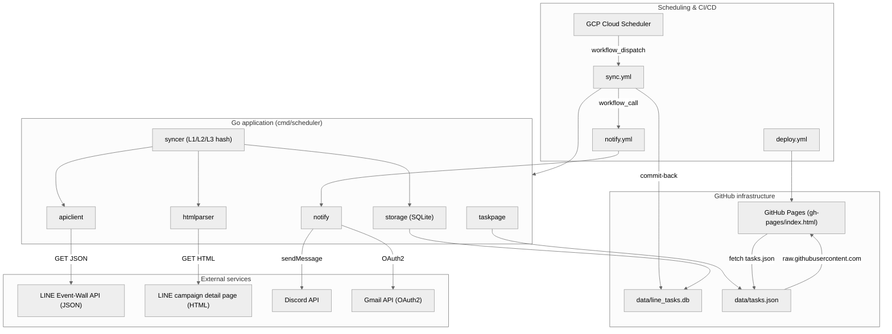

# more-line-points

**An automated crawler and notification system for LINE promotional point-collection campaigns.**

LINE regularly runs point-collection, keyword-reward, and share-to-win marketing
campaigns in Taiwan. Keeping up means visiting the LINE event wall every day,
opening each official account, and typing in the right keyword — tedious and easy
to miss. `more-line-points` automates the whole loop: it periodically scrapes the
LINE event-wall API, parses each campaign's task type and daily keyword schedule,
stores everything in a single SQLite file, and pushes a short daily reminder
(task count + a link to a static task dashboard) via **Discord** and **Email**.
From the dashboard you get one-click LINE deep links and can track your own
completion progress.

The system is designed to run **fully unattended**: GCP Cloud Scheduler triggers
the GitHub Actions sync workflow, the sync result is committed back to the repo,
the notification workflow fires automatically, and GitHub Pages serves the latest
tasks — zero manual intervention.

> **Implementation status:** the scheduler CLI (`init` / `sync` / `notify`),
> Discord + Email notifications, the static dashboard, and the full CI/CD
> automation are implemented. The interactive Discord Bot command interface and
> the optional LLM parsing fallback are specified but **not yet implemented** —
> see [Roadmap](#roadmap).

---

## Architecture



### How it works (sync flow)

1. **Fetch** the full campaign list from the LINE event-wall JSON API (paginated,
   10 per page, following `pageToken` until it is `null`).
2. **Three-layer hash diffing** to skip unchanged data:
   - **Layer 1** (`activity_list`) — hash of the whole activity-ID list (did anything change at all?).
   - **Layer 2** (`activity:{id}`) — hash per activity summary (which activities changed?).
   - **Layer 3** (`detail:{id}`) — hash of the keyword block on a detail page (did the keyword schedule change?).
3. For `unknown` (new) or `keyword` activities, **fetch and parse the detail page**
   to classify the task type and extract the daily keyword schedule. Task types
   are matched against rules in `config/parse_rules.yaml`.
4. **Clean up** expired activities and persist updated hashes.
5. **Export** `data/tasks.json` for the web dashboard; the sync workflow then
   triggers **notify**.

---

## Features

| Area | What it does |
| --- | --- |
| **Activity sync** | Pulls the campaign list from the LINE event-wall JSON API with automatic pagination. No headless browser required. |
| **Rule-based detail parsing** | Parses non-uniform HTML detail pages with `goquery` to classify the task type and extract per-day keywords / links. Types are configurable in `config/parse_rules.yaml` (`keyword`, `share`, `shop-collect`, `poll`, `task`, `lucky-draw`, `app-checkin`, `passport`, `other`, `unknown`). |
| **Three-layer hash diffing** | Minimizes redundant API calls, HTML fetches, and DB writes by comparing hashes at list / activity / detail granularity. |
| **Idempotent SQLite storage** | Single-file `data/line_tasks.db` (pure-Go driver, no CGO, WAL mode), version-controlled in Git via commit-back. |
| **Channel mapping → deep links** | Maps API `channelName` to `@channel_id` so tasks carry one-click LINE deep links (`https://line.me/R/oaMessage/@{channel_id}/?{keyword}`); degrades gracefully when unmapped (`on_missing: warn / skip / error`). |
| **Multi-channel notify** | Sends a short message (task count + dashboard URL) via Discord and Email (Gmail API). Each channel has an independent `enabled` switch. |
| **Static task dashboard** | Responsive GitHub Pages UI that reads the first-hand `data/tasks.json` and tracks click/completion progress in `localStorage`. |
| **Full automation** | GCP Cloud Scheduler → GitHub Actions (`sync.yml` → `notify.yml`) → commit-back → GitHub Pages, end to end. |

---

## Tech stack

| Category | Choice |
| --- | --- |
| Language | Go 1.22 (`golang-standards/project-layout`) |
| CLI framework | `spf13/cobra` (`init` / `sync` / `notify` subcommands) |
| HTTP | `net/http` |
| HTML parsing | `PuerkitoBio/goquery` |
| Database | SQLite via `modernc.org/sqlite` (pure Go, no CGO) |
| Config | YAML (`config.yaml`, `channel_mapping.yaml`, `parse_rules.yaml`); `.env` via `joho/godotenv` |
| Notifications | Discord (`bwmarrin/discordgo`) + Email (Gmail API via `google.golang.org/api` + `golang.org/x/oauth2`) |
| Logging | Rotating file logs via `natefinch/lumberjack` (`logs/more-line-points.log`) |
| Dashboard | Native HTML/JS/CSS on GitHub Pages |
| Scheduling | GCP Cloud Scheduler + GitHub Actions |
| Toolchain / tasks | [mise](https://mise.jdx.dev/) |
| Quality | `golangci-lint` v2, `gofumpt` |

---

## Project structure

```
.
├── cmd/
│   └── scheduler/            # CLI entry point (init / sync / notify)
│       ├── main.go           # .env load, log rotation, Asia/Taipei tz, signal handling
│       └── cli/              # Cobra subcommands (root, init, sync, notify)
├── internal/
│   ├── apiclient/            # LINE event-wall API client + pagination
│   ├── htmlparser/           # Detail-page HTML parsing + oaMessage link decoding
│   ├── syncer/               # Sync orchestration + three-layer hash diffing
│   ├── storage/              # SQLite CRUD, schema, hash management, expiry cleanup
│   ├── config/               # Config / ChannelMapping / ParseRules loading
│   ├── notify/               # Notification assembly & dispatch
│   ├── discord/              # Discord API wrapper (sender)
│   ├── email/                # Gmail API (OAuth2) wrapper
│   ├── taskpage/             # tasks.json assembly for the web UI
│   └── model/                # Shared data structures
├── config/
│   ├── config.yaml           # Application config
│   ├── channel_mapping.yaml  # channelName → @channel_id
│   └── parse_rules.yaml      # HTML task-type detection rules + date patterns
├── data/
│   ├── line_tasks.db         # SQLite database (tracked in Git)
│   └── tasks.json            # Generated task feed for the dashboard (tracked in Git)
├── gh-pages/
│   └── index.html            # GitHub Pages dashboard shell (fetches data/tasks.json)
├── .github/
│   ├── actions/setup-go/     # Composite action: setup Go + module cache
│   └── workflows/            # ci.yml · sync.yml · notify.yml · deploy.yml
├── tests/                    # integration/ (txtar), helpers/, fixture/
├── docs/                     # requirements / design / guides / test / changes
└── .mise.toml                # Toolchain + task runner
```

---

## Getting started

### Prerequisites

- [mise](https://mise.jdx.dev/) (manages Go 1.22, `golangci-lint`, `gofumpt`)
- A Discord bot token + guild/channel IDs (only if Discord notifications are enabled)
- Gmail API `credentials.json` / `token.json` (for email notifications)

### Install & build

```bash
# Install the pinned toolchain
mise install

# Build the scheduler binary → bin/scheduler
mise run build
```

### Configure

Edit `config/config.yaml`, `config/channel_mapping.yaml`, and
`config/parse_rules.yaml`. Config values support `${ENV_VAR}` expansion (via
`os.ExpandEnv`), so secrets can come from a local `.env` file or the environment
instead of being hard-coded (see [Configuration](#configuration)).

### Run

```bash
# 1. Initialize the SQLite database (creates schema)
./bin/scheduler init   --config ./config/config.yaml

# 2. Sync campaigns from LINE (fetch + parse + store + export data/tasks.json)
./bin/scheduler sync   --config ./config/config.yaml

# 3. Notify today's tasks via the enabled channels (Discord / Email)
./bin/scheduler notify --config ./config/config.yaml

# Notify a specific date instead (Asia/Taipei)
./bin/scheduler notify --config ./config/config.yaml --date 2026-07-03
```

> `notify` defaults to the **current date** (Asia/Taipei, UTC+8). All timestamps
> in the app are forced to the Asia/Taipei timezone.

---

## Configuration

### `config/config.yaml`

```yaml
database:
  path: "data/line_tasks.db"

channel_mapping:
  path: "config/channel_mapping.yaml"

taskpage:
  output_path: "data/tasks.json"
  github_pages_url: "https://dccoding1118.github.io/more-line-points/"

api:
  base_url: "https://ec-bot-web.line-apps.com/event-wall/home"
  region: "tw"
  headers:
    origin: "https://event.line.me"
    referer: "https://event.line.me/bulletin/tw"
    user-agent: "Mozilla/5.0 ..."

parser:
  rules_path: config/parse_rules.yaml

discord:
  enabled: false                              # off by default
  bot_token: "${DISCORD_BOT_TOKEN}"
  guild_id: "${DISCORD_GUILD_ID}"
  notify_channel_id: "${DISCORD_NOTIFY_CHANNEL_ID}"
  admin_channel_id: "${DISCORD_ADMIN_CHANNEL_ID}"
  api_endpoint: ""                            # blank = Discord official API

email:
  enabled: true
  credentials_path: "${GMAIL_CREDENTIAL_PATH}"
  token_path: "${GMAIL_TOKEN_PATH}"
  sender: "${EMAIL_SENDER}"
  recipients_env: "${EMAIL_RECIPIENTS}"       # comma-separated; overrides recipients
  recipients: []
```

Required fields are validated at load time: `database.path`, `taskpage.*`,
`api.*` (incl. all three headers), and `parser.rules_path`.

### `config/channel_mapping.yaml`

Because the API only returns a display `channelName`, this file maps it to a LINE
`@channel_id` so deep links can be generated.

```yaml
mappings:
  "LINE 購物": "@lineshopping_tw"
  "LINE Pay": "@linepay"
  "LINE TODAY": "@linetoday"
  # ...

# Behavior when a channelName has no mapping:
#   warn  → log a warning, leave channel_id blank, continue
#   skip  → skip the activity
#   error → abort the whole sync
on_missing: warn
```

### `config/parse_rules.yaml`

Defines how detail-page HTML is classified into task types and how dates are
extracted. Each rule matches on `text_patterns` and/or a `url_pattern`; flags
like `has_daily_tasks`, `has_keyword`, `url_only`, and `use_click_url` control
extraction. New task types can be added here without code changes.

> **Security note:** `credentials.json`, `token.json`, and `.env` are git-ignored
> and must never be committed. In CI they are materialized from GitHub Secrets.

---

## Data model

Schema is created by `internal/storage` (`PRAGMA journal_mode=WAL`, `foreign_keys=ON`).

| Table | Key columns |
| --- | --- |
| `activities` | `id`, `title`, `channel_name`, `channel_id`, `type` (default `unknown`), `page_url`, `action_url`, `valid_from`, `valid_until`, `is_active`, timestamps. |
| `daily_tasks` | `id`, `activity_id` (FK, cascade), `use_date`, `keyword`, `url`, `note`. |
| `sync_state` | `key`, `hash`, `synced_at` — keys: `activity_list` (L1), `activity:{id}` (L2), `detail:{id}` (L3). |

---

## Deployment & automation

Scheduling is externalized to **GCP Cloud Scheduler**, which triggers the sync
workflow via `workflow_dispatch` (GitHub's own cron can be delayed 10–60 min).
The workflows themselves define **no cron schedule** — Cloud Scheduler is the
single scheduled trigger, and `sync.yml` chains into `notify.yml`.

| Workflow | Purpose | Trigger |
| --- | --- | --- |
| `ci.yml` | Lint → unit tests (`-race`) → integration tests → build | `push` / `pull_request` to `main` (ignores `data/**`, `docs/**`, `*.md`) + manual |
| `sync.yml` | Sync LINE events, export `tasks.json`, commit-back `data/`, then call `notify.yml` | `workflow_dispatch` (Cloud Scheduler / manual) |
| `notify.yml` | Materialize `.env` + credentials, send daily tasks via Discord & Email | `workflow_call` from `sync.yml` + `workflow_dispatch` (optional `date` input) |
| `deploy.yml` | Publish the dashboard to GitHub Pages | `push` to `main` touching `gh-pages/index.html` + manual |

### Required GitHub Secrets

| Secret | Purpose |
| --- | --- |
| `DISCORD_BOT_TOKEN` | Discord bot token |
| `DISCORD_GUILD_ID` | Discord guild (server) ID |
| `DISCORD_NOTIFY_CHANNEL_ID` | Notification channel ID |
| `DISCORD_ADMIN_CHANNEL_ID` | Admin channel ID |
| `GMAIL_CREDENTIALS_JSON` | Contents of `credentials.json` |
| `GMAIL_TOKEN_JSON` | Contents of `token.json` |

### Required GitHub Variables (Actions → Variables)

| Variable | Purpose |
| --- | --- |
| `EMAIL_SENDER` | Sender email address |
| `EMAIL_RECIPIENTS` | Comma-separated recipient list |

### Setup notes

- **Gmail OAuth** must be switched to **Production Mode** so the refresh token
  does not expire every 7 days.
- **Fine-grained PAT** for Cloud Scheduler: grant only `Actions: Read and write`,
  scope to this single repo, rotate every 90 days.
- Full step-by-step setup: [`docs/guides/cicd-guides.md`](docs/guides/cicd-guides.md).

The `data/line_tasks.db` and `data/tasks.json` files are intentionally tracked in
Git; `sync.yml` commits them back as `github-actions[bot]`, and because CI ignores
`data/**` this does not cause an infinite build loop. The dashboard reads
`data/tasks.json` directly from `raw.githubusercontent.com`.

---

## Development

This project uses **mise** for the toolchain and task running:

```bash
mise run fmt              # Format with gofumpt (-extra)
mise run lint             # golangci-lint v2
mise run test             # Unit tests + coverage → logs/coverage.out
mise run test-integration # Integration tests → logs/integration_test_report.log
mise run build            # Build → bin/scheduler
```

Conventions (see [`AGENTS.md`](AGENTS.md) for the full list):

- **Formatting:** `gofumpt`; **Linting:** `golangci-lint` v2.
- **Tests:** stdlib `testing` only, table-driven, `t.Run` subtests, ≥ 90% coverage;
  external deps (HTTP/DB) mocked via interfaces. Integration tests use `txtar`
  under `tests/integration/` (helpers in `tests/helpers/`, fixtures in `tests/fixture/`).
- **Errors:** always wrap with `fmt.Errorf("failed to <action>: %w", err)`.
- **Context:** all I/O functions take `ctx context.Context` first.
- **Commits:** English, [Conventional Commits](https://www.conventionalcommits.org/).

---

## Roadmap

Specified in the requirements but **not yet implemented**:

- **Discord Bot command interface** — an always-on WebSocket Gateway bot
  (`/sync`, `/list`, `/keywords`, `/notify`, `/status`) restricted to an admin
  channel, deployable on Render free tier or locally. (No `cmd/bot` /
  `internal/bot` exists yet.)
- **AI enhancement (optional)** — an LLM fallback (OpenAI / Ollama) in
  `htmlparser` for keyword extraction when rule-based parsing has low confidence.

---

## Documentation

| Document | Contents |
| --- | --- |
| [`docs/requirements/requirements.md`](docs/requirements/requirements.md) | Full requirements spec (architecture, modules, schema, phases) |
| [`docs/design/`](docs/design/) | Per-phase design docs (init, sync L1/L2, L3 parser, notify, task page, CI/CD) |
| [`docs/guides/cicd-guides.md`](docs/guides/cicd-guides.md) | Step-by-step GitHub / Cloud Scheduler / Gmail OAuth setup |
| [`docs/test/test-plan.md`](docs/test/test-plan.md) | Test plan and cases |
| [`AGENTS.md`](AGENTS.md) | Project conventions for contributors and coding agents |
