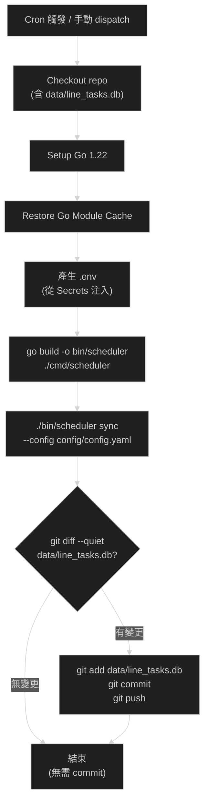
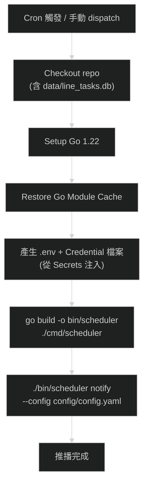

# Part 5 細部設計：Patch 4 — GitHub Actions CI/CD 與排程自動化

> **對應開發階段**：Patch 4
> **前置條件**：Patch 3 完成（`scheduler sync` 與 `scheduler notify` 可於本機正常執行）
> **驗收標準**：GitHub Actions 排程自動觸發 Sync 與 Notify；Sync 後 DB 變更自動 commit-back 至 repo；push / PR 自動觸發 CI（lint + test + build）

---

## 1. 範圍與目標

### 交付物

| 項目                   | 說明                                                                         |
| ---------------------- | ---------------------------------------------------------------------------- |
| `ci.yml`（新增）       | PR / push 觸發的 CI Pipeline：lint → test → build，確保代碼品質。            |
| `sync.yml`（新增）     | Cron 排程與手動觸發 Sync 流程，執行後自動 commit-back `data/line_tasks.db`。 |
| `notify.yml`（新增）   | Cron 排程與手動觸發 Notify 流程，推播明日任務至 Discord / Email。            |
| `.env.ci` 模板（新增） | CI 環境中 `.env` 的對應模板，由 GitHub Secrets 動態產生，不含敏感資訊。      |
| `AGENTS.md` 更新       | 補充 CI/CD 相關說明（Workflow 檔案位置、Secrets 清單、排程時區對照）。       |
| `.gitignore` 更新      | 確保 `.env.ci` 不被提交（若有必要）。                                        |

### 不在範圍內

- Bot 指令介面（Patch 5）
- AI 強化 LLM fallback（Patch 6）
- Render 部署配置（Bot 常駐部署）
- 自動化 Release / Tag 流程（不在需求規格內）

### Patch 大小判斷標準

> 設計文件超過 **500 行** / 單元測試超過 **50 個** / 超過 **5 個模組** / 預估超過 **2 天**

本 Patch 涉及 3 個 Workflow YAML 檔案 + 1 個環境變數模板 + 2 個文件更新，無 Go 程式碼新增，主要為 YAML 與 Shell Script 撰寫，預估 **1 天內**完成。

---

## 2. 上下文與約束

### 2.1 現有工具鏈

本專案使用 `mise` 管理 Go 工具版本與執行任務，以下為現有 task 定義（`.mise.toml`）：

| Task             | 命令                                            | 說明              |
| ---------------- | ----------------------------------------------- | ----------------- |
| `mise run fmt`   | `gofumpt -extra -w .`                           | 格式化代碼        |
| `mise run lint`  | `golangci-lint run`                             | Lint 檢查         |
| `mise run test`  | `go test -coverprofile=logs/coverage.out ./...` | 單元測試 + 覆蓋率 |
| `mise run build` | `go build -o bin/scheduler ./cmd/scheduler`     | 建構 binary       |

> **CI 中不使用 mise**：為了降低 CI 環境複雜度與啟動時間，CI Pipeline 直接使用 Go CLI 與 `golangci-lint` 的 Official GitHub Action，不引入 `mise`。

### 2.2 Go 版本與依賴

- **Go 版本**：`1.22`（基於 `go.mod` 與 `.mise.toml`）
- **SQLite Driver**：`modernc.org/sqlite`（純 Go、免 CGO），CI 不需額外安裝 C 編譯器
- **Linter**：`golangci-lint` v2（使用 `golangci/golangci-lint-action`）

### 2.3 環境變數與 Secrets 策略

本專案的 `config.yaml` 使用 `${ENV_VAR}` 語法引用環境變數。在 CI 環境中，這些變數透過 **GitHub Secrets** 注入。

#### GitHub Secrets 清單

| Secret 名稱                 | 用途                              | 使用的 Workflow          |
| --------------------------- | --------------------------------- | ------------------------ |
| `DISCORD_BOT_TOKEN`         | Discord Bot Token                 | `sync.yml`, `notify.yml` |
| `DISCORD_GUILD_ID`          | Discord 伺服器 ID                 | `sync.yml`, `notify.yml` |
| `DISCORD_NOTIFY_CHANNEL_ID` | 推播每日任務清單的 Channel ID     | `notify.yml`             |
| `DISCORD_ADMIN_CHANNEL_ID`  | 管理/維運 Channel ID              | `notify.yml`             |
| `GMAIL_CREDENTIALS_JSON`    | Gmail API `credentials.json` 內容 | `notify.yml`             |
| `GMAIL_TOKEN_JSON`          | Gmail API `token.json` 內容       | `notify.yml`             |

> **注意**：Gmail 的 `credentials.json` 與 `token.json` 為機密檔案，在 CI 環境中以 **Secret 內容** 形式儲存（非路徑），Workflow 中透過 `echo "$SECRET" > {file}.json` 還原為檔案。

#### .env 產生策略

Sync 與 Notify Workflow 在 runtime 前，透過 Shell Script 將 GitHub Secrets 寫入 `.env` 檔案，使 `godotenv.Overload()` 能正確載入：

```bash
cat <<EOF > .env
DISCORD_BOT_TOKEN=${{ secrets.DISCORD_BOT_TOKEN }}
DISCORD_GUILD_ID=${{ secrets.DISCORD_GUILD_ID }}
DISCORD_NOTIFY_CHANNEL_ID=${{ secrets.DISCORD_NOTIFY_CHANNEL_ID }}
DISCORD_ADMIN_CHANNEL_ID=${{ secrets.DISCORD_ADMIN_CHANNEL_ID }}
GMAIL_CREDENTIAL_PATH=credentials.json
GMAIL_TOKEN_PATH=token.json
EOF
```

### 2.4 排程時區對照

需求規格中的排程時間以 **台灣時間 (UTC+8)** 定義，GitHub Actions Cron 使用 **UTC**：

| Workflow     | Cron (UTC)    | 台灣時間 (UTC+8) | 說明     |
| ------------ | ------------- | ---------------- | -------- |
| `sync.yml`   | `0 4 * * *`   | 12:00            | 午間同步 |
| `sync.yml`   | `0 15 * * *`  | 23:00            | 晚間同步 |
| `sync.yml`   | `5 16 * * *`  | 00:05 (+1d)      | 午夜同步 |
| `notify.yml` | `50 15 * * *` | 23:50            | 每日推播 |

> **GitHub Actions Cron 延遲**：GitHub 不保證 Cron 精確執行，可能延遲 5–15 分鐘。對本專案而言，此延遲可接受。

### 2.5 DB commit-back 機制

`data/line_tasks.db` 納入 Git 版控（見 `AGENTS.md`）。Sync Workflow 執行後若 DB 有變更，需自動 commit 並 push 回 repo。

**關鍵約束**：
- 使用 `GITHUB_TOKEN`（GitHub 自動提供），無需額外建立 PAT
- Commit 作者使用 `github-actions[bot]` 避免觸發無限迴圈
- 必須檢查 `git diff` 確認真正有變更才執行 commit
- SQLite 為二進位檔案，`git diff` 使用 `--quiet` 模式（僅判斷是否有變更，不顯示 diff 內容）
- commit message 遵循 Conventional Commits：`chore(data): auto-sync line_tasks.db`

### 2.6 CI 觸發策略

| 事件                | 觸發 Workflow | 說明                       |
| ------------------- | ------------- | -------------------------- |
| `push` to `main`    | `ci.yml`      | 主分支代碼品質守門         |
| `pull_request`      | `ci.yml`      | PR 合併前品質檢查          |
| Cron 排程           | `sync.yml`    | 定時同步活動資料           |
| Cron 排程           | `notify.yml`  | 定時推播明日任務           |
| `workflow_dispatch` | 全部          | 手動觸發（除錯、臨時操作） |

**避免無限迴圈**：`sync.yml` 的 commit-back 使用 `github-actions[bot]` 作為 commit 作者，若 CI 的 push 觸發規則中排除此 bot 的 commit，或使用 `[skip ci]` 標記，即可避免 sync → push → CI → sync 的無限迴圈。本設計採用 **`paths` 過濾** 方式：`ci.yml` 僅在 Go 源碼或配置檔變更時觸發，`data/` 目錄變更不觸發 CI。

---

## 3. Workflow 設計

### 3.1 CI Pipeline — `ci.yml`

**職責**：在 push 至 `main` 分支或開啟 PR 時，自動執行 lint、單元測試、整合測試與編譯，確保代碼品質。

#### 觸發條件

```yaml
on:
  push:
    branches: [main]
    paths-ignore:
      - 'data/**'
      - 'docs/**'
      - '*.md'
  pull_request:
    branches: [main]
    paths-ignore:
      - 'data/**'
      - 'docs/**'
      - '*.md'
  workflow_dispatch:
```

> `paths-ignore` 排除 `data/` 與文件變更，避免 sync commit-back 或純文件修改觸發 CI。

#### Pipeline 階段


#### 各階段詳細設計

**Stage 1: Checkout + Setup**
- `actions/checkout@v4`：checkout 代碼
- `actions/setup-go@v5`：安裝 Go 1.22，啟用模組快取

**Stage 2: Lint**
- 使用 `golangci/golangci-lint-action@v6`
- 版本：`v2.9.0`（與 `.mise.toml` 及 `.golangci.yml` 一致）
- 不額外指定 args，使用 repo 中的 `.golangci.yml` 配置

**Stage 3: Unit Test**
- 執行：`go test -v -coverprofile=coverage.out -race ./...`
- 使用 `-race` 偵測競態條件（業界標準做法）
- 覆蓋率報告輸出至 `coverage.out`（job 內暫存，不 commit）

**Stage 4: Integration Test**
- 執行：`go test -v -tags integration ./tests/helpers/...`
- 使用 `-tags integration` 啟用整合測試（與 `.mise.toml` 中 `test-integration` task 一致）
- 整合測試驗證完整的 sync / notify 流程（使用 `txtar` test script）

**Stage 5: Build**
- 執行：`go build -o bin/scheduler ./cmd/scheduler`
- 驗證編譯通過，不做 artifact upload（非 Release 流程）

#### 行為契約

| #   | 場景                   | 預期行為                                                  |
| --- | ---------------------- | --------------------------------------------------------- |
| C1  | Go 源碼 push 至 main   | 觸發 CI：lint → unit test → integration test → build 全通 |
| C2  | PR 開啟                | 觸發 CI；PR 頁面顯示 check 結果                           |
| C3  | Lint 失敗              | Pipeline 中止，不執行 test 與 build                       |
| C4  | Unit Test 失敗         | Pipeline 中止，不執行 integration test 與 build           |
| C5  | Integration Test 失敗  | Pipeline 中止，不執行 build                               |
| C6  | `data/` 變更 push      | 不觸發 CI（`paths-ignore`）                               |
| C7  | 純 `.md` 文件修改 push | 不觸發 CI（`paths-ignore`）                               |
| C8  | `workflow_dispatch`    | 手動觸發完整 CI Pipeline                                  |

---

### 3.2 Sync 排程 — `sync.yml`

**職責**：依 Cron 排程或手動觸發，執行 `scheduler sync`，同步完成後若 DB 有變更則自動 commit-back。

#### 觸發條件

```yaml
on:
  schedule:
    - cron: '0 4 * * *'    # UTC 04:00 = TWN 12:00
    - cron: '0 15 * * *'   # UTC 15:00 = TWN 23:00
    - cron: '5 16 * * *'   # UTC 16:05 = TWN 00:05
  workflow_dispatch:
```

#### 完整流程



#### 各階段詳細設計

**Step 1: Checkout**
- `actions/checkout@v4`
- 需設定 `fetch-depth: 0` 以取得完整歷史（commit-back 需要）
- 需設定 `token: ${{ secrets.GITHUB_TOKEN }}` 以允許 push

**Step 2: Setup Go + Cache**
- 同 CI Pipeline

**Step 3: 產生 .env 與 Credential 檔案**
- 從 GitHub Secrets 產生 `.env` 檔案
- 從 Secrets 還原 `credentials.json` 與 `token.json`（Sync 本身不需要，但 config 載入時可能驗證路徑存在）

```yaml
- name: Generate runtime environment
  env:
    DISCORD_BOT_TOKEN: ${{ secrets.DISCORD_BOT_TOKEN }}
    DISCORD_GUILD_ID: ${{ secrets.DISCORD_GUILD_ID }}
    DISCORD_NOTIFY_CHANNEL_ID: ${{ secrets.DISCORD_NOTIFY_CHANNEL_ID }}
    DISCORD_ADMIN_CHANNEL_ID: ${{ secrets.DISCORD_ADMIN_CHANNEL_ID }}
    GMAIL_CREDENTIALS_JSON: ${{ secrets.GMAIL_CREDENTIALS_JSON }}
    GMAIL_TOKEN_JSON: ${{ secrets.GMAIL_TOKEN_JSON }}
  run: |
    cat <<EOF > .env
    DISCORD_BOT_TOKEN=${DISCORD_BOT_TOKEN}
    DISCORD_GUILD_ID=${DISCORD_GUILD_ID}
    DISCORD_NOTIFY_CHANNEL_ID=${DISCORD_NOTIFY_CHANNEL_ID}
    DISCORD_ADMIN_CHANNEL_ID=${DISCORD_ADMIN_CHANNEL_ID}
    GMAIL_CREDENTIAL_PATH=credentials.json
    GMAIL_TOKEN_PATH=token.json
    EOF

    echo "${GMAIL_CREDENTIALS_JSON}" > credentials.json
    echo "${GMAIL_TOKEN_JSON}" > token.json
```

**Step 4: Build + Sync**
```yaml
- name: Build scheduler
  run: go build -o bin/scheduler ./cmd/scheduler

- name: Run sync
  run: ./bin/scheduler sync --config config/config.yaml
```

**Step 5: Commit-back**
```yaml
- name: Commit and push DB changes
  run: |
    git diff --quiet data/line_tasks.db && exit 0
    git config user.name "github-actions[bot]"
    git config user.email "github-actions[bot]@users.noreply.github.com"
    git add data/line_tasks.db
    git commit -m "chore(data): auto-sync line_tasks.db"
    git push
```

> `git diff --quiet` 回傳 0 表示無變更，直接 `exit 0` 跳過；回傳 1 表示有變更，繼續 commit。

#### 行為契約

| #   | 場景                  | 預期行為                                               |
| --- | --------------------- | ------------------------------------------------------ |
| S1  | Cron 觸發，DB 有變更  | Sync 執行成功；DB 自動 commit 並 push                  |
| S2  | Cron 觸發，DB 無變更  | Sync 執行成功；不產生 commit                           |
| S3  | `workflow_dispatch`   | 手動觸發完整 Sync + commit-back 流程                   |
| S4  | API 呼叫失敗          | Sync 回傳 error；Workflow 標記為 failed；不產生 commit |
| S5  | Secrets 未設定        | `.env` 產生空值；Sync 可能因 config 驗證失敗而報錯     |
| S6  | commit-back 觸發 CI？ | 不會觸發：`ci.yml` 設定 `paths-ignore: data/**`        |

---

### 3.3 Notify 排程 — `notify.yml`

**職責**：依 Cron 排程或手動觸發，執行 `scheduler notify`，推播明日任務清單至 Discord 與 Email。

#### 觸發條件

```yaml
on:
  schedule:
    - cron: '50 15 * * *'   # UTC 15:50 = TWN 23:50
  workflow_dispatch:
    inputs:
      date:
        description: 'Target date (YYYY-MM-DD), defaults to tomorrow'
        required: false
        type: string
```

> 手動觸發時支援 `date` 參數（格式：`YYYY-MM-DD`），方便指定特定日期的推播（除錯用途）。
> `scheduler notify --date` 已驗證可正確運作。

#### 完整流程



#### 各階段詳細設計

**Step 1–3**：同 `sync.yml`（Checkout + Setup Go + 產生 .env）。

**Step 4: Build + Notify**
```yaml
- name: Build scheduler
  run: go build -o bin/scheduler ./cmd/scheduler

- name: Run notify
  run: |
    DATE_ARG=""
    if [ -n "${{ github.event.inputs.date }}" ]; then
      DATE_ARG="--date ${{ github.event.inputs.date }}"
    fi
    ./bin/scheduler notify --config config/config.yaml ${DATE_ARG}
```

> Notify 不需要 commit-back：推播是唯寫外部（Discord / Email），不修改 repo 內容。

#### 行為契約

| #   | 場景                          | 預期行為                                   |
| --- | ----------------------------- | ------------------------------------------ |
| N1  | Cron 觸發                     | Notify 執行成功；Discord 與 Email 收到推播 |
| N2  | `workflow_dispatch` 無 date   | 預設推播明日任務                           |
| N3  | `workflow_dispatch` 指定 date | 推播指定日期任務                           |
| N4  | Discord 發送失敗              | Workflow 標記為 failed；Email 仍然嘗試發送 |
| N5  | Email 發送失敗                | Workflow 標記為 failed                     |
| N6  | DB 中無明日任務               | 推播「無需執行任務」的空報表               |

---

## 4. 共用元件設計

### 4.1 Reusable Composite Action — Go Setup

三個 Workflow 共用相同的 Go 環境初始化步驟（Checkout + Setup Go + Cache），可抽取為 **Composite Action** 避免重複。

#### 檔案路徑

```
.github/
├── actions/
│   └── setup-go/
│       └── action.yml       # Composite Action 定義
└── workflows/
    ├── ci.yml
    ├── sync.yml
    └── notify.yml
```

#### `action.yml` 設計

```yaml
name: 'Setup Go Environment'
description: 'Checkout, setup Go, and restore module cache'
inputs:
  go-version:
    description: 'Go version to install'
    required: false
    default: '1.22'
  fetch-depth:
    description: 'Git fetch depth'
    required: false
    default: '1'
runs:
  using: 'composite'
  steps:
    - uses: actions/checkout@v4
      with:
        fetch-depth: ${{ inputs.fetch-depth }}

    - uses: actions/setup-go@v5
      with:
        go-version: ${{ inputs.go-version }}
        cache: true
```

> 各 Workflow 透過 `uses: ./.github/actions/setup-go` 引用此 Composite Action。

### 4.2 .env 產生 Step（可複用 Shell Block）

為 `sync.yml` 與 `notify.yml` 共用的 `.env` 與 Credential 檔案產生邏輯，透過 YAML Anchor 或直接在各 Workflow 中複製（GitHub Actions 不支援跨 Workflow 的 YAML Anchor）。

---

## 5. 檔案結構

本 Patch 完成後新增的檔案：

```
.github/
├── actions/
│   └── setup-go/
│       └── action.yml         # Composite Action：Go 環境初始化
└── workflows/
    ├── ci.yml                 # CI Pipeline（lint → test → build）
    ├── sync.yml               # Sync 排程 + DB commit-back
    └── notify.yml             # Notify 排程
```

---

## 6. 安全性考量

### 6.1 Secrets 管理

- 所有敏感資訊（Token、Credential）僅透過 GitHub Secrets 儲存，**絕不寫入** repo 中的任何檔案
- Workflow 中產生的 `.env`、`credentials.json`、`token.json` 為 **runner 內暫存**，job 結束後自動銷毀
- `.gitignore` 已包含 `.env`、`credentials.json`、`token.json`，確保即使 commit-back step 有 bug 也不會意外提交

### 6.2 權限最小化

- `ci.yml`：僅需 `contents: read`（不需寫入）
- `sync.yml`：需 `contents: write`（commit-back）
- `notify.yml`：僅需 `contents: read`

```yaml
# ci.yml
permissions:
  contents: read

# sync.yml
permissions:
  contents: write

# notify.yml
permissions:
  contents: read
```

### 6.3 防止無限迴圈

| 防護機制                | 說明                                                              |
| ----------------------- | ----------------------------------------------------------------- |
| `ci.yml` `paths-ignore` | `data/**` 與 `*.md` 變更不觸發 CI                                 |
| commit 作者識別         | `github-actions[bot]` 的 commit 因 `paths-ignore` 規則而不觸發 CI |
| sync.yml 不監聽 push    | `sync.yml` 僅有 `schedule` 與 `workflow_dispatch` 觸發            |

---

## 7. TDD 開發順序

> 本 Patch 不涉及 Go 程式碼變更，主要為 YAML Workflow 與 Shell Script。
> TDD 概念應用於 **Workflow 行為測試**：先定義行為契約（§3 各 Workflow 的行為契約表），再實作 Workflow。

| 步驟 | 交付物                      | 🔴 RED（定義預期行為）                | 🟢 GREEN（實作通過）                                             | 🔵 REFACTOR                 |
| ---- | --------------------------- | ------------------------------------ | --------------------------------------------------------------- | -------------------------- |
| 1    | Composite Action            | 定義 setup-go 的 inputs/outputs 規格 | 實作 `action.yml`                                               | —                          |
| 2    | `ci.yml`                    | §3.1 C1–C8 行為契約                  | 實作 CI Pipeline（lint → unit test → integration test → build） | 抽取 Composite Action 引用 |
| 3    | `sync.yml`                  | §3.2 S1–S6 行為契約                  | 實作 Sync Pipeline + commit-back                                | `.env` 產生邏輯調整        |
| 4    | `notify.yml`                | §3.3 N1–N6 行為契約                  | 實作 Notify Pipeline + date 參數支援                            | —                          |
| 5    | AGENTS.md + .gitignore 更新 | —                                    | 補充 CI/CD 說明至 AGENTS.md                                     | —                          |

---

## 8. 驗收標準

| 項目                   | 方法                                       | 通過條件                                                                     |
| ---------------------- | ------------------------------------------ | ---------------------------------------------------------------------------- |
| CI Pipeline            | push Go 源碼至 main 或開 PR                | Actions 頁面顯示 CI 通過（lint + unit test + integration test + build 全綠） |
| CI 不觸發（data 變更） | 觀察 sync commit-back 後的 Actions 頁面    | 不產生新的 CI run                                                            |
| Sync 排程              | 等待 Cron 觸發或手動 `workflow_dispatch`   | Actions 頁面顯示 Sync 成功；DB commit 出現於 Git 歷史                        |
| Sync 無變更            | 連續手動觸發兩次 `workflow_dispatch`       | 第二次不產生 commit（`git diff --quiet` 判定無變更）                         |
| Notify 排程            | 手動 `workflow_dispatch`                   | Discord 頻道與 Email 收到格式正確的推播訊息                                  |
| Notify 指定日期        | 手動 `workflow_dispatch`，填入 `date` 參數 | 推播指定日期的任務清單                                                       |
| Secrets 安全性         | 審查 Workflow YAML 與 Actions 日誌         | 日誌中無敏感資訊洩漏；`.env` / credential 檔案未被 commit                    |
| 權限最小化             | 審查各 Workflow 的 `permissions` 設定      | 符合 §6.2 定義的最小權限                                                     |
| AGENTS.md              | 審查更新內容                               | 包含 Workflow 檔案位置、Secrets 清單、排程時區對照                           |

### 手動驗證步驟

1. **CI 驗證**：
   - 從 `main` 切出 `feat/patch4-cicd` 分支
   - 將所有 Workflow YAML 與文件變更提交至該分支
   - Push 至 remote 並開啟 PR 至 `main`
   - 確認 CI Workflow 自動觸發
   - 確認 lint / unit test / integration test / build 四個步驟全部通過

2. **Sync 驗證**（合併至 main 後）：
   - 於 GitHub Actions 頁面 → `sync.yml` → `Run workflow` → 手動觸發
   - 確認 Sync 執行成功（Actions 日誌中有 `Sync complete` 輸出）
   - 確認 `data/line_tasks.db` 有新的 commit（若有資料變更）
   - 再次手動觸發，確認不產生新 commit（冪等性）

3. **Notify 驗證**（合併至 main 後）：
   - 於 GitHub Actions 頁面 → `notify.yml` → `Run workflow` → 手動觸發
   - 確認 Notify 執行成功（Actions 日誌中有推播結果輸出）
   - 登入 Discord 頻道確認收到推播訊息
   - 登入 Email 確認收到推播信件

4. **安全性驗證**：
   - 檢視各 Workflow 的 Actions 日誌，確認無 Token / Password 洩漏
   - 確認 Git 歷史中不存在 `.env`、`credentials.json`、`token.json` 的提交紀錄
