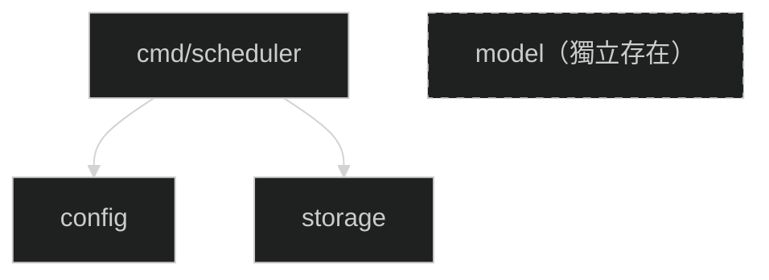

# Part 1 細部設計：Patch 0 — 專案骨架

> **對應開發階段**：Patch 0
> **驗收標準**：`mise run build` 成功；`scheduler init --config config.yaml` 建立 DB 且 schema 正確

---

## 1. 範圍與目標

### 交付物

| 項目                 | 說明                                                                 |
| -------------------- | -------------------------------------------------------------------- |
| Go module            | `go.mod` 初始化，引入 `modernc.org/sqlite`、`gopkg.in/yaml.v3`       |
| `.mise.toml`         | 定義 `build` / `test` / `lint` / `fmt` task                          |
| `AGENTS.md`          | Agent 協作規範文件                                                   |
| `model` 模組         | 定義 `Activity`、`SyncState`、`Keyword` 三個共用結構（純定義無邏輯） |
| `config` 模組        | 載入 config.yaml 與 channel_mapping.yaml                             |
| `storage` 模組       | SQLite 初始化 + schema 建立（三張表）+ Close                         |
| `cmd/scheduler init` | CLI 子命令：載入 config → 載入 channel mapping → 初始化 DB           |

### 不在範圍內

- Storage CRUD 操作、LookupChannelID（Patch 1，搭配 Syncer 一起實作）
- API 呼叫與分頁遍歷、Sync 編排與 Hash 計算（Patch 1）
- 詳細頁 HTML 解析與 keywords 寫入（Patch 2）
- 推播通知（Patch 3）、Bot 指令（Patch 5）

### Patch 大小判斷標準

> 若符合以下任一條件，表示 Patch 範圍過大，應拆分：
>
> - 設計文件超過 **500 行**
> - 單元測試案例超過 **50 個**
> - 涉及超過 **5 個模組**
> - 預估實作時間超過 **2 天**

---

## 2. 上下文與約束

### Config 漸進式擴充策略

Config struct 隨 Patch 逐步成長。每個 Patch 只定義自己需要使用的配置欄位。
Go `yaml.Unmarshal` 遇到 struct 中沒有的 YAML 欄位會**靜默忽略**，所以使用者可先寫好完整 config.yaml，Patch 0 的程式只讀取自己定義的區塊。

| Patch | Config struct 新增的欄位                                                          | 新增的驗證規則                                                   |
| ----- | --------------------------------------------------------------------------------- | ---------------------------------------------------------------- |
| 0     | `Database.Path` + `ChannelMapping.Path`                                           | `database.path` 必填                                             |
| 1     | `API.BaseURL` / `Region` / `Headers`（origin, referer, user-agent）               | `api.base_url`、`api.region`、三個 headers 必填                  |
| 3     | `Discord.Enabled` / `BotToken` / `GuildID` / `NotifyChannelID` / `AdminChannelID` | 當 `discord.enabled=true` → 必填以上四個欄位                     |
| 3     | `Email.Enabled` / `SMTPHost` / `Sender` / `Password`                              | 當 `email.enabled=true` → `smtp_host`、`sender`、`password` 必填 |

### 環境變數

本 Patch 的配置欄位（`database.path`、`channel_mapping.path`）不含 `${...}` 佔位符，不需要環境變數。
載入流程中仍執行 `os.ExpandEnv`（統一流程），但實際上沒有東西需要展開。
未來 Patch 新增 `${DISCORD_BOT_TOKEN}` 等欄位時，才會真正用到環境變數注入。

### 真實 API 回應結構

以下是 LINE Event-Wall API 的真實回應格式。本 Patch 不呼叫 API，但 model 的 Activity struct 欄位設計依此定義：

```json
{
    "status": "OK",
    "timestamp": 1772606390725,
    "result": {
        "dataList": [
            {
                "eventId": "SnSqz5xDKxyDaCtv",
                "eventTitle": "202603拿到大獎超開心",
                "descriptionText": "最高領990點紅包",
                "channelName": "LINE 購物",
                "clickUrl": "https://buy.line.me/u/article/617684?...",
                "eventStartTime": "2026-03-01 00:00:00",
                "eventEndTime": "2026-03-31 23:59:59",
                "imageUrl": "https://ec-bot-obs.line-scdn.net/...",
                "promotionLabelNameList": [],
                "joined": false
            },
            ...
        ],
        "pageToken": "CD98nAez..."
    }
}
```

**API → Model 欄位映射**（Patch 1 實作 API 呼叫時使用）：

| API 欄位 (`result.dataList[]`) | Model Activity 欄位 | 轉換規則                                 |
| ------------------------------ | ------------------- | ---------------------------------------- |
| `eventId`                      | ID                  | 直接映射                                 |
| `eventTitle`                   | Title               | 直接映射                                 |
| `channelName`                  | ChannelName         | 直接映射                                 |
| `clickUrl`                     | PageURL             | 直接映射                                 |
| `eventStartTime`               | ValidFrom           | 解析 `"2006-01-02 15:04:05"` → time.Time |
| `eventEndTime`                 | ValidUntil          | 解析 `"2006-01-02 15:04:05"` → time.Time |
| —                              | ChannelID           | 由 Syncer 透過 ChannelMapping 查詢填入   |
| —                              | Type                | 固定為 `"unknown"`（Patch 2 回填）       |

**未使用的 API 欄位**：`imageUrl`、`descriptionText`、`promotionLabelNameList`、`joined`、`status`、`timestamp` — 不儲存，忽略即可。

**分頁機制**：`result.pageToken` 非 null 時帶入下一次請求的 `pageToken` 參數。為 null 時表示已取完所有資料。

---

## 3. 模組分解

### 模組依賴與實作順序



> model 在 Patch 0 中獨立存在，沒有其他模組依賴它。
> 到 Patch 1 實作 storage CRUD 與 Syncer 時，storage、apiclient、syncer 才會 import model。

實作順序：model → config → storage → cmd/scheduler

---

### 3.1 model — 共用資料結構

**職責**：定義各模組共用的領域物件。純結構定義，不含任何業務邏輯。
本 Patch 同時建立三張表的 schema，因此也同時定義三個對應的 Go struct，保持 schema 與 model 的一致性。

#### Activity

代表一個 LINE 活動。對應 `activities` 表。

| 欄位        | 型別      | 語意                   | 來源                      | 約束                 |
| ----------- | --------- | ---------------------- | ------------------------- | -------------------- |
| ID          | string    | 活動唯一識別碼         | API `eventId`             | PK，不可空           |
| Title       | string    | 活動標題               | API `eventTitle`          | 不可空               |
| ChannelName | string    | 頻道顯示名稱           | API `channelName`         | 不可空               |
| ChannelID   | string    | LINE 帳號 ID（`@xxx`） | ChannelMapping 查詢       | 可空                 |
| Type        | string    | 任務類型               | Patch 2 htmlparser 回填   | 本階段固定 `unknown` |
| PageURL     | string    | 活動頁 URL             | API `clickUrl`            | 不可空               |
| ValidFrom   | time.Time | 開始時間               | API `eventStartTime` 解析 | —                    |
| ValidUntil  | time.Time | 結束時間               | API `eventEndTime` 解析   | 過期判斷依據         |
| IsActive    | bool      | 是否仍在 API 清單中    | Sync 控制                 | 消失時設 false       |
| CreatedAt   | time.Time | 記錄建立時間           | DB DEFAULT                | 不可修改             |
| UpdatedAt   | time.Time | 最後更新時間           | DB DEFAULT                | 每次更新重設         |

#### SyncState

代表某個 Hash 層級的同步狀態。對應 `sync_state` 表。

| 欄位     | 型別      | 語意             | Key 格式範例                                                                  |
| -------- | --------- | ---------------- | ----------------------------------------------------------------------------- |
| Key      | string    | Hash 識別 key    | `"activity_list"`(L1) / `"activity:{eventId}"`(L2) / `"detail:{eventId}"`(L3) |
| Hash     | string    | SHA-256 hex 字串 | —                                                                             |
| SyncedAt | time.Time | 最後同步時間戳記 | —                                                                             |

#### Keyword

代表某個活動在某一天的關鍵字。對應 `keywords` 表。Patch 2 才會實際寫入資料。

| 欄位       | 型別      | 語意        | 來源               |
| ---------- | --------- | ----------- | ------------------ |
| ID         | int64     | 自增主鍵    | DB AUTOINCREMENT   |
| ActivityID | string    | 所屬活動 ID | FK → activities.id |
| UseDate    | time.Time | 使用日期    | htmlparser 解析    |
| Keyword    | string    | 關鍵字文字  | htmlparser 解析    |
| Note       | string    | 備註        | 可空               |

> model 無業務邏輯，不需要單元測試。

---

### 3.2 config — 設定載入

**職責**：從 YAML 檔案載入應用設定與頻道對應表。
本 Patch 的 Config struct 僅包含 `database` 與 `channel_mapping` 兩個區塊。

#### Patch 0 的 Config struct 定義

```go
// Config 代表 config.yaml 的設定內容。
// 每個 Patch 會在此 struct 中新增該 Patch 所需的欄位。
// Patch 0 僅包含 database 與 channel_mapping 區塊。
type Config struct {
    Database       DatabaseConfig       `yaml:"database"`
    ChannelMapping ChannelMappingConfig  `yaml:"channel_mapping"`
}

type DatabaseConfig struct {
    Path string `yaml:"path"` // SQLite 檔案路徑，必填
}

type ChannelMappingConfig struct {
    Path string `yaml:"path"` // channel_mapping.yaml 的檔案路徑
}
```

```go
// ChannelMapping 代表 channel_mapping.yaml 的內容。
// 定義 channelName → @channel_id 的對應關係。
type ChannelMapping struct {
    Mappings  map[string]string `yaml:"mappings"`   // key=channelName, value=@channel_id
    OnMissing string            `yaml:"on_missing"` // "warn" | "skip" | "error"，預設是 "warn"
}
```

#### Patch 0 的 config.yaml 格式

本 Patch 僅使用以下兩個區塊。YAML 中的其他區塊（如 api、discord、email）會被靜默忽略。

```yaml
database:
  path: "data/line_tasks.db"

channel_mapping:
  path: "config/channel_mapping.yaml"
```

#### channel_mapping.yaml 格式

```yaml
mappings:
  "LINE 購物": "@lineshopping"
  "LINE Pay": "@linepay"
  "LINE TODAY": "@linetoday"

on_missing: warn   # warn | skip | error
```

#### 資料流

```
config.yaml 載入流程（Load 函數）：

  1. os.ReadFile 讀取 config.yaml 原始文字內容
     → 檔案不存在或無法讀取時，回傳 error

  2. os.ExpandEnv 對整個檔案內容展開 ${...} 佔位符
     → 本 Patch 的欄位不含 ${...}，此步驟實際上不會改變內容
     → 保留此步驟是為了統一流程，未來 Patch 新增含環境變數的欄位時不需改動載入邏輯

  3. yaml.Unmarshal 將展開後的文字解析為 Config struct
     → YAML 語法錯誤時回傳 error
     → YAML 中存在但 struct 中沒有的欄位會被靜默忽略
     → YAML 中的欄位名稱寫錯也會被忽略（視同不存在的欄位）

  4. Validate() 驗證必填欄位
     → Patch 0 規則：database.path 不可為空字串
     → 驗證失敗時回傳 error，訊息格式：config validation: <欄位路徑> is required
     → 未來 Patch 在此方法中新增規則即可

  5. 回傳 Config struct

channel_mapping.yaml 載入流程（LoadChannelMapping 函數）：

  1. os.ReadFile 讀取 channel_mapping.yaml
     → 檔案不存在時回傳 error

  2. yaml.Unmarshal 解析為 ChannelMapping struct
     → YAML 語法錯誤時回傳 error
     → Mappings 解析為 map[string]string
     → 若 YAML 中 mappings 區塊為空，Mappings 為空 map（不為 nil）

  3. 回傳 ChannelMapping
```

#### 行為契約

以下描述運作邏輯規則。

**Load（載入 Config）**

| #   | 場景            | 規則                                                              |
| --- | --------------- | ----------------------------------------------------------------- |
| L1  | 合法 YAML       | 解析成功，Config struct 中有定義的欄位被正確填入                  |
| L2  | YAML 含多餘欄位 | struct 中沒有的欄位被忽略，不報錯                                 |
| L3  | 檔案不存在      | 回傳 error，訊息格式：`failed to read config file: <OS 錯誤描述>` |
| L4  | YAML 語法錯誤   | 回傳 error，訊息格式：`failed to parse config: <yaml 錯誤描述>`   |
| L5  | 必填欄位為空    | 回傳 error，訊息格式：`config validation: <欄位路徑> is required` |

> L5 是通用必填驗證規則。Patch 0 的必填欄位僅 `database.path`。

**LoadChannelMapping（載入 ChannelMapping）**

| #   | 場景          | 規則                                                                        |
| --- | ------------- | --------------------------------------------------------------------------- |
| M1  | 合法 YAML     | 解析為 ChannelMapping struct，Mappings 為有效 map（可能為空 map，不為 nil） |
| M2  | 檔案不存在    | 回傳 error，訊息格式：`failed to read channel mapping: <OS 錯誤描述>`       |
| M3  | YAML 語法錯誤 | 回傳 error，訊息格式：`failed to parse channel mapping: <yaml 錯誤描述>`    |

#### 不變量

- Load 成功後，`Config.Database.Path` 保證非空字串
- LoadChannelMapping 成功後，`ChannelMapping.Mappings` 保證為有效 map（不為 nil）

#### 單元測試案例

| #   | 案例                       | 衍生自 | 驗證重點                                   |
| --- | -------------------------- | ------ | ------------------------------------------ |
| 1   | 載入合法 config            | L1     | `Database.Path` 正確解析                   |
| 2   | config YAML 含多餘欄位     | L2     | 多餘欄位被忽略；有定義的欄位正確解析       |
| 3   | config 檔案不存在          | L3     | error 含 `failed to read`                  |
| 4   | config 非法 YAML           | L4     | error 含 `failed to parse`                 |
| 5   | `database.path` 為空字串   | L5     | error 含 `database.path`                   |
| 6   | `database.path` 欄位不存在 | L5     | error 含 `database.path`（未填等於空字串） |
| 7   | 載入合法 channel_mapping   | M1     | Mappings 為有效 map，逐 key-value 驗證正確 |
| 8   | channel_mapping 不存在     | M2     | error 含 `failed to read`                  |
| 9   | channel_mapping 非法 YAML  | M3     | error 含 `failed to parse`                 |

---

### 3.3 storage — SQLite 初始化

**職責**：建立 SQLite 資料庫連線並初始化 schema。
本 Patch 僅實作 `NewSQLiteStore`（初始化）與 `Close`（關閉連線），不實作任何 CRUD 操作。
CRUD 操作（如 `UpsertActivity`、`GetHash` 等）在 Patch 1 隨 Syncer 一起實作與測試。

#### 為什麼 CRUD 不在 Patch 0

本 Patch 沒有任何功能會呼叫 CRUD 方法（Syncer 在 Patch 1 才實作）。
依據 TDD 原則，只在有消費者需要時才實作方法。
在 Patch 0 先寫 CRUD 再測試，等於「為了測試而測試」，不符合 TDD 精神。

#### 資料流

```
初始化流程（NewSQLiteStore 函數）：

  1. 接收參數：ctx context.Context, dbPath string
     → dbPath 來自 Config.Database.Path

  2. 嘗試建立 dbPath 所在的目錄（若不存在）
     → 使用 os.MkdirAll 建立路徑中缺少的目錄
     → 目錄建立失敗時回傳 error

  3. 開啟 SQLite 連線
     → 使用 modernc.org/sqlite 驅動
     → 若檔案不存在，SQLite 會自動建立新檔案
     → 連線失敗時回傳 error

  4. 設定 SQLite Pragmas（逐一執行 PRAGMA 語句）：
     → journal_mode=WAL   ：啟用 Write-Ahead Logging，提升併發讀取效能
     → foreign_keys=ON    ：啟用外鍵約束，讓 DELETE 時 ON DELETE CASCADE 生效
                            （CleanExpired 刪除活動時，自動刪除該活動的 keywords）
     → busy_timeout=5000  ：等待 5 秒再回報 SQLITE_BUSY，避免多程序同時存取時立即失敗

  5. 建立三張表（使用 CREATE TABLE IF NOT EXISTS）：
     → activities 表：活動基本資料
     → keywords 表  ：關鍵字排程（本 Patch 僅建表，Patch 2 才寫入資料）
     → sync_state 表：Hash 狀態管理
     → CREATE TABLE IF NOT EXISTS 保證重複執行不報錯、不影響既有資料

  6. 回傳 SQLiteStore 實例
     → 提供 Close() 方法釋放 DB 連線資源

關閉流程（Close 函數）：
  關閉底層 SQL 連線，釋放檔案鎖。
```

#### DB Schema

```sql
CREATE TABLE IF NOT EXISTS activities (
  id            TEXT PRIMARY KEY,
  title         TEXT NOT NULL,
  channel_name  TEXT NOT NULL,
  channel_id    TEXT,
  type          TEXT NOT NULL DEFAULT 'unknown',
  page_url      TEXT NOT NULL,
  valid_from    DATETIME,
  valid_until   DATETIME,
  is_active     INTEGER NOT NULL DEFAULT 1,
  created_at    DATETIME NOT NULL DEFAULT CURRENT_TIMESTAMP,
  updated_at    DATETIME NOT NULL DEFAULT CURRENT_TIMESTAMP
);

CREATE TABLE IF NOT EXISTS keywords (
  id            INTEGER PRIMARY KEY AUTOINCREMENT,
  activity_id   TEXT NOT NULL REFERENCES activities(id) ON DELETE CASCADE,
  use_date      DATE NOT NULL,
  keyword       TEXT NOT NULL,
  note          TEXT
);

CREATE TABLE IF NOT EXISTS sync_state (
  key           TEXT PRIMARY KEY,
  hash          TEXT NOT NULL,
  synced_at     DATETIME NOT NULL
);
```

#### 行為契約

| #   | 場景                 | 規則                                                              |
| --- | -------------------- | ----------------------------------------------------------------- |
| N1  | 正常初始化           | DB 檔案建立（或開啟既有），三張表的 schema 存在                   |
| N2  | 重複初始化（冪等性） | 對同一個 DB 路徑執行兩次 NewSQLiteStore，不報錯且既有資料不被影響 |
| N3  | DB 路徑不可寫        | 回傳 error                                                        |
| N4  | Close                | 釋放 DB 連線，Close 後不可再執行 DB 操作                          |

#### 不變量

- NewSQLiteStore 成功後，activities / keywords / sync_state 三張表必定存在
- 重複呼叫 NewSQLiteStore 不會破壞既有資料

#### 單元測試案例

> 使用 in-memory SQLite `:memory:` 或 temp dir 中的 DB 檔案。

| #   | 案例              | 衍生自 | 驗證重點                                           |
| --- | ----------------- | ------ | -------------------------------------------------- |
| 1   | Schema 初始化成功 | N1     | 查 `sqlite_master` 確認三張表存在；驗證表名稱正確  |
| 2   | 重複初始化冪等    | N2     | 同路徑兩次不報錯；第一次建立的資料在第二次後仍存在 |
| 3   | DB 路徑不可寫     | N3     | 回傳 error                                         |
| 4   | Close 成功        | N4     | Close 後 error 為 nil                              |

---

### 3.4 cmd/scheduler — CLI 進入點（Cobra）

**職責**：使用 Cobra 框架定義 CLI 子命令，組裝所有模組依賴。本 Patch 實作 `init` 子命令，
驗證專案骨架可正確運作（config 載入 → channel mapping 載入 → DB 初始化）。

#### 檔案結構

```
cmd/scheduler/
├── main.go              # 程式進入點：signal handling + cli.Execute(ctx)
└── cli/
    ├── root.go          # Cobra root command 定義（scheduler 根命令）
    ├── init.go          # init 子命令定義 + runInit 業務邏輯
    └── init_test.go     # init 子命令單元測試
```

**分層設計**：
- `main.go`：僅負責 `signal.NotifyContext`（SIGINT / SIGTERM）+ 呼叫 `cli.Execute(ctx)`，不含業務邏輯
- `cli/root.go`：定義 Cobra root command，註冊所有子命令
- `cli/init.go`：`newInitCmd()` 定義 init 子命令的旗標與參數，`runInit()` 包含實際業務邏輯
- 單元測試直接測試 `runInit()` 函數，注入測試用 config 路徑與 temp dir

#### 資料流

```
使用者執行：scheduler init --config config.yaml

  main.go：
    1. signal.NotifyContext 監聽 SIGINT / SIGTERM → ctx
    2. 呼叫 cli.Execute(ctx)
       → Cobra 解析子命令名稱與旗標
       → 若子命令不存在或缺少必要旗標 → Cobra 自動輸出使用說明，退出碼 1

  cli/init.go（runInit 函數）：
    3. 載入 config.yaml → Config struct
       → 呼叫 config.Load(configPath)
       → 驗證 database.path 必填
       → 失敗時 Cobra 輸出 error 至 stderr，退出碼 1

    4. 載入 channel_mapping.yaml → ChannelMapping
       → 從 Config.ChannelMapping.Path 取得 mapping 檔案路徑
       → 呼叫 config.LoadChannelMapping(mappingPath)
       → 失敗時退出碼 1

    5. 初始化 SQLiteStore
       → 呼叫 storage.NewSQLiteStore(ctx, Config.Database.Path)
       → 建立 DB 檔案 + 三張表 schema
       → 失敗時退出碼 1

    6. 輸出成功訊息至 stdout：
       "Initialization complete. Database: <path>"

    7. defer Store.Close() 關閉 DB 連線 → 退出碼 0
```

> 各步驟失敗時**立即結束**，不繼續後續步驟。錯誤訊息包含失敗的具體原因。

#### 行為契約

| #   | 場景                             | 退出碼 | 輸出                                |
| --- | -------------------------------- | ------ | ----------------------------------- |
| C1  | `init --config config.yaml` 成功 | 0      | stdout 含 `Initialization complete` |
| C2  | 缺少 --config 參數               | 1      | stderr 含使用說明                   |
| C3  | 不支援的子命令                   | 1      | stderr 含使用說明                   |
| C4  | config 檔案不存在                | 1      | stderr 含具體 error                 |
| C5  | config YAML 格式錯誤             | 1      | stderr 含 `failed to parse`         |
| C6  | config 必填欄位為空              | 1      | stderr 含欄位名稱                   |
| C7  | channel_mapping 檔案不存在       | 1      | stderr 含具體 error                 |
| C8  | channel_mapping YAML 格式錯誤    | 1      | stderr 含 `failed to parse`         |
| C9  | DB 路徑不可寫                    | 1      | stderr 含 error                     |

#### 單元測試案例

> 測試 `runInit(ctx, opts)` 函數。每個案例在 temp dir 中建立測試用的 config.yaml 與 channel_mapping.yaml。
> Cobra 的子命令解析（C2、C3）由 Cobra 框架自動處理，不需自行測試。

| #   | 案例                       | 衍生自 | 驗證重點                             |
| --- | -------------------------- | ------ | ------------------------------------ |
| 1   | 合法 init 子命令           | C1     | 回傳 nil error；DB 檔案存在          |
| 2   | config 檔案不存在          | C4     | 回傳 error，訊息含 `failed to read`  |
| 3   | config 格式錯誤            | C5     | 回傳 error，訊息含 `failed to parse` |
| 4   | config 必填欄位為空        | C6     | 回傳 error，訊息含欄位名稱           |
| 5   | channel_mapping 檔案不存在 | C7     | 回傳 error，訊息含 `failed to read`  |
| 6   | channel_mapping 格式錯誤   | C8     | 回傳 error，訊息含 `failed to parse` |

---

## 4. TDD 開發順序

| 步驟 | 模組          | 🔴 RED      | 🟢 GREEN                                    | 🔵 REFACTOR              |
| ---- | ------------- | ---------- | ------------------------------------------ | ----------------------- |
| 1    | model         | —          | 定義 Activity + SyncState + Keyword struct | —                       |
| 2    | config        | §3.2 #1-#9 | Load / LoadChannelMapping                  | 提取共用 `loadYAMLFile` |
| 3    | storage       | §3.3 #1-#4 | NewSQLiteStore（schema）+ Close            | —                       |
| 4    | cmd/scheduler | §3.4 #1-#6 | main.go + Cobra root + init 子命令         | —                       |

> 單元測試總計 **19 個**（config 9 + storage 4 + cmd 6），在 50 個上限內。

---

## 5. 驗收標準

| 項目        | 方法                                        | 通過條件                                     |
| ----------- | ------------------------------------------- | -------------------------------------------- |
| 單元測試    | `mise run test`                             | 全部通過，覆蓋率 ≥ **90%**                   |
| Lint        | `mise run lint`                             | golangci-lint v2 零 warning                  |
| Build       | `mise run build`                            | 成功產出 `bin/scheduler`                     |
| Init 執行   | `./bin/scheduler init --config config.yaml` | DB 建立；stdout 含 `Initialization complete` |
| Schema 驗證 | init 後查 DB                                | activities / keywords / sync_state 三表存在  |
| 重複 Init   | 再次執行 init                               | 無 error；既有資料保留                       |
