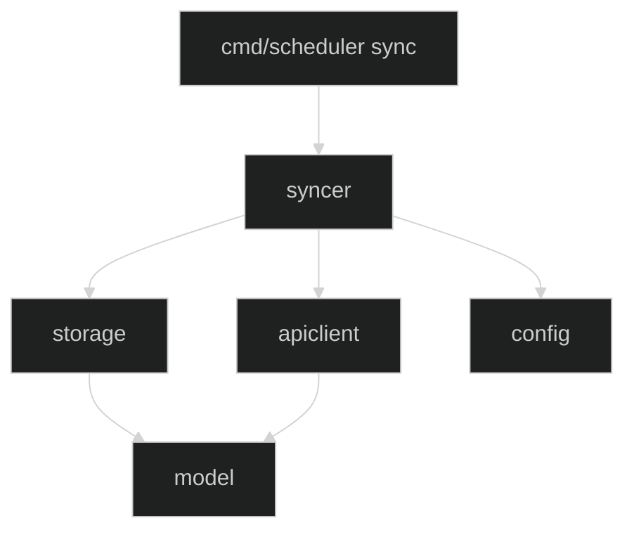

# Part 2 細部設計：Patch 1 — 清單 Sync（L1 + L2）

> **對應開發階段**：Patch 1
> **前置條件**：Patch 0 完成（config、model、storage schema、init CLI）
> **驗收標準**：`scheduler sync --config config.yaml` 成功從 API 抓取活動清單並寫入 DB；二次執行顯示「無變化」

---

## 1. 範圍與目標

### 交付物

| 項目                   | 說明                                                              |
| ---------------------- | ----------------------------------------------------------------- |
| config 擴充            | 新增 `API` 區塊（BaseURL / Region / Headers），擴充驗證規則       |
| config LookupChannelID | 查詢 channelName → @channel_id 對應                               |
| storage CRUD           | 實作 `ActivityStore` + `SyncStateStore` 兩個 Interface 的所有方法 |
| apiclient 模組（新增） | 呼叫 LINE event-wall API、分頁遍歷、回應反序列化                  |
| syncer 模組（新增）    | L1 + L2 Hash 差異偵測、Sync 編排邏輯                              |
| cmd/scheduler sync     | CLI 子命令：載入 config → 初始化依賴 → 執行 Sync → 輸出摘要       |

### 不在範圍內

- L3 Hash（詳細頁 HTML 解析與 keywords 寫入）— Patch 2
- 推播通知 — Patch 3
- Bot 指令介面 — Patch 5
- `activities.type` 回填（Patch 2，本 Patch 所有新活動 type 固定為 `unknown`）

### Patch 大小判斷標準

> 設計文件超過 **500 行** / 單元測試超過 **50 個** / 超過 **5 個模組** / 預估超過 **2 天**

本 Patch 涉及 5 個模組（config 擴充 + storage CRUD + apiclient + syncer + cmd/scheduler sync），為上限值。

---

## 2. 上下文與約束

### Config 擴充（Patch 1 新增欄位）

在 Patch 0 的 `Config` struct 基礎上新增 `API` 區塊：

```go
// Patch 1 新增
type Config struct {
    Database       DatabaseConfig       `yaml:"database"`
    ChannelMapping ChannelMappingConfig  `yaml:"channel_mapping"`
    API            APIConfig             `yaml:"api"`        // ← Patch 1 新增
}

type APIConfig struct {
    BaseURL string      `yaml:"base_url"` // API 端點 URL，必填
    Region  string      `yaml:"region"`   // 地區碼（如 "tw"），必填
    Headers HeadersConfig `yaml:"headers"`
}

type HeadersConfig struct {
    Origin    string `yaml:"origin"`     // 必填
    Referer   string `yaml:"referer"`    // 必填
    UserAgent string `yaml:"user-agent"` // 必填
}
```

Patch 1 的 config.yaml 新增區塊：

```yaml
api:
  base_url: "https://ec-bot-web.line-apps.com/event-wall/home"
  region: "tw"
  headers:
    origin: "https://event.line.me"
    referer: "https://event.line.me/bulletin/tw"
    user-agent: "Mozilla/5.0 (Windows NT 10.0; Win64; x64) AppleWebKit/537.36 (KHTML, like Gecko) Chrome/131.0.0.0 Safari/537.36"
```

Patch 1 新增的驗證規則（在 `Validate()` 中擴充）：

| 欄位                     | 驗證規則     |
| ------------------------ | ------------ |
| `api.base_url`           | 不可為空字串 |
| `api.region`             | 不可為空字串 |
| `api.headers.origin`     | 不可為空字串 |
| `api.headers.referer`    | 不可為空字串 |
| `api.headers.user-agent` | 不可為空字串 |

`Validate()` 為**單一統一方法**，驗證所有已定義欄位（database.path + api.*）。
`init` 與 `sync` 共用同一個 `Validate()`。
因此 Patch 1 之後，執行 `init` 也需要 config.yaml 中有完整的 `api` 區塊。
這符合 `init` 的定位：「**初始化 DB schema 並確認整份配置可正確載入**」。

### API 回應結構

LINE Event-Wall API 的真實回應格式（已在 design-part1.md §2 定義）：

```json
{
    "status": "OK",
    "timestamp": 1772606390725,
    "result": {
        "dataList": [
            {
                "eventId": "SnSqz5xDKxyDaCtv",
                "eventTitle": "202603拿到大獎超開心",
                "channelName": "LINE 購物",
                "clickUrl": "https://buy.line.me/u/article/617684?...",
                "eventStartTime": "2026-03-01 00:00:00",
                "eventEndTime": "2026-03-31 23:59:59",
                "imageUrl": "https://ec-bot-obs.line-scdn.net/...",
                "promotionLabelNameList": [],
                "joined": false
            },
            ...
        ],
        "pageToken": "CD98nAez..."
    }
}
```

**分頁機制**：
- 第一頁不帶 `pageToken` 參數
- 每頁回傳約 10 筆活動
- `result.pageToken` 非 null → 帶入下一次請求
- `result.pageToken` 為 null → 已取完所有活動

### 三層 Hash 差異偵測（本 Patch 實作 L1 + L2）

本系統使用三層 Hash 機制減少不必要的 API 呼叫與 DB 寫入。
**本 Patch 僅實作 L1 與 L2**，L3 為 Patch 2 的詳細頁解析範圍。

| 層級 | sync_state key 格式    | Hash 輸入內容                                        | 用途                         |
| ---- | ---------------------- | ---------------------------------------------------- | ---------------------------- |
| L1   | `"activity_list"`      | 所有活動 ID 排序後串接，取 SHA-256                   | 偵測活動清單是否有增減       |
| L2   | `"activity:{eventId}"` | 單筆活動的關鍵欄位組合，取 SHA-256                   | 偵測單筆活動基本資料是否變更 |
| L3   | `"detail:{eventId}"`   | 活動詳細頁關鍵字區塊 HTML，取 SHA-256（**Patch 2**） | 偵測關鍵字排程是否變更       |

**L1 Hash 計算方式**：
將 API 回傳的所有 eventId 按字母排序後，以 `|` 串接，取 SHA-256 hex 字串。與 L2 統一使用 `|` 作為分隔符。

**L2 Hash 計算方式**：
將單筆活動的以下欄位以 `|` 串接，取 SHA-256 hex 字串：
`eventId|eventTitle|channelName|clickUrl|eventStartTime|eventEndTime`

---

## 3. 模組分解

### 模組依賴與實作順序



實作順序：config 擴充 → storage CRUD → apiclient → syncer → cmd/scheduler sync

---

### 3.1 config 擴充 — API 設定與 LookupChannelID

**新增職責**：
- 載入 `api` 區塊設定，驗證 5 個新增必填欄位
- 提供 `LookupChannelID` 方法，查詢 channelName → @channel_id

#### LookupChannelID

Syncer 在 Upsert 活動前呼叫此方法，以 API 回傳的 `channelName` 查詢對應的 `@channel_id`。

```go
// LookupChannelID 在 Mappings 中查詢 channelName 對應的 channel_id。
// 回傳 (channelID, true) 表示找到對應；("", false) 表示無對應。
func (cm *ChannelMapping) LookupChannelID(channelName string) (string, bool) {
    id, ok := cm.Mappings[channelName]
    return id, ok
}
```

#### 行為契約（新增部分）

**Validate 擴充**

| #   | 場景                     | 規則                         |
| --- | ------------------------ | ---------------------------- |
| V1  | `api.base_url` 為空      | error 含 `api.base_url`      |
| V2  | `api.region` 為空        | error 含 `api.region`        |
| V3  | `api.headers.*` 任一為空 | error 含具體 header 欄位路徑 |

**LookupChannelID**

| #   | 場景                        | 規則                              |
| --- | --------------------------- | --------------------------------- |
| K1  | channelName 存在於 Mappings | 回傳對應的 channel_id 字串與 true |
| K2  | channelName 不在 Mappings   | 回傳空字串與 false                |

#### 單元測試案例（新增部分）

| #   | 案例                          | 衍生自 | 驗證重點                          |
| --- | ----------------------------- | ------ | --------------------------------- |
| 1   | 合法 config 含 API 區塊       | V1-V3  | API 欄位正確解析                  |
| 2   | `api.base_url` 為空           | V1     | error 含 `api.base_url`           |
| 3   | `api.region` 為空             | V2     | error 含 `api.region`             |
| 4   | `api.headers.origin` 為空     | V3     | error 含 `api.headers.origin`     |
| 5   | `api.headers.referer` 為空    | V3     | error 含 `api.headers.referer`    |
| 6   | `api.headers.user-agent` 為空 | V3     | error 含 `api.headers.user-agent` |
| 7   | LookupChannelID 存在          | K1     | 回傳對應值與 true                 |
| 8   | LookupChannelID 不存在        | K2     | 回傳空字串與 false                |

---

### 3.2 storage 擴充 — CRUD 實作

**新增職責**：在 Patch 0 的 `SQLiteStore` 上實作兩個 Interface 的所有方法。

#### Interface 定義

```go
// ActivityStore 管理活動資料的持久化操作。
type ActivityStore interface {
    UpsertActivity(ctx context.Context, a *model.Activity) error
    GetActivity(ctx context.Context, id string) (*model.Activity, error)
    ListAllActivityIDs(ctx context.Context) ([]string, error)
    MarkInactive(ctx context.Context, ids []string) error
    CleanExpired(ctx context.Context, cutoff time.Time) (int64, error)
}

// SyncStateStore 管理同步狀態的 Hash 存取。
type SyncStateStore interface {
    GetHash(ctx context.Context, key string) (string, error)
    SetHash(ctx context.Context, key string, hash string, syncedAt time.Time) error
    UpdateSyncedAt(ctx context.Context, key string, syncedAt time.Time) error
}
```

#### 行為契約 — ActivityStore

**UpsertActivity**

使用 `INSERT ... ON CONFLICT(id) DO UPDATE SET` 實現 upsert。
UPDATE 子句中**刻意排除 type 欄位**（type 由 Patch 2 的 htmlparser 管理）。

| #   | 場景               | 判斷條件                   | 行為                                                                      |
| --- | ------------------ | -------------------------- | ------------------------------------------------------------------------- |
| U1  | 全新活動           | DB 中該 ID 不存在          | INSERT 完整記錄，type 為傳入值（通常 `unknown`），is_active 設為 1        |
| U2  | 既有活動資料更新   | DB 中該 ID 存在且 active   | UPDATE title / channelName / channelID / pageURL / validFrom / validUntil |
| U3  | 已消失活動重新出現 | DB 中該 ID 存在且 inactive | 恢復 is_active=1，更新基本欄位                                            |

U2、U3 共同約束：**不可覆寫 type 與 created_at**。

**GetActivity**

| #   | 場景      | 結果                                      |
| --- | --------- | ----------------------------------------- |
| G1  | ID 存在   | 回傳完整 Activity struct                  |
| G2  | ID 不存在 | 回傳 sentinel error `ErrActivityNotFound` |

**ListAllActivityIDs**

| #   | 場景   | 結果                                 |
| --- | ------ | ------------------------------------ |
| A1  | 有資料 | 回傳所有 ID 的字串 slice，按字母升序 |
| A2  | 無資料 | 回傳空 slice（`[]string{}`，非 nil） |

**MarkInactive**

| #   | 場景                 | 行為                                       |
| --- | -------------------- | ------------------------------------------ |
| I1  | ID 列表含有效 ID     | 存在的 ID 設 is_active=0；其他活動不受影響 |
| I2  | ID 列表為空          | 不執行 SQL，不回傳 error                   |
| I3  | ID 列表含不存在的 ID | 存在的被標記；不存在的靜默忽略             |

**CleanExpired**

| #   | 場景       | 行為                                   | 回傳     |
| --- | ---------- | -------------------------------------- | -------- |
| E1  | 有過期活動 | DELETE 過期活動（CASCADE 刪 keywords） | 刪除數量 |
| E2  | 無過期活動 | 不執行                                 | 0        |

#### 行為契約 — SyncStateStore

**GetHash**

| #   | 場景       | 結果                                             |
| --- | ---------- | ------------------------------------------------ |
| H1  | Key 存在   | 回傳 hash 字串                                   |
| H2  | Key 不存在 | 回傳空字串 `""`，**無 error**（空 = 從未同步過） |

**SetHash**

| #   | 場景     | 行為                          |
| --- | -------- | ----------------------------- |
| S1  | 新 key   | INSERT key + hash + synced_at |
| S2  | 既有 key | UPDATE hash 與 synced_at      |

**UpdateSyncedAt**

僅更新 synced_at 時間戳，**不改變 hash 值**。
用途：L1 Hash 比對無變化時，僅更新時間戳記錄「已確認過沒變」。

| #   | 場景       | 行為                            |
| --- | ---------- | ------------------------------- |
| T1  | Key 存在   | 僅更新 synced_at；hash 維持不變 |
| T2  | Key 不存在 | 不執行，不報錯                  |

#### 不變量

- UpsertActivity 完成後，該活動的 is_active 必為 1
- UpsertActivity 永遠不修改 type 和 created_at
- MarkInactive 完成後，被標記的 ID 的 is_active 必為 0
- CleanExpired 完成後，不存在 valid_until < cutoff 的 activities 記錄

#### 單元測試案例

> 使用 in-memory SQLite `:memory:`，每案例獨立建庫。
> **驗證重要欄位值，不可僅驗證筆數。**

| #   | 案例                    | 衍生自 | 驗證重點                                                       |
| --- | ----------------------- | ------ | -------------------------------------------------------------- |
| 1   | Upsert 新活動           | U1     | is_active=1；type 為傳入值；title、channelName、validFrom 正確 |
| 2   | Upsert 更新既有         | U2     | title 為新值；type 仍為原值（未被覆寫）；created_at 未變       |
| 3   | Upsert 恢復 inactive    | U3     | is_active 恢復為 1；type 仍為原值                              |
| 4   | Get 存在                | G1     | 逐欄位比對 ID / Title / ChannelName / Type / PageURL           |
| 5   | Get 不存在              | G2     | `ErrActivityNotFound`                                          |
| 6   | ListIDs 有資料          | A1     | 驗證具體 ID 值與排序正確性                                     |
| 7   | ListIDs 空 DB           | A2     | 空 slice，非 nil                                               |
| 8   | MarkInactive 正常       | I1     | 目標 is_active=0；其他活動仍為 1                               |
| 9   | MarkInactive 空列表     | I2     | 無操作，無 error                                               |
| 10  | MarkInactive 含不存在ID | I3     | 存在的被標記；不報錯                                           |
| 11  | CleanExpired 有過期     | E1     | 過期刪除；未過期仍在且欄位正確                                 |
| 12  | CleanExpired 無過期     | E2     | 回傳 0                                                         |
| 13  | SetHash 新 key          | S1     | GetHash 確認回傳正確 hash                                      |
| 14  | SetHash 更新            | S2     | GetHash 確認回傳更新後 hash                                    |
| 15  | GetHash 不存在          | H2     | 回傳 `""`，無 error                                            |
| 16  | UpdateSyncedAt 存在     | T1     | synced_at 更新；hash 不變                                      |
| 17  | UpdateSyncedAt 不存在   | T2     | 不報錯                                                         |

---

### 3.3 apiclient — LINE API 呼叫

**職責**：封裝 LINE event-wall API 的 HTTP 呼叫與回應反序列化。
負責分頁遍歷取得所有活動，並將 API 回應轉換為 `model.Activity` slice。

#### 依賴注入設計

apiclient 透過 Interface 抽象 HTTP 層，以便單元測試使用 Mock：

```go
// HTTPClient 抽象 HTTP 請求。使用 Interface 以便測試時注入 Mock。
type HTTPClient interface {
    Do(req *http.Request) (*http.Response, error)
}

// Client 封裝 LINE event-wall API 的呼叫邏輯。
type Client struct {
    httpClient HTTPClient
    baseURL    string
    region     string
    headers    config.HeadersConfig
}
```

#### API 回應 struct

```go
type apiResponse struct {
    Status string    `json:"status"`
    Result apiResult `json:"result"`
}

type apiResult struct {
    DataList  []apiActivity `json:"dataList"`
    PageToken *string       `json:"pageToken"` // null = 最後一頁
}

type apiActivity struct {
    EventID        string `json:"eventId"`
    EventTitle     string `json:"eventTitle"`
    ChannelName    string `json:"channelName"`
    ClickURL       string `json:"clickUrl"`
    EventStartTime string `json:"eventStartTime"` // "2006-01-02 15:04:05"
    EventEndTime   string `json:"eventEndTime"`   // "2006-01-02 15:04:05"
}
```

#### 資料流

```
FetchAll(ctx) 完整呼叫流程：

  1. 建構第一頁請求 URL：
     → {baseURL}?region={region}
     → 設定 HTTP Headers（origin / referer / user-agent）

  2. 發送 GET 請求 → 讀取 response body → json.Unmarshal 為 apiResponse
     → HTTP 狀態碼非 200 → 回傳 error
     → JSON 解析失敗 → 回傳 error
     → status 欄位非 "OK" → 回傳 error

  3. 將 apiActivity 轉換為 model.Activity：
     → eventId → ID
     → eventTitle → Title
     → channelName → ChannelName
     → clickUrl → PageURL
     → eventStartTime → ValidFrom（解析 "2006-01-02 15:04:05" 格式）
     → eventEndTime → ValidUntil（同上）
     → ChannelID 由呼叫端（Syncer）透過 LookupChannelID 填入，apiclient 不處理
     → Type 固定為 "unknown"
     → IsActive 固定為 true

  4. 檢查 pageToken：
     → 非 null → 帶入 pageToken 參數，回到步驟 2
     → null → 收集完成，回傳所有活動的 []model.Activity

  5. 若某一頁請求失敗，整個 FetchAll 回傳 error（不做部分回傳）
```

#### 行為契約

| #   | 場景               | 規則                                       |
| --- | ------------------ | ------------------------------------------ |
| F1  | 正常回應（單頁）   | 回傳所有活動，欄位正確映射                 |
| F2  | 正常回應（多頁）   | 自動遍歷所有頁面，回傳合併後的完整活動清單 |
| F3  | HTTP 非 200        | 回傳 error，訊息含 HTTP 狀態碼             |
| F4  | JSON 解析失敗      | 回傳 error，訊息含 `failed to decode`      |
| F5  | status 欄位非 "OK" | 回傳 error，訊息含實際 status 值           |
| F6  | 時間格式解析失敗   | 回傳 error，訊息含具體欄位與解析錯誤       |
| F7  | 空 dataList        | 回傳空 slice（非 nil），不報錯             |
| F8  | 網路錯誤           | 回傳 error（透過 HTTPClient.Do 的 error）  |

#### 單元測試案例

> 使用 `net/http/httptest` 建立 mock server，或注入 mock HTTPClient。

| #   | 案例          | 衍生自 | 驗證重點                                                   |
| --- | ------------- | ------ | ---------------------------------------------------------- |
| 1   | 單頁正常回應  | F1     | 活動數量正確；逐欄位驗證 ID/Title/ChannelName/ValidFrom 等 |
| 2   | 多頁分頁遍歷  | F2     | 自動請求第 2 頁；合併後活動數 = 兩頁之和                   |
| 3   | HTTP 500 錯誤 | F3     | error 含狀態碼                                             |
| 4   | 非法 JSON     | F4     | error 含 `failed to decode`                                |
| 5   | status 非 OK  | F5     | error 含 status 值                                         |
| 6   | 時間格式錯誤  | F6     | error 含解析錯誤                                           |
| 7   | 空 dataList   | F7     | 空 slice，非 nil                                           |

---

### 3.4 syncer — Sync 編排引擎

**職責**：接收 apiclient 回傳的活動清單，執行 L1 + L2 Hash 差異偵測，決定哪些活動需要 Upsert，哪些需要標記為 inactive。不含 L3 邏輯（Patch 2）。

#### 依賴注入設計

```go
// Syncer 編排 Sync 流程，透過 Interface 注入依賴以便測試。
type Syncer struct {
    activityStore  storage.ActivityStore
    syncStateStore storage.SyncStateStore
    apiClient      APIFetcher             // Interface 抽象 apiclient
    channelMapping *config.ChannelMapping
}

// APIFetcher 抽象 API 呼叫，以便測試時注入 Mock。
type APIFetcher interface {
    FetchAll(ctx context.Context) ([]model.Activity, error)
}
```

#### 資料流（完整 Sync 流程）

```
Sync(ctx) 流程：

  ┌─ 1. 呼叫 apiclient.FetchAll(ctx) 取得所有活動
  │     → 失敗 → 回傳 error（整個 Sync 中止）
  │
  ├─ 2. 計算 L1 Hash
  │     → 將所有活動 ID 排序 → 以 "|" 串接 → SHA-256
  │     → 與 sync_state["activity_list"] 比對
  │
  ├─ 2a. L1 無變化：
  │     → 呼叫 UpdateSyncedAt("activity_list", now)
  │     → 輸出 "L1 unchanged, skipping"
  │     → 結束（回傳 SyncResult{Unchanged: true}）
  │
  ├─ 2b. L1 有變化：
  │     → 繼續步驟 3
  │
  ├─ 3. 找出消失的活動 ID
  │     → DB 中的 IDs（ListAllActivityIDs）- API 回傳的 IDs = 消失的 IDs
  │     → 呼叫 MarkInactive(消失的 IDs)
  │
  ├─ 4. 逐一處理每筆活動（L2 比對）
  │     → 計算 L2 Hash：eventId|eventTitle|channelName|clickUrl|startTime|endTime
  │     → 與 sync_state["activity:{eventId}"] 比對
  │     │
  │     ├─ 4a. L2 無變化：跳過此筆
  │     │
  │     └─ 4b. L2 有變化：
  │           → 透過 LookupChannelID(channelName) 填入 ChannelID
  │           → 呼叫 UpsertActivity(activity)
  │           → 呼叫 SetHash("activity:{eventId}", l2Hash, now)
  │           → 計數 added++ 或 updated++
  │
  ├─ 5. 更新 L1 Hash
  │     → 呼叫 SetHash("activity_list", l1Hash, now)
  │
  ├─ 6. 清除過期活動
  │     → 呼叫 CleanExpired(ctx, today)
  │
  └─ 7. 回傳 SyncResult{Added, Updated, Deactivated, Expired, Unchanged}
```

#### SyncResult 輸出結構

```go
// SyncResult 代表一次 Sync 的執行結果摘要。
type SyncResult struct {
    Added       int  // 新增的活動數
    Updated     int  // 更新的活動數
    Deactivated int  // 標記為 inactive 的活動數
    Expired     int  // 清除過期的活動數
    Unchanged   bool // L1 Hash 無變化，跳過所有處理
}
```

#### 行為契約

| #   | 場景                     | 規則                                                      |
| --- | ------------------------ | --------------------------------------------------------- |
| Y1  | 首次 Sync（DB 為空）     | 全部活動 INSERT；SyncResult.Added = 活動數                |
| Y2  | L1 無變化                | 不執行任何 DB 寫入（除 UpdateSyncedAt）；Unchanged = true |
| Y3  | L1 有變化，L2 部分有變化 | 僅 Upsert L2 有變化的活動；無變化的跳過                   |
| Y4  | 活動從 API 消失          | 消失的 ID 被 MarkInactive；其他活動不受影響               |
| Y5  | API 呼叫失敗             | 整個 Sync 回傳 error，不寫入任何資料                      |
| Y6  | 單筆 Upsert 失敗         | 回傳 error（本 Patch 不做部分容錯，整體中止）             |
| Y7  | 有過期活動               | CleanExpired 刪除過期活動；SyncResult.Expired = 刪除數    |
| Y8  | ChannelMapping 查無對應  | ChannelID 設為空字串，活動仍正常寫入                      |

#### 單元測試案例

> 使用 Mock 注入 ActivityStore、SyncStateStore、APIFetcher，不呼叫真實 API 或 DB。

| #   | 案例                    | 衍生自 | 驗證重點                                                         |
| --- | ----------------------- | ------ | ---------------------------------------------------------------- |
| 1   | 首次 Sync（空 DB）      | Y1     | FetchAll 被呼叫；所有活動 UpsertActivity；SetHash 被呼叫         |
| 2   | L1 無變化               | Y2     | UpdateSyncedAt 被呼叫；UpsertActivity 未被呼叫；Unchanged = true |
| 3   | L1 有變化，L2 部分變化  | Y3     | 僅 L2 有變化的活動呼叫 UpsertActivity；無變化的跳過              |
| 4   | 活動消失                | Y4     | MarkInactive 被呼叫，傳入正確的消失 ID 列表                      |
| 5   | API 呼叫失敗            | Y5     | Sync 回傳 error；UpsertActivity 未被呼叫                         |
| 6   | 過期活動清除            | Y7     | CleanExpired 被呼叫；SyncResult.Expired 正確                     |
| 7   | ChannelMapping 查無對應 | Y8     | 活動仍 Upsert；ChannelID 為空字串                                |

---

### 3.5 cmd/scheduler sync — CLI 子命令

**職責**：定義 `sync` Cobra 子命令，組裝 apiclient、storage、config、syncer 的依賴，執行 Sync 並輸出結果摘要。

#### 檔案結構

```
cmd/scheduler/cli/
├── root.go          # 根命令（Patch 0 已存在）
├── init.go          # init 子命令（Patch 0 已存在）
├── sync.go          # sync 子命令（本 Patch 新增）
└── sync_test.go     # sync 子命令單元測試
```

#### 資料流

```
使用者執行：scheduler sync --config config.yaml

  main.go：
    1. signal.NotifyContext → ctx
    2. cli.Execute(ctx) → Cobra 解析到 sync 子命令

  cli/sync.go（runSync 函數）：
    3. 載入 config.yaml → Config struct
       → Validate() 驗證所有必填欄位（database.path + api.*）
       → 失敗 → error，退出碼 1

    4. 載入 channel_mapping.yaml → ChannelMapping
       → 失敗 → error，退出碼 1

    5. 初始化 SQLiteStore（sync 自足，不依賴 init）
       → 呼叫 NewSQLiteStore(ctx, dbPath)：建立 DB + schema（IF NOT EXISTS）
       → defer Store.Close()

    6. 建構 apiclient.Client
       → 注入 http.DefaultClient、config.API 設定

    7. 建構 syncer.Syncer
       → 注入 Store（as ActivityStore + SyncStateStore）
       → 注入 apiclient.Client（as APIFetcher）
       → 注入 ChannelMapping

    8. 執行 syncer.Sync(ctx)
       → 回傳 SyncResult 或 error

    9. 輸出結果摘要至 stdout：
       → Unchanged: "Sync complete: no changes detected."
       → 有變化:    "Sync complete: added=2, updated=1, deactivated=0, expired=0"
```

#### 行為契約

| #   | 場景                | 退出碼 | 輸出                            |
| --- | ------------------- | ------ | ------------------------------- |
| C1  | sync 成功（有變化） | 0      | stdout 含 `Sync complete`       |
| C2  | sync 成功（無變化） | 0      | stdout 含 `no changes detected` |
| C3  | config 載入失敗     | 1      | stderr 含具體 error             |
| C4  | API 呼叫失敗        | 1      | stderr 含具體 error             |

#### 單元測試案例

> 測試 `runSync(ctx, opts)` 函數。由於涉及真實 HTTP 呼叫，此處僅測試組裝與錯誤處理路徑。
> Sync 的核心邏輯在 syncer 模組中已測試。

| #   | 案例                | 衍生自 | 驗證重點                  |
| --- | ------------------- | ------ | ------------------------- |
| 1   | config 檔案不存在   | C3     | error 含 `failed to read` |
| 2   | config API 欄位為空 | C3     | error 含 `api.base_url`   |

---

## 4. TDD 開發順序

| 步驟 | 模組          | 🔴 RED       | 🟢 GREEN                                 | 🔵 REFACTOR                    |
| ---- | ------------- | ----------- | --------------------------------------- | ----------------------------- |
| 1    | config        | §3.1 #1-#8  | Validate 擴充 + LookupChannelID         | —                             |
| 2    | storage       | §3.2 #1-#17 | ActivityStore + SyncStateStore 所有方法 | SQL 提取為 const              |
| 3    | apiclient     | §3.3 #1-#7  | FetchAll + 分頁遍歷 + 欄位映射          | 提取 `buildURL` / `parseTime` |
| 4    | syncer        | §3.4 #1-#7  | L1/L2 Hash 計算 + Sync 編排             | 提取 Hash 計算為獨立函數      |
| 5    | cmd/scheduler | §3.5 #1-#2  | sync 子命令 + runSync                   | —                             |

> 單元測試總計 **43 個**（config 8 + storage 17 + apiclient 7 + syncer 7 + cmd 2 + Patch 0 既有 19）。
> 其中本 Patch 新增 **41 個**，在 50 個上限內。

---

## 5. 驗收標準

| 項目        | 方法                                        | 通過條件                                            |
| ----------- | ------------------------------------------- | --------------------------------------------------- |
| 單元測試    | `mise run test`                             | 全部通過，覆蓋率 ≥ **90%**                          |
| Lint        | `mise run lint`                             | golangci-lint v2 零 warning                         |
| Build       | `mise run build`                            | 成功產出 `bin/scheduler`                            |
| Sync 執行   | `./bin/scheduler sync --config config.yaml` | activities 表有資料；stdout 含 `Sync complete`      |
| 冪等性驗證  | 連續執行兩次 sync                           | 第二次 stdout 含 `no changes detected`              |
| Init 不退化 | `./bin/scheduler init --config config.yaml` | 仍正常運作；config 需含 api 區塊（Validate 已擴充） |
