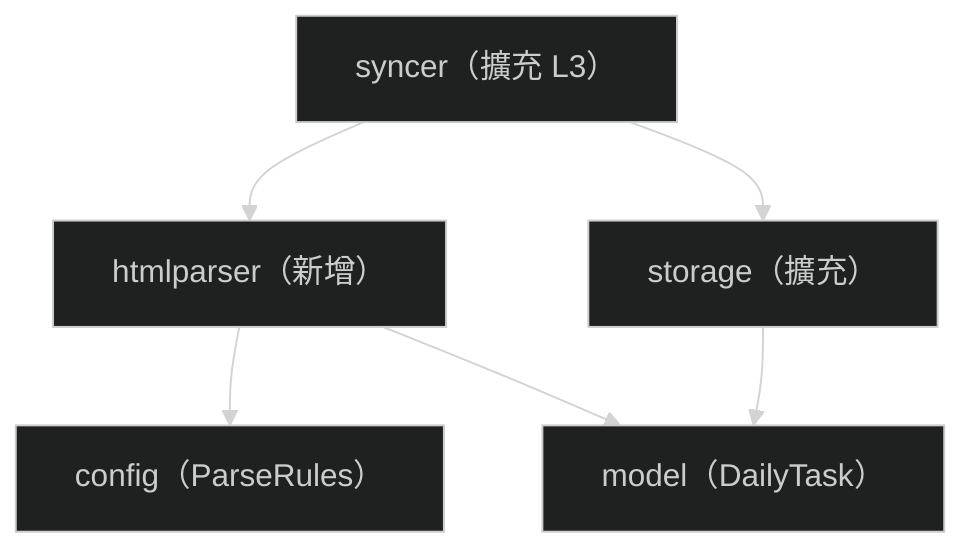

# Part 3 細部設計：Patch 2 — 詳細頁解析（L3）

> **對應開發階段**：Patch 2
> **前置條件**：Patch 1 完成（apiclient、storage CRUD、syncer L1+L2、sync CLI）
> **驗收標準**：`scheduler sync` 執行後，`activities.type` 正確分類，`daily_tasks` 表有逐日任務資料

---

## 1. 範圍與目標

### 交付物

| 項目                    | 說明                                                                        |
| ----------------------- | --------------------------------------------------------------------------- |
| config 擴充             | 新增 `ParserConfig`（rules_path）+ `LoadParseRules` 函數                    |
| model 變更              | `Keyword` → `DailyTask`（新增 URL 欄位）                                    |
| storage 擴充            | Schema 變更 + `UpdateType` / `UpdateActionURL` + `DailyTaskStore` Interface |
| htmlparser 模組（新增） | 配置驅動的規則式 HTML 解析，判定活動類型並提取逐日任務                      |
| syncer 擴充             | L3 流程：poll 前篩 + HTML 解析 + 回填 type/action_url + L3 Hash + 寫入任務  |

### 不在範圍內

- 推播通知（Patch 3）、GitHub Actions（Patch 4）、Bot（Patch 5）
- AI/LLM fallback（Patch 6，本 Patch 僅使用規則式解析）

### Patch 大小判斷標準

> 設計文件 ≤500 行 / 單元測試 ≤50 個 / 模組 ≤5 個 / 預估 ≤2 天

本 Patch 涉及 5 個模組（config + model + storage + htmlparser + syncer），為上限值。

---

## 2. 上下文與約束

### 活動類型體系（9 種）

| type           | 說明           | 需寫入 daily_tasks | 有 action_url  |
| -------------- | -------------- | ------------------ | -------------- |
| `keyword`      | 關鍵字任務     | ✅（關鍵字+連結）   | ❌（多連結）    |
| `share`        | 分享好友拿獎勵 | ❌                  | ✅              |
| `passport`     | 購物護照開通   | ❌                  | ✅              |
| `shop-collect` | 收藏指定店家   | ✅（每日店家連結）  | ❌（多連結）    |
| `lucky-draw`   | 點我試手氣     | ❌                  | ✅              |
| `app-checkin`  | App 簽到       | ❌                  | ✅              |
| `poll`         | 投票           | ❌                  | ✅（=clickURL） |
| `other`        | 無法辨識       | ❌                  | ❌              |
| `unknown`      | 尚未解析       | —                  | —              |

- `keyword` / `shop-collect`：有逐日任務項目 → 寫入 `daily_tasks` 表
- `share` / `passport` / `lucky-draw` / `app-checkin` / `poll`：單一操作連結 → 存入 `activities.action_url`
- 僅 `keyword` / `shop-collect` 需要 L3 Hash（偵測逐日清單是否異動）

### parse_rules.yaml — 配置驅動的判定規則

```yaml
# config/parse_rules.yaml

rules:
  - type: keyword
    text_patterns: ["輸入關鍵字", "指定關鍵字", "完整關鍵字"]
    url_pattern: "line.me/R/oaMessage/"
    has_daily_tasks: true
    has_keyword: true

  - type: share
    text_patterns: ["分享連結"]
    url_pattern: "event.line.me/s/"

  - type: passport
    text_patterns: ["LINE購物護照"]
    url_pattern: "ec-bot-web.line.me"

  - type: shop-collect
    text_patterns: ["收藏指定店家"]
    url_pattern: "buy.line.me/u/partner/"
    has_daily_tasks: true

  - type: lucky-draw
    text_patterns: ["點我試手氣", "點我*試手氣"]   # * = 萬用字元
    url_pattern: "event.line.me/r/"

  - type: app-checkin
    text_patterns: ["點我簽到", "App簽到"]
    url_pattern: "buy.line.me"

  - type: poll
    url_pattern: "event.line.me/poll/"
    url_only: true          # 僅需 URL pattern，跳過 HTML 抓取
    use_click_url: true     # action_url = clickURL

# 鄰近文字日期提取 pattern
date_patterns:
  - '(\d{1,2})[月/](\d{1,2})[日]?'   # 3月1日、3/1、03/05
  - '^(\d{2})(\d{2})'                  # 0301（關鍵字文字開頭 MMDD）
```

**text_patterns 萬用字元 `*`**：
- 不含 `*`：`strings.Contains(pageText, pattern)`（子字串比對）
- 含 `*`：拆分前後兩段，驗證兩段依序出現在文字中
- 例：`"點我*試手氣"` 比對 `"點我週三試手氣"` → ✅ 符合

**配置 vs 程式碼分工**：

| 放配置（YAML）                             | 留在程式碼                  |
| ------------------------------------------ | --------------------------- |
| type 名稱、text_patterns、url_pattern      | HTML DOM 遍歷與連結提取邏輯 |
| has_daily_tasks / url_only / use_click_url | 鄰近文字定位策略            |
| date_patterns 正則表達式                   | 日期正則匹配與年份推斷      |
| `*` 萬用字元語法                           | 萬用字元拆分與序列比對實作  |

### Schema 變更

**activities 表 — 新增 `action_url` 欄位**：

```sql
CREATE TABLE IF NOT EXISTS activities (
    -- ...既有欄位...
    action_url    TEXT,          -- Patch 2 新增：單連結活動的操作 URL
    created_at    DATETIME NOT NULL DEFAULT CURRENT_TIMESTAMP,
    updated_at    DATETIME NOT NULL DEFAULT CURRENT_TIMESTAMP
);
```

**keywords 表 → daily_tasks 表（重新命名 + 擴充）**：

```sql
CREATE TABLE IF NOT EXISTS daily_tasks (
    id            INTEGER PRIMARY KEY AUTOINCREMENT,
    activity_id   TEXT NOT NULL REFERENCES activities(id) ON DELETE CASCADE,
    use_date      DATE NOT NULL,
    keyword       TEXT,          -- keyword 類型有值；shop-collect 為空
    url           TEXT,          -- oaMessage 連結 或 店家連結
    note          TEXT
);
```

> 開發階段，直接修改 `storage.go` 的 schema SQL 即可。既有測試使用 in-memory DB 不受影響。

### 鄰近文字日期提取策略

不做頁面全域掃描，改為**針對已識別連結的鄰近文字**做局部日期提取：

```
對每個從頁面中提取到的目標連結：

  1. 取連結所在 DOM 元素的父容器文字（<li>、<tr>、<p>）

  2. 在該段文字中套用 date_patterns（按優先序）：
     → "3月5日請輸入：" → month=3, day=5 ✅
     → "3/5：收藏店家"  → month=3, day=5 ✅

  3. 若步驟 2 未匹配，且為 keyword 類型：
     → 從關鍵字文字開頭提取 MMDD
     → "0305美食扭蛋機" → month=3, day=5 ✅

  4. 年份推斷：使用活動 ValidFrom 年份
     → 若 month < ValidFrom.Month → 年份 +1（跨年）
```

### poll 前篩機制

poll 的 clickURL 本身就是投票頁面，不需要 HTML 抓取：

```
L3 前篩：
  → 檢查活動 clickURL 是否符合 parse_rules 中的 url_pattern 且 use_click_url=true 的規則
  → 符合 → type=poll, action_url=clickURL，跳過 HTML 抓取
  → 不符合 → 進入正常 HTML 解析流程
```

### TaskHTML 提取規則

TaskHTML 用於 L3 Hash 計算，需精確反映逐日任務清單的變化，且不受頁面裝飾性變更影響。

```
提取流程（僅 has_daily_tasks=true 的類型）：

  1. 找到頁面中所有 href 符合 rule.url_pattern 的 <a> 標籤

  2. 對每個匹配的 <a>，取其最近的區塊級父元素
     （優先選最小容器：<li> > <tr> > <p> > <div>）

  3. 提取該父元素的 outerHTML

  4. 將所有父元素的 outerHTML 按文件順序串接

  5. 串接結果 = TaskHTML
```

**為什麼取父元素而非只取 `<a>` 本身**：
日期文字通常在 `<a>` 的同一個容器裡，例如：
```html
<li>3月5日請輸入：<a href="line.me/R/oaMessage/...">0305美食扭蛋機</a></li>
```
取 `<li>` 的 outerHTML 同時涵蓋日期與連結。這樣：
- 關鍵字/連結變更 → L3 Hash 變 → 觸發更新 ✅
- 日期調整 → 同上 ✅
- 頁面其他區域變更（裝飾、獎品說明）→ 不影響 L3 Hash ✅

### L3 Hash

僅 `has_daily_tasks=true` 的類型（keyword / shop-collect）需要 L3 Hash。
sync_state key：`"detail:{eventId}"`，Hash 輸入 = TaskHTML 取 SHA-256 hex。

### HTTP 請求禮貌性

- 逐筆 HTML 請求之間延遲 1 秒
- 使用與 API 相同的 Headers（origin / referer / user-agent）
- HTTP 超時 10 秒

---

## 3. 模組分解

### 模組依賴與實作順序



實作順序：config 擴充 → model 變更 → storage 擴充 → htmlparser → syncer 擴充

---

### 3.1 config 擴充 — ParserConfig + LoadParseRules

**新增職責**：
- Config struct 新增 `Parser` 欄位
- 新增 `LoadParseRules` 函數載入 parse_rules.yaml
- Validate 擴充：`parser.rules_path` 不可為空

#### 新增 struct

```go
type ParserConfig struct {
    RulesPath string `yaml:"rules_path"` // parse_rules.yaml 路徑，必填
}

type ParseRules struct {
    Rules        []TypeRule `yaml:"rules"`
    DatePatterns []string   `yaml:"date_patterns"`
}

type TypeRule struct {
    Type           string   `yaml:"type"`
    TextPatterns   []string `yaml:"text_patterns"`
    URLPattern     string   `yaml:"url_pattern"`
    HasDailyTasks  bool     `yaml:"has_daily_tasks"`
    URLOnly        bool     `yaml:"url_only"`
    UseClickURL    bool     `yaml:"use_click_url"`
}
```

#### 單元測試案例

| #   | 案例                  | 驗證重點                              |
| --- | --------------------- | ------------------------------------- |
| 1   | 合法 parse_rules.yaml | Rules 長度正確；各欄位正確解析        |
| 2   | rules_path 為空       | Validate error 含 `parser.rules_path` |
| 3   | 檔案不存在            | error 含 `failed to read`             |

---

### 3.2 model 變更 + storage 擴充

#### model 變更

`Keyword` struct → `DailyTask`，新增 `URL` 欄位：

```go
type DailyTask struct {
    ID         int64
    ActivityID string
    UseDate    time.Time
    Keyword    string    // keyword 類型有值
    URL        string    // oaMessage / 店家連結
    Note       string
}
```

#### storage 新增 Interface

```go
// ActivityStore 擴充
type ActivityStore interface {
    // ...Patch 1 既有方法...
    UpdateType(ctx context.Context, id string, actType string) error
    UpdateActionURL(ctx context.Context, id string, actionURL string) error
}

// DailyTaskStore 管理 daily_tasks 表
type DailyTaskStore interface {
    ReplaceDailyTasks(ctx context.Context, activityID string, tasks []model.DailyTask) error
    GetDailyTasksByDate(ctx context.Context, date time.Time) ([]model.DailyTask, error)
}
```

#### 行為契約 — UpdateType / UpdateActionURL

| #   | 場景      | 行為                            |
| --- | --------- | ------------------------------- |
| UT1 | ID 存在   | 僅更新 type 與 updated_at       |
| UT2 | ID 不存在 | 回傳 error                      |
| UA1 | ID 存在   | 僅更新 action_url 與 updated_at |
| UA2 | ID 不存在 | 回傳 error                      |

#### 行為契約 — DailyTaskStore

**ReplaceDailyTasks**（Transaction 內先刪後插，確保原子性）

| #   | 場景               | 行為                               |
| --- | ------------------ | ---------------------------------- |
| R1  | 有既有 daily_tasks | 先刪全部舊的，再批次插入新的       |
| R2  | 無既有 daily_tasks | 直接插入新的                       |
| R3  | tasks 為空 slice   | 僅刪除既有的（等同清除）           |
| R4  | 任一插入失敗       | Transaction 回滾，既有資料維持不變 |

**GetDailyTasksByDate**

| #   | 場景       | 結果                                  |
| --- | ---------- | ------------------------------------- |
| D1  | 有當日資料 | 回傳所有 DailyTask（含 ActivityID）   |
| D2  | 無當日資料 | 回傳空 slice（`[]model.DailyTask{}`） |

#### 單元測試案例

| #   | 案例                       | 衍生自 | 驗證重點                                      |
| --- | -------------------------- | ------ | --------------------------------------------- |
| 1   | UpdateType 成功            | UT1    | type 更新；其他欄位未變                       |
| 2   | UpdateType ID 不存在       | UT2    | 回傳 error                                    |
| 3   | UpdateActionURL 成功       | UA1    | action_url 正確寫入                           |
| 4   | UpdateActionURL ID 不存在  | UA2    | 回傳 error                                    |
| 5   | ReplaceDailyTasks 新增     | R2     | 逐筆驗證 ActivityID / UseDate / Keyword / URL |
| 6   | ReplaceDailyTasks 取代既有 | R1     | 舊 tasks 消失；新 tasks 正確                  |
| 7   | ReplaceDailyTasks 空 slice | R3     | 既有被清除                                    |
| 8   | GetDailyTasksByDate 有資料 | D1     | 正確筆數與內容                                |
| 9   | GetDailyTasksByDate 無資料 | D2     | 空 slice，非 nil                              |

---

### 3.3 htmlparser — 配置驅動的 HTML 解析

**職責**：抓取活動詳細頁 HTML，依 `parse_rules.yaml` 定義的規則判定類型，
若 `has_daily_tasks=true` 則提取逐日任務項目（關鍵字 / 店家連結）。

#### 依賴注入設計

```go
// HTTPFetcher 抽象 HTML 頁面 HTTP 抓取
type HTTPFetcher interface {
    Fetch(ctx context.Context, url string) ([]byte, error)
}

// Parser 負責解析活動詳細頁
type Parser struct {
    fetcher HTTPFetcher
    rules   *config.ParseRules
}

// ParseResult 代表一次解析結果
type ParseResult struct {
    Type        string            // 判定的活動類型
    ActionURL   string            // 單連結操作 URL（share/passport 等）
    DailyTasks  []model.DailyTask // has_daily_tasks=true 時有值
    TaskHTML    string            // 任務區塊原始 HTML（用於 L3 Hash）
}
```

#### 資料流

```
Parse(ctx, activity) 流程：

  1. 透過 HTTPFetcher 抓取 activity.PageURL 的 HTML
     → 失敗 → 回傳 error

  2. 依 rules 清單逐一比對（先符合先採用）：
     → 對每條 rule：
       a. url_only=true → 僅檢查是否有符合 url_pattern 的 <a> href
       b. url_only=false → 頁面文字含 text_patterns 之一
                           且存在符合 url_pattern 的 <a> href
     → 符合 → 設定 type，提取第一個匹配的 href 作為 ActionURL

  3. 若 has_daily_tasks=true（keyword / shop-collect）：
     → 收集所有符合 url_pattern 的 <a> 連結
     → 對每個連結做鄰近文字日期提取：
       a. 取連結父容器文字 → 套用 date_patterns
       b. keyword 回退：從關鍵字文字開頭提取 MMDD
     → keyword 類型：從 oaMessage URL 解構出 keyword 文字
     → shop-collect 類型：keyword 為空，url = 店家連結
     → 提取任務區塊 HTML（TaskHTML，用於 L3 Hash）

  4. 若都不符合 → type = "other"

  5. 回傳 ParseResult
```

#### oaMessage 連結解構（keyword 類型）

```
URL 格式：https://line.me/R/oaMessage/@{channel_id}/?{關鍵字}

範例：https://line.me/R/oaMessage/@linegiftshoptw/?0304美食扭蛋機
                                   ↑ channel_id       ↑ 關鍵字（URL encoded）

解構步驟：
  1. 從 path 提取 channel_id："/R/oaMessage/@linegiftshoptw/" → "@linegiftshoptw"
  2. 從 query 提取 keyword：URL decode("0304美食扭蛋機")
  3. 產出 DailyTask{
       Keyword: "0304美食扭蛋機",
       URL:     "https://line.me/R/oaMessage/@linegiftshoptw/?0304美食扭蛋機"
     }

> channel_id 可與 channel_mapping.yaml 交叉驗證對應是否一致。
```

#### 行為契約

| #   | 場景                       | 規則                                           |
| --- | -------------------------- | ---------------------------------------------- |
| P1  | keyword 頁面               | type="keyword"；DailyTasks 含逐日關鍵字+連結   |
| P2  | share 頁面                 | type="share"；ActionURL 含 event.line.me/s/    |
| P3  | passport 頁面              | type="passport"；ActionURL 正確                |
| P4  | shop-collect 頁面          | type="shop-collect"；DailyTasks 含逐日店家連結 |
| P5  | lucky-draw 頁面            | type="lucky-draw"；ActionURL 正確              |
| P6  | app-checkin 頁面           | type="app-checkin"；ActionURL 正確             |
| P7  | poll（由 syncer 前篩處理） | 不經過 htmlparser                              |
| P8  | 都不符合                   | type="other"                                   |
| P9  | HTTP 抓取失敗              | 回傳 error                                     |
| P10 | 日期解析失敗（部分）       | 可解析的照常回傳；無法解析的任務項目忽略       |
| P11 | 空 HTML                    | type="other"                                   |

#### 單元測試案例

> 使用 Mock HTTPFetcher + 預製 HTML + 測試用 ParseRules

| #   | 案例                       | 衍生自 | 驗證重點                                      |
| --- | -------------------------- | ------ | --------------------------------------------- |
| 1   | keyword（oaMessage 連結）  | P1     | DailyTasks 含正確 Keyword + URL；UseDate 正確 |
| 2   | keyword（多個 oaMessage）  | P1     | 多筆 DailyTasks，各自 UseDate 不同            |
| 3   | share 頁面                 | P2     | type="share"；ActionURL 正確                  |
| 4   | passport 頁面              | P3     | type="passport"                               |
| 5   | shop-collect（多店家連結） | P4     | DailyTasks 含多筆店家 URL；Keyword 為空       |
| 6   | lucky-draw 頁面            | P5     | type="lucky-draw"；ActionURL 正確             |
| 7   | app-checkin 頁面           | P6     | type="app-checkin"                            |
| 8   | 無法辨識頁面               | P8     | type="other"                                  |
| 9   | HTTP 抓取失敗              | P9     | 回傳 error                                    |
| 10  | 部分日期解析失敗           | P10    | 可解析的正常回傳；無法解析的被忽略            |
| 11  | 空 HTML                    | P11    | type="other"                                  |
| 12  | TaskHTML 正確提取          | P1     | TaskHTML 含任務區塊原始 HTML                  |
| 13  | 日期跨年推斷               | P1     | 12 月活動中 1 月任務年份 +1                   |

---

### 3.4 syncer 擴充 — L3 流程

**新增依賴**：

```go
type Syncer struct {
    // ...Patch 1 既有...
    dailyTaskStore storage.DailyTaskStore  // ← Patch 2 新增
    htmlParser     HTMLParser              // ← Patch 2 新增
    parseRules     *config.ParseRules      // ← Patch 2 新增（用於 poll 前篩）
}

type HTMLParser interface {
    Parse(ctx context.Context, activity *model.Activity) (*htmlparser.ParseResult, error)
}
```

#### L3 流程（插入在 L2 之後、更新 L1 Hash 之前）

```
  ├─ 4.5 L3 流程
  │
  │  篩選：type == "unknown" 或 type == "keyword" 或 type == "shop-collect"
  │  其他已確認類型 → 跳過
  │
  │  對每筆活動：
  │  │
  │  ├─ a. Poll 前篩
  │  │     → clickURL 符合 use_click_url 規則？
  │  │     → 是 → UpdateType("poll") + UpdateActionURL(clickURL)，跳過 HTML
  │  │
  │  ├─ b. 呼叫 htmlParser.Parse(ctx, activity)
  │  │     → 失敗 → log warning，跳過（部分容錯）
  │  │
  │  ├─ c. 若 type 有變更 → UpdateType
  │  │
  │  ├─ d. 若有 ActionURL → UpdateActionURL
  │  │
  │  ├─ e. 若 has_daily_tasks 且有 DailyTasks：
  │  │     → 計算 L3 Hash（TaskHTML 取 SHA-256）
  │  │     → 比對 sync_state["detail:{eventId}"]
  │  │     ├─ 無變化 → 跳過
  │  │     └─ 有變化 → ReplaceDailyTasks + SetHash
  │  │
  │  └─ f. 延遲 1 秒
```

#### 錯誤處理

| 層級 | 策略     | 原因                                |
| ---- | -------- | ----------------------------------- |
| L1   | 整體中止 | API 失敗 = 無法取得任何資料         |
| L2   | 整體中止 | DB 異常                             |
| L3   | 部分容錯 | HTML 抓取失敗不應影響其他活動的同步 |

#### SyncResult 擴充

```go
type SyncResult struct {
    // ...Patch 1 既有...
    Parsed      int  // L3 成功解析的活動數
    ParseErrors int  // L3 解析失敗的活動數
}
```

#### 行為契約（L3）

| #   | 場景                                          | 規則                                         |
| --- | --------------------------------------------- | -------------------------------------------- |
| L1  | unknown → keyword，有 daily_tasks             | UpdateType + ReplaceDailyTasks + SetHash     |
| L2  | unknown → share，有 ActionURL                 | UpdateType + UpdateActionURL                 |
| L3  | unknown → poll（前篩命中）                    | UpdateType + UpdateActionURL，Parse 未被呼叫 |
| L4  | keyword 活動，L3 Hash 無變化                  | 不重寫 daily_tasks                           |
| L5  | keyword 活動，L3 Hash 有變化                  | ReplaceDailyTasks + SetHash                  |
| L6  | shop-collect，有 daily_tasks                  | UpdateType + ReplaceDailyTasks + SetHash     |
| L7  | HTML 抓取失敗                                 | log warning；跳過；type 不變                 |
| L8  | 已確認類型（非 unknown/keyword/shop-collect） | 跳過 L3                                      |
| L9  | L1 無變化時                                   | 不執行 L3                                    |

#### 單元測試案例

| #   | 案例                            | 衍生自 | 驗證重點                                         |
| --- | ------------------------------- | ------ | ------------------------------------------------ |
| 1   | unknown → keyword + daily_tasks | L1     | UpdateType + ReplaceDailyTasks + SetHash 被呼叫  |
| 2   | unknown → share + ActionURL     | L2     | UpdateType + UpdateActionURL 被呼叫              |
| 3   | poll 前篩命中                   | L3     | Parse 未被呼叫；action_url = clickURL            |
| 4   | keyword，L3 Hash 無變化         | L4     | ReplaceDailyTasks 未被呼叫                       |
| 5   | keyword，L3 Hash 有變化         | L5     | ReplaceDailyTasks 被呼叫                         |
| 6   | shop-collect + daily_tasks      | L6     | ReplaceDailyTasks 被呼叫；Keyword 為空、URL 有值 |
| 7   | HTML 抓取失敗（部分容錯）       | L7     | Sync 不回傳 error；ParseErrors 正確              |
| 8   | 已確認類型跳過 L3               | L8     | Parse 未被呼叫                                   |
| 9   | L1 無變化不執行 L3              | L9     | Parse 未被呼叫                                   |

---

## 4. TDD 開發順序

| 步驟 | 模組            | 🔴 RED       | 🟢 GREEN                                             | 🔵 REFACTOR       |
| ---- | --------------- | ----------- | --------------------------------------------------- | ---------------- |
| 1    | config          | §3.1 #1-#3  | ParserConfig + LoadParseRules                       | —                |
| 2    | model + storage | §3.2 #1-#9  | Schema 變更 + UpdateType/ActionURL + DailyTaskStore | SQL 提取為 const |
| 3    | htmlparser      | §3.3 #1-#13 | 配置驅動解析 + 日期提取 + oaMessage 解構            | —                |
| 4    | syncer          | §3.4 #1-#9  | poll 前篩 + L3 流程整合                             | —                |

> 本 Patch 新增單元測試 **34 個**（config 3 + storage 9 + htmlparser 13 + syncer 9），在 50 個上限內。

---

## 5. 驗收標準

| 項目            | 方法                                        | 通過條件                                     |
| --------------- | ------------------------------------------- | -------------------------------------------- |
| 單元測試        | `mise run test`                             | 全部通過，覆蓋率 ≥ **90%**                   |
| Lint            | `mise run lint`                             | golangci-lint v2 零 warning                  |
| Build           | `mise run build`                            | 成功產出 `bin/scheduler`                     |
| Sync + L3 執行  | `./bin/scheduler sync --config config.yaml` | activities.type 有正確分類                   |
| DailyTasks 驗證 | sync 後查 DB                                | daily_tasks 表有逐日任務資料（keyword+連結） |
| ActionURL 驗證  | sync 後查 DB                                | share/passport 等活動的 action_url 有值      |
| 冪等性驗證      | 連續執行兩次 sync                           | 第二次 L3 Hash 無變化，不重寫 daily_tasks    |
| Patch 1 不退化  | sync 基本流程                               | L1+L2 功能正常                               |
