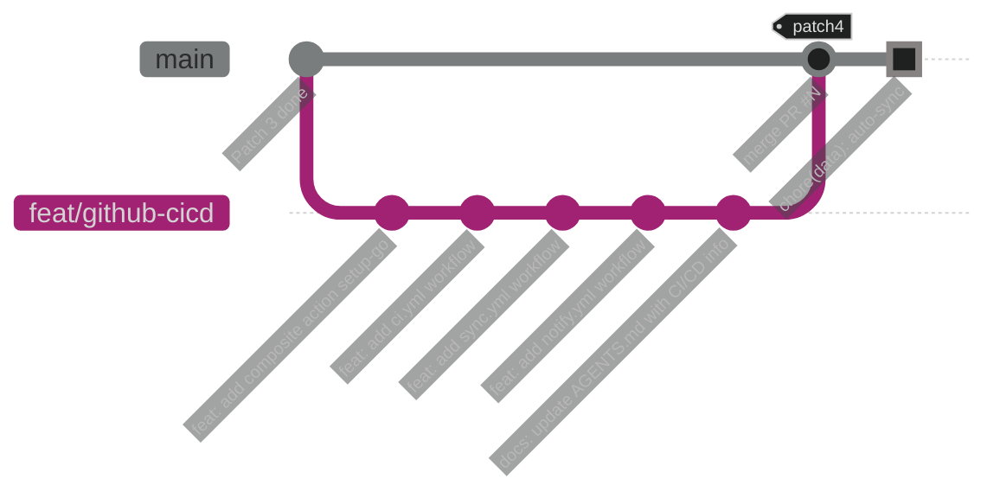

# GitHub 配置指南

> 以下為在 GitHub 上啟用 CI/CD 所需的手動配置步驟，請依序完成。

## 1. 設定 GitHub Secrets

前往 **GitHub Repo → Settings → Secrets and variables → Actions → New repository secret**，依序新增：

| 順序 | Secret 名稱                 | 值來源                                                |
| ---- | --------------------------- | ----------------------------------------------------- |
| 1    | `DISCORD_BOT_TOKEN`         | 從本機 `.env` 中的 `DISCORD_BOT_TOKEN` 值複製         |
| 2    | `DISCORD_GUILD_ID`          | 從本機 `.env` 中的 `DISCORD_GUILD_ID` 值複製          |
| 3    | `DISCORD_NOTIFY_CHANNEL_ID` | 從本機 `.env` 中的 `DISCORD_NOTIFY_CHANNEL_ID` 值複製 |
| 4    | `DISCORD_ADMIN_CHANNEL_ID`  | 從本機 `.env` 中的 `DISCORD_ADMIN_CHANNEL_ID` 值複製  |
| 5    | `GMAIL_CREDENTIALS_JSON`    | 將本機 `credentials.json` 檔案**完整內容**貼入        |
| 6    | `GMAIL_TOKEN_JSON`          | 將本機 `token.json` 檔案**完整內容**貼入              |

> **操作提示**：可使用 `cat credentials.json | pbcopy`（macOS）或 `cat credentials.json | xclip`（Linux）快速複製檔案內容。

## 2. 確認 Workflow 權限

前往 **GitHub Repo → Settings → Actions → General → Workflow permissions**：

1. 選擇 **Read and write permissions**（sync.yml 需要 push 權限）
2. 勾選 **Allow GitHub Actions to create and approve pull requests**（可選，目前不需要）
3. 點擊 **Save**

> `GITHUB_TOKEN` 為 GitHub 自動注入，安全且無需額外管理，不必另建 PAT。

## 3. 確認 Branch Protection（選配）

若 `main` 分支已啟用 **Branch Protection Rules**，需確認以下設定：

- **Require status checks to pass before merging**：勾選，並加入 `CI` check（ci.yml 的 job name）
- **Include administrators**：視需求決定是否對管理者也強制執行
- **Allow force pushes**：**不建議**開啟（sync commit-back 使用一般 push）

> 如果尚未設定 Branch Protection，可於 CI 驗證通過後再啟用。

## 4. 驗證 Secrets 設定正確性

在 **GitHub Repo → Settings → Secrets and variables → Actions** 頁面確認 6 個 Secrets 都已新增，Secret 名稱無拼字錯誤。

> Secret 值新增後無法再查看內容，若不確定是否正確可選擇 **Update** 重新貼入。

---

## 5. Git 分支策略

### 5.1 Patch 4 開發流程



### 5.2 分支命名與操作步驟

1. **從 `main` 切出開發分支**：
   ```bash
   git checkout main
   git pull origin main
   git checkout -b feat/github-cicd
   ```

2. **按 TDD 順序提交**（每個 Workflow 一個 commit）：
   ```bash
   # Step 1: Composite Action
   git add .github/actions/
   git commit -m "feat: add composite action setup-go"

   # Step 2: CI Pipeline
   git add .github/workflows/ci.yml
   git commit -m "feat: add ci.yml with lint, test, and build"

   # Step 3: Sync Workflow
   git add .github/workflows/sync.yml
   git commit -m "feat: add sync.yml with cron schedule and db commit-back"

   # Step 4: Notify Workflow
   git add .github/workflows/notify.yml
   git commit -m "feat: add notify.yml with cron schedule and date input"

   # Step 5: Documentation
   git add AGENTS.md docs/
   git commit -m "docs: update AGENTS.md and add design-cicd.md"
   ```

3. **Push 並開 PR**：
   ```bash
   git push -u origin feat/github-cicd
   ```
   - 於 GitHub 開啟 PR：`feat/github-cicd` → `main`
   - PR Title：`feat: GitHub Actions CI/CD 與排程自動化`
   - 此時 `ci.yml` 會自動觸發 CI 檢查（第一次驗證）

4. **CI 通過後合併**：
   - 確認 CI 全綠（lint + unit test + integration test + build）
   - 使用 **Squash and merge** 或 **Create a merge commit**（依團隊慣例）
   - 合併後 `sync.yml` 與 `notify.yml` 的 Cron 排程開始生效

5. **合併後驗證**：
   - 手動觸發 `sync.yml`（§8 驗證步驟 2）
   - 手動觸發 `notify.yml`（§8 驗證步驟 3）
   - 確認排程 Cron 正常執行（可於隔日檢查 Actions 歷史）
