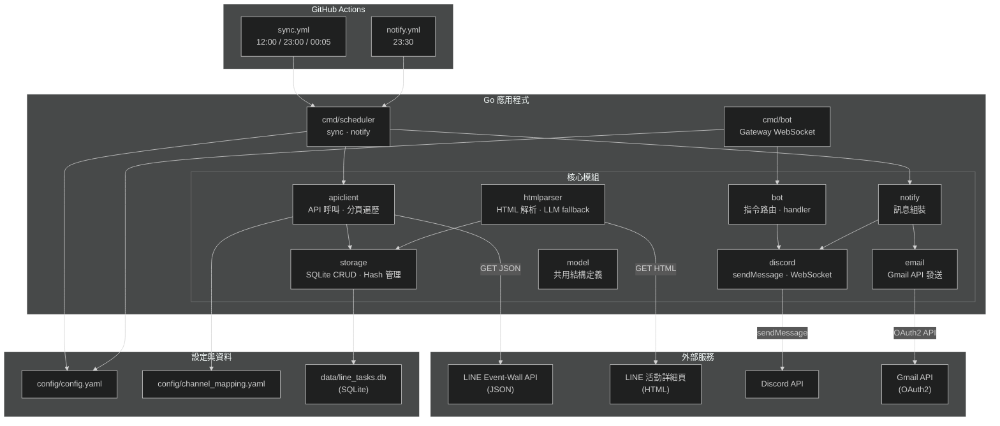
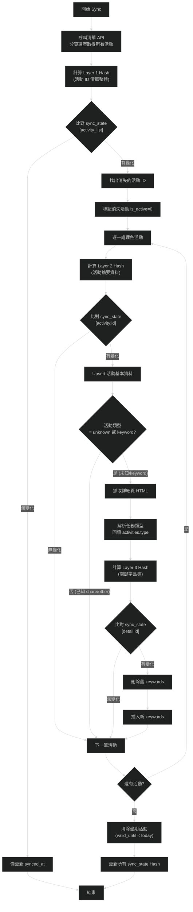
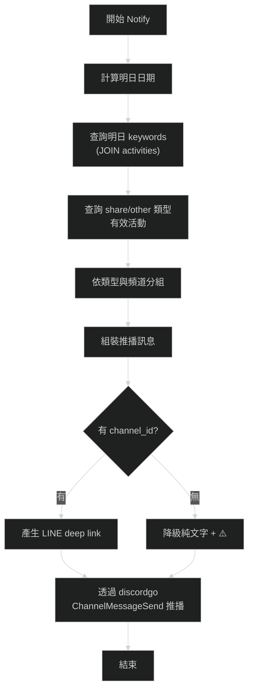
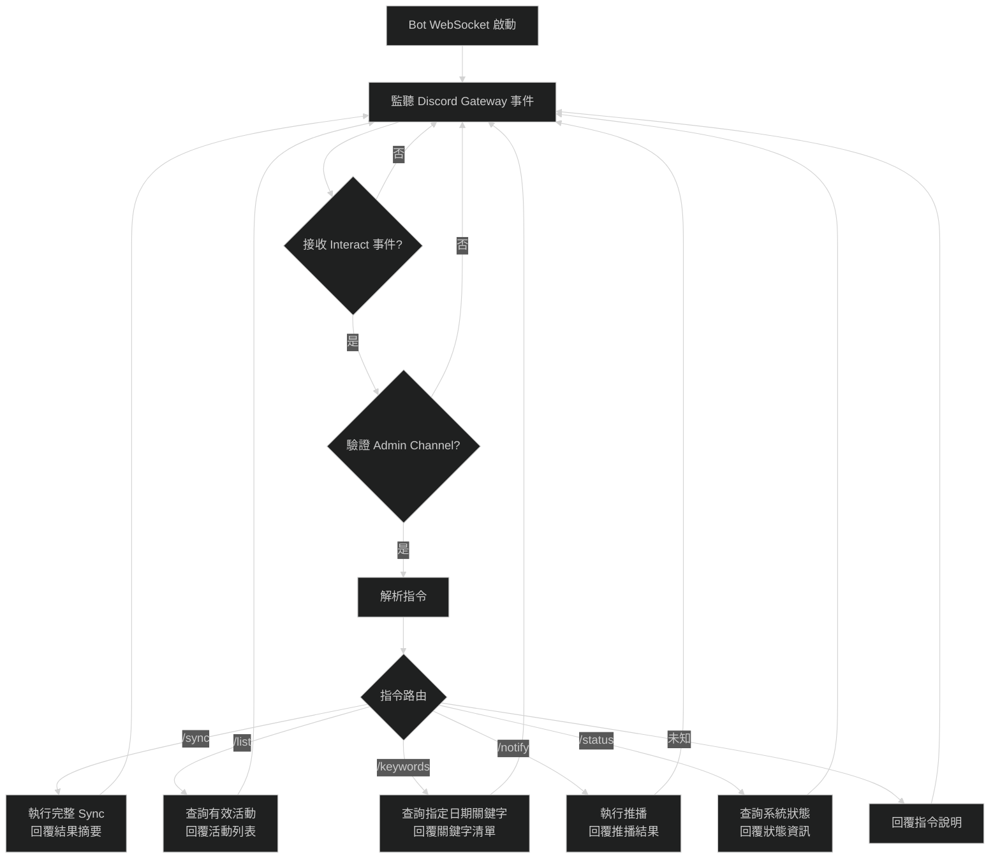
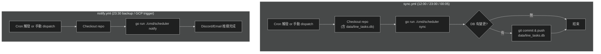
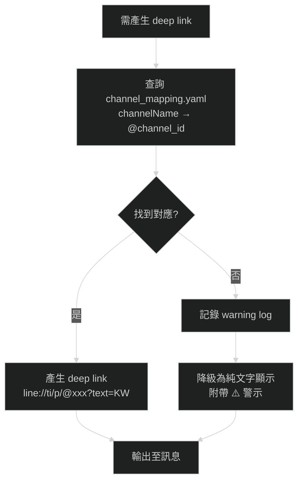

# LINE 活動集點任務爬蟲與推播系統 — 需求規格文件

> **版本**: v1.1
> **最後更新**: 2026-03-03

---

## 一、專案背景

LINE 平台在台灣定期舉辦各種集點、關鍵字回饋、分享抽獎等行銷活動，使用者需每日手動前往 LINE 活動牆頁面查看當日可參與的活動，並逐一開啟對應官方帳號輸入關鍵字或完成分享任務。此過程繁瑣且容易遺漏。

本專案旨在開發一套自動化爬蟲與推播系統，定期從 LINE 活動牆後端 API 抓取最新活動資訊，解析各活動的任務類型與關鍵字排程，並於每日固定時段透過 Telegram Bot 推播隔日任務清單（含可直接點擊的 LINE deep link），讓使用者一鍵完成任務。

---

## 二、專案說明

### 核心目標

1. **自動同步活動資料**：定時從 LINE event-wall JSON API 擷取活動清單，並解析活動詳細頁 HTML 取得關鍵字排程。
2. **三層 Hash 差異偵測**：透過分層雜湊比對機制，最小化不必要的重複抓取與解析。
3. **多管道推播通知**：將明日任務清單（含 LINE deep link）同時透過 Discord 與 Email (Gmail API) 推播。
4. **Discord Bot 指令介面**：提供互動式查詢與手動觸發功能（指定 Admin 頻道）。
5. **GitHub Actions 自動化**：排程觸發 Sync 與 Notify 流程，DB 檔案自動 commit-back 持久化。

### 關鍵設計決策

- **JSON API 優先**：活動清單透過 LINE 後端 JSON API 取得（非 HTML 爬取），穩定性高、不需 Headless Browser。
- **HTML 解析僅用於詳細頁**：活動詳細頁的關鍵字排程需透過 HTML 解析取得，此處為 AI fallback 最有價值的應用場景。
- **SQLite 單檔儲存**：純 Go driver（`modernc.org/sqlite`，免 CGO），單一 `.db` 檔案方便 Git 管理。
- **Channel Mapping 配置檔**：因 API 僅回傳 `channelName` 顯示名稱，需透過手動維護的 `channel_mapping.yaml` 對應至 `@channel_id` 以產生 LINE deep link。

---

## 三、技術棧

| 類別            | 技術選型                      | 說明                                        |
| --------------- | ----------------------------- | ------------------------------------------- |
| 程式語言        | Go (Golang)                   | 遵循 `golang-standards/project-layout` 標準 |
| CLI 框架        | `cobra`                       | 子命令架構（init / sync / notify）          |
| HTTP 客戶端     | `net/http`                    | 呼叫 LINE API 與 Discord API                |
| HTML 解析       | `goquery` 或等效              | 解析活動詳細頁 HTML                         |
| 資料庫          | SQLite                        | 使用 `modernc.org/sqlite`（純 Go、免 CGO）  |
| 設定檔          | YAML                          | `config.yaml` + `channel_mapping.yaml`      |
| 通知推播        | Discord Bot API (`discordgo`) | `ChannelMessageSend` 等，支援 Markdown 格式 |
| 通知推播        | Email (Gmail API)             | `google.golang.org/api/gmail/v1` (OAuth2)   |
| 排程自動化      | GitHub Actions                | Cron 排程觸發 sync / notify                 |
| Bot 部署        | Render free tier / 本機       | WebSocket Gateway (常駐模式)                |
| AI 強化（選配） | OpenAI / Ollama               | 詳細頁關鍵字抽取的 LLM fallback             |
| 程式碼品質      | `golangci-lint` / `gofumpt`   | Lint + format 規範                          |

---

## 四、高階架構圖



---

## 五、主要功能模組

### 5.1 活動同步模組（Sync）— `apiclient` + `storage`

**功能說明**：
定期從 LINE event-wall API 擷取活動清單，透過三層 Hash 差異偵測機制判斷資料是否變更，僅對有異動的部分進行更新，最小化 API 請求次數與資料庫寫入。

> **注意**：JSON API 回傳的活動清單**不含**任務類型（`type`）與關鍵字。新活動首次寫入時，`type` 設為 `unknown`，需透過 §5.2 詳細頁解析模組抓取 HTML 後回填。

**輸入**：
| 項目                   | 來源          | 說明                                                         |
| ---------------------- | ------------- | ------------------------------------------------------------ |
| API 端點               | 固定值        | `https://ec-bot-web.line-apps.com/event-wall/home?region=tw` |
| HTTP Headers           | `config.yaml` | 必須帶入 `origin`、`referer`、`user-agent`                   |
| `pageToken`            | API 回應      | 分頁游標，第一頁不帶此參數                                   |
| `channel_mapping.yaml` | 設定檔        | `channelName` → `@channel_id` 對應表                         |

**輸出**：
| 項目     | 儲存位置        | 說明                              |
| -------- | --------------- | --------------------------------- |
| 活動記錄 | `activities` 表 | 含 ID、標題、類型、頻道、有效期等 |
| 同步狀態 | `sync_state` 表 | 各層 Hash 值與同步時間戳          |
| 日誌     | stdout          | 同步結果摘要（新增/更新/無變化）  |

**分頁邏輯**：
1. 第一次請求不帶 `pageToken`，取得前 10 筆活動。
2. 回應中包含 `pageToken`，帶入下一次請求以取得後續 10 筆。
3. 當回應的 `pageToken` 為 `null` 時，表示已取完所有活動。

**請求 Header 規格**：
```
origin: https://event.line.me
referer: https://event.line.me/bulletin/tw
user-agent: Mozilla/5.0 (Windows NT 10.0; Win64; x64) AppleWebKit/537.36 ...
```

---

### 5.2 詳細頁解析模組（Parse）— `htmlparser`

**功能說明**：
針對 `type` 為 `unknown`（新活動）或 `keyword`（已知關鍵字活動）的活動，抓取其活動詳細頁 HTML，解析任務類型與逐日關鍵字排程。此頁面結構不固定，為 AI fallback 最有價值的應用場景。

- **`unknown` 類型**：新活動首次進入系統，必須抓取詳細頁以判定任務類型（`keyword` / `share` / `other`），解析後回填 `activities.type`。
- **`keyword` 類型**：已知為關鍵字活動，定期抓取詳細頁以檢查關鍵字排程是否異動（Layer 3 Hash 比對）。
- **`share` / `other` 類型**：已確認為非關鍵字活動，跳過詳細頁抓取。

**輸入**：
| 項目       | 來源            | 說明           |
| ---------- | --------------- | -------------- |
| `page_url` | `activities` 表 | 活動詳細頁 URL |

**輸出**：
| 項目         | 儲存位置          | 說明                                      |
| ------------ | ----------------- | ----------------------------------------- |
| 任務類型     | `activities.type` | `keyword` / `share` / `other` / `unknown` |
| 關鍵字排程   | `daily_tasks` 表  | 每日對應的關鍵字列表                      |
| Layer 3 Hash | `sync_state` 表   | 關鍵字區塊內容雜湊值                      |

---

### 5.3 推播通知模組（Notify）— `notify` + `discord` + `email`

**功能說明**：
查詢明日的任務清單，依任務類型與頻道分組，組裝格式化訊息後透過 **Discord Bot API** 與 **Email（Gmail API）** 雙管道同時推播。每個管道各自擁有 `enabled` 開關，可獨立啟用或停用。

**輸入**：
| 項目             | 來源                   | 說明                                             |
| ---------------- | ---------------------- | ------------------------------------------------ |
| 明日日期         | 系統時間               | 自動計算                                         |
| 活動與關鍵字資料 | SQLite                 | `activities` + `daily_tasks` 表查詢              |
| Discord 設定     | `config.yaml`          | Bot Token、Guild ID、Notify Channel ID           |
| Email 設定       | `config.yaml`          | credentials_path、token_path、寄件者、收件人清單 |
| 頻道對應         | `channel_mapping.yaml` | 產生 deep link 所需                              |

**輸出**：
| 項目         | 目標              | 說明                    |
| ------------ | ----------------- | ----------------------- |
| Discord 訊息 | Notify Channel ID | Markdown 格式的任務清單 |
| Email        | 設定的收件人清單  | HTML 格式的任務清單     |

**訊息格式規格**：
```
📅 03/04 任務清單

━━━━━━━━━━━━━━━━
🔑 關鍵字任務

📣 LINE 購物
  • [輸入：SHOP0304](line://ti/p/@lineshopping?text=SHOP0304)

📣 LINE Pay（⚠️ 頻道未設定）
  • 輸入：PAY0304（請手動開啟頻道）

━━━━━━━━━━━━━━━━
🔗 分享任務

  • [好友分享抽好禮](https://event.line.me/...)
  • [LINE TODAY 分享活動](https://event.line.me/...)

━━━━━━━━━━━━━━━━
📌 其他任務

  • [集點卡任務](https://event.line.me/...)
```

**deep link 格式**：
- 有 `channel_id` 對應時：`https://line.me/R/oaMessage/@{channel_id}/?{keyword}`
- 無 `channel_id` 對應時：降級為純文字顯示關鍵字，並附帶 ⚠️ 警示

---

### 5.4 儲存管理模組（Storage）— `storage`

**功能說明**：
封裝所有 SQLite 資料庫操作，包含 Activity / Keyword / SyncState 的 CRUD、Hash 管理、過期資料清除等。

**輸入**：
| 項目     | 來源          | 說明                         |
| -------- | ------------- | ---------------------------- |
| DB 路徑  | `config.yaml` | 預設 `data/line_tasks.db`    |
| 資料異動 | 各模組呼叫    | Upsert / Delete / Query 操作 |

**輸出**：
| 項目         | 說明                                |
| ------------ | ----------------------------------- |
| 資料查詢結果 | Activity / Keyword / SyncState 結構 |
| 過期清除結果 | 清除 `valid_until < today` 的記錄   |

---

### 5.5 Bot 指令介面模組 — `bot` + `discord`

**功能說明**：
透過 Discord WebSocket Gateway 模式接收使用者指令，提供即時查詢與手動操作觸發功能。
為確保安全，指令接收僅限於配置的 `Admin Channel ID` 內生效。

**輸入**：使用者透過 Discord Admin Channel 發送的指令訊息。

**輸出**：Bot 回覆的格式化訊息。

**指令清單**：

| 指令               | 功能                   | 回應內容                            |
| ------------------ | ---------------------- | ----------------------------------- |
| `/sync`            | 手動觸發完整 Sync      | 同步結果摘要（新增/更新/無變化）    |
| `/list`            | 列出所有有效活動       | 活動清單（類型、頻道、有效期）      |
| `/keywords {mmdd}` | 查詢指定日期關鍵字清單 | 關鍵字列表（省略日期則為明日）      |
| `/notify`          | 手動觸發推播           | 內容同自動推播                      |
| `/status`          | 系統狀態查詢           | 上次 Sync 時間、Hash 狀態、活動筆數 |

**部署方案**：Bot WebSocket Gateway 常駐於 Render free tier 或本機背景執行。

---

### 5.6 GitHub Actions 自動化模組

**功能說明**：
透過 GitHub Actions Cron 排程自動觸發 Sync 與 Notify 流程，並在 DB 有變更時自動 commit-back 至 repo。

#### `sync.yml`
| 排程 (UTC)          | 排程 (TWN) | 用途     |
| ------------------- | ---------- | -------- |
| `0 4 * * *`         | 12:00      | 午間同步 |
| `0 15 * * *`        | 23:00      | 晚間同步 |
| `5 16 * * *`        | 00:05      | 午夜同步 |
| `workflow_dispatch` | —          | 手動觸發 |

**流程**：checkout → `go run ./cmd/scheduler sync` → commit & push `data/line_tasks.db`（若有變更）

#### `notify.yml`
| 排程 (UTC)          | 排程 (TWN) | 用途                                                   |
| ------------------- | ---------- | ------------------------------------------------------ |
| `30 15 * * *`       | 23:30      | 每日推播（Cron 備援；主要由 GCP Cloud Scheduler 觸發） |
| `workflow_dispatch` | —          | 手動觸發 / GCP Cloud Scheduler 外部觸發                |

> **外部排程**：Notify 主要由 GCP Cloud Scheduler 透過 GitHub REST API 觸發 `workflow_dispatch`，使用 Fine-grained PAT 認證（僅 `Actions: Read and write`、限定單一 repo）。

**流程**：checkout → `go run ./cmd/scheduler notify`

**GitHub Secrets 需求**：
- `DISCORD_BOT_TOKEN`：Discord Bot/App Token
- `DISCORD_GUILD_ID`：Discord 伺服器 ID
- `DISCORD_NOTIFY_CHANNEL_ID`：推送每日任務清單的 Channel ID
- `DISCORD_ADMIN_CHANNEL_ID`：接收管理/維運 slash 指令的 Channel ID
- `GMAIL_CREDENTIAL_PATH`：Gmail API 的 `credentials.json` 檔案路徑環境變數
- `GMAIL_TOKEN_PATH`：Gmail API 的 `token.json` 授權檔案路徑環境變數

---

### 5.7 AI 強化模組（選配）— `htmlparser` 擴充

**功能說明**：
為 `htmlparser` 加入 LLM fallback 機制，當規則式解析信心不足時，將頁面關鍵段落送入 LLM 進行關鍵字抽取。

**輸入**：
| 項目      | 來源       | 說明                       |
| --------- | ---------- | -------------------------- |
| HTML 片段 | 活動詳細頁 | 關鍵字區塊原始 HTML        |
| LLM API   | 設定檔     | OpenAI / Ollama 端點與金鑰 |

**輸出**：
| 項目            | 說明                           |
| --------------- | ------------------------------ |
| 關鍵字排程 JSON | `{date: keyword[]}` 結構       |
| 信心評分        | 高信心直接使用，低信心觸發 LLM |
| 異常標記        | 推播訊息附帶 ⚠️ 警示            |

**AI 必要性評估**：

| 場景                            | 必要性     | 說明                                      |
| ------------------------------- | ---------- | ----------------------------------------- |
| 清單 API JSON 解析              | **不需要** | JSON 結構固定                             |
| 關鍵字頁面解析                  | **低**     | 詳細頁有固定 pattern                      |
| 關鍵字異常偵測                  | **中**     | 格式不符預期時先用 regex 驗證，失敗再 LLM |
| 詳細頁 HTML 關鍵字抽取 fallback | **中高**   | 頁面結構不規律時，LLM 最具價值            |

---

## 六、運作流程

### 6.1 完整 Sync 流程



### 6.2 推播通知流程



### 6.3 Bot 指令處理流程



### 6.4 GitHub Actions 自動化流程



### 6.5 Channel Mapping 降級流程



---

## 七、資料庫 Schema

### `activities` 表

```sql
CREATE TABLE activities (
  id            TEXT PRIMARY KEY,           -- 來自 API 的活動唯一 ID
  title         TEXT NOT NULL,
  channel_name  TEXT,                       -- 頻道顯示名稱（來自 API）
  channel_id    TEXT,                       -- LINE 帳號 ID（來自 channel_mapping，可為空）
  type          TEXT,                       -- keyword | share | other | unknown
  page_url      TEXT,
  valid_from    DATE,
  valid_until   DATE,
  is_active     INTEGER NOT NULL DEFAULT 1, -- 0 = 已從清單消失
  created_at    DATETIME NOT NULL DEFAULT CURRENT_TIMESTAMP,
  updated_at    DATETIME NOT NULL DEFAULT CURRENT_TIMESTAMP
);
-- Hash 統一儲存於 sync_state 表（key: "activity:{id}" / "detail:{id}"），
-- 不在 activities 表中冗餘存放。
```

### `daily_tasks` 表

```sql
CREATE TABLE daily_tasks (
  id            INTEGER PRIMARY KEY AUTOINCREMENT,
  activity_id   TEXT NOT NULL REFERENCES activities(id) ON DELETE CASCADE,
  use_date      DATE NOT NULL,              -- 使用日期
  keyword       TEXT NOT NULL,
  note          TEXT
);
```

### `sync_state` 表

```sql
CREATE TABLE sync_state (
  key           TEXT PRIMARY KEY,           -- 索引鍵
  hash          TEXT NOT NULL,              -- 雜湊值
  synced_at     DATETIME NOT NULL           -- 同步時間
);
-- key 範例：
--   "activity_list"      → Layer 1（活動 ID 清單整體 Hash）
--   "activity:{id}"      → Layer 2（各活動摘要 Hash）
--   "detail:{id}"        → Layer 3（詳細頁關鍵字區塊 Hash）
```

---

## 八、目錄結構

```
.
├── cmd/
│   ├── scheduler/          # Sync / Notify CLI 進入點
│   │   ├── main.go         # signal handling + cli.Execute(ctx)
│   │   └── cli/            # Cobra 子命令（每個子命令一個檔案）
│   │       ├── root.go     # root command 定義
│   │       ├── init.go     # init 子命令
│   │       └── sync.go     # sync 子命令（Patch 1+）
│   └── bot/                # Telegram Bot Long Polling 進入點
│       └── main.go
├── internal/
│   ├── apiclient/          # LINE event-wall API 呼叫與分頁遍歷
│   ├── htmlparser/         # 活動詳細頁 HTML 解析（+ LLM fallback）
│   ├── storage/            # SQLite CRUD、Hash 管理、過期清除
│   ├── config/             # 設定載入（Config struct + ChannelMapping）
│   ├── notify/             # 推播訊息組裝（多管道調度）
│   ├── discord/            # Discord API 封裝（sendMessage + WebSocket）
│   ├── email/              # Email Gmail API 封裝（OAuth2）
│   ├── bot/                # Bot 指令路由與 handler
│   └── model/              # 共用資料結構定義
├── config/
│   ├── config.yaml         # 應用程式設定（Telegram token、DB 路徑等）
│   └── channel_mapping.yaml # channelName → @channel_id 對應表
├── data/
│   └── line_tasks.db       # SQLite 資料庫（納入 Git 版控）
├── .github/
│   └── workflows/
│       ├── sync.yml        # Sync 排程
│       └── notify.yml      # Notify 排程
├── docs/
│   └── requirements/
│       └── requirements.md # 本文件
└── go.mod
```

---

## 九、設定檔格式

### `config.yaml`

```yaml
discord:
  enabled: true
  bot_token: "${DISCORD_BOT_TOKEN}"
  guild_id: "${DISCORD_GUILD_ID}"
  notify_channel_id: "${DISCORD_NOTIFY_CHANNEL_ID}"
  admin_channel_id: "${DISCORD_ADMIN_CHANNEL_ID}"

email:
  enabled: true
  credentials_path: "${GMAIL_CREDENTIAL_PATH:-credentials.json}"
  token_path: "${GMAIL_TOKEN_PATH:-token.json}"
  sender: "windyskykarl912@gmail.com"
  recipients:
    - "windyskykarl912@gmail.com"

database:
  path: "data/line_tasks.db"

channel_mapping:
  path: "config/channel_mapping.yaml"

sync:
  cron:
    - "0 4 * * *"   # UTC 04:00 = TWN 12:00
    - "0 15 * * *"   # UTC 15:00 = TWN 23:00
    - "5 16 * * *"   # UTC 16:05 = TWN 00:05

api:
  base_url: "https://ec-bot-web.line-apps.com/event-wall/home"
  region: "tw"
  headers:
    origin: "https://event.line.me"
    referer: "https://event.line.me/bulletin/tw"
    user-agent: "Mozilla/5.0 (Windows NT 10.0; Win64; x64) AppleWebKit/537.36 ..."
```

### `channel_mapping.yaml`

```yaml
# channelName（來自 API）→ LINE channel_id（@xxx）
mappings:
  "LINE 購物": "@lineshopping"
  "LINE Pay": "@linepay"
  "LINE TODAY": "@linetoday"

# 遇到未對應的 channelName 時的行為
on_missing: warn   # warn | skip | error
```

---

## 十、非功能性需求

### 10.1 可靠性

- **三層 Hash 差異偵測**：避免重複處理，減少不必要的 API 呼叫和 DB 寫入。
- **冪等性**：同一份資料重複 Sync 不產生副作用，多次執行結果一致。
- **錯誤容忍**：單一活動解析失敗不影響整體 Sync 流程，記錄錯誤日誌後繼續處理下一筆。

### 10.2 效能

- **分頁遍歷效率**：API 分頁以 10 筆為單位，預期活動總數在百筆以內，全量遍歷應在數秒內完成。
- **差異化更新**：透過 Hash 層級比對，僅對有變更的活動進行資料庫寫入與詳細頁抓取。
- **HTTP 請求禮貌性**：對 LINE API 的請求間隔適當控制，避免觸發速率限制。

### 10.3 可維護性

- **模組化架構**：各模組職責單一，可獨立測試與替換。
- **Table-Driven Tests**：所有單元測試採用 Go 標準 Table-Driven 模式。
- **Interface 隔離**：外部依賴（HTTP 客戶端、DB）透過 Interface 注入，方便 Mock 測試。
- **代碼品質**：通過 `golangci-lint` 檢查（含 `staticcheck`、`gosec`、`govet`）。

### 10.4 可觀測性

- **結構化日誌**：每次 Sync / Notify 輸出明確的操作摘要（新增/更新/無變化/錯誤）。
- **狀態查詢**：透過 `/status` Bot 指令查看上次同步時間、各層 Hash 狀態與活動筆數。

### 10.5 安全性

- **敏感資訊管理**：Discord Bot Token 等私密資訊透過 GitHub Secrets 或環境變數注入，不硬編碼於配置檔。
- **管理權限**：Bot 互動限定在 `DISCORD_ADMIN_CHANNEL_ID` 指明的頻道內，避免未授權操作。
- **Email 認證**：使用 Gmail API 進行 OAuth2 認證（**Production Mode**，refresh token 不受 7 天過期限制），捨棄舊有的 SMTP App Password 降低被攔截的風險，且要求從 `.gitignore` 排除 `credentials.json` 與 `token.json`。
- **外部排程認證**：GCP Cloud Scheduler 使用 GitHub **Fine-grained PAT**（僅授予 `Actions: Read and write`、限定單一 repo、90 天過期定期輪替），最小化憑證洩漏風險。
- **API 偽裝**：HTTP 請求帶入瀏覽器 User-Agent 與正確 origin/referer，避免被封鎖。

### 10.6 可部署性

- **純 Go 編譯**：使用 `modernc.org/sqlite` 免 CGO，支援跨平台編譯。
- **GitHub Actions 自動化**：排程執行（GCP Cloud Scheduler 外部觸發 + GitHub Cron 備援）與 DB 持久化，零人工介入。
- **Bot 部署靈活性**：支援 Render free tier 雲端常駐或本機背景執行。

### 10.7 可擴充性

- **AI 強化（選配）**：htmlparser 預留 LLM fallback 擴充點，不影響核心流程。
- **Channel Mapping 動態擴展**：新增頻道僅需編輯 YAML 配置檔，無需修改代碼。
- **on_missing 策略可配置**：未對應 channelName 時的處理行為（warn / skip / error）可透過設定調整。

---

## 十一、開發階段規劃

> 採用洋蔥式開發策略：每個 Patch 結束都有**可執行、可驗證的成品**。由內而外，核心先行。

| Patch | 名稱                  | 目標                                  | 驗證標準                                                 |
| ----- | --------------------- | ------------------------------------- | -------------------------------------------------------- |
| 0     | 專案骨架與基礎設施    | `go run .` 能跑、config 可讀、DB 可開 | `data/line_tasks.db` 存在，schema 正確，log 顯示啟動成功 |
| 1     | 清單 Sync (L1+L2)     | 從 API 抓活動清單並寫入 DB            | `activities` 表有資料；二次執行顯示「無變化，跳過」      |
| 2     | 詳細頁解析 (L3)       | 解析 HTML 取得任務類型與關鍵字        | `activities.type` 正確分類，`daily_tasks` 表有逐日資料   |
| 3     | 推播通知              | 發送明日任務清單到 Discord + Email    | Discord 與 Email 收到格式正確訊息，deep link 可開啟 LINE |
| 4     | GitHub Actions 自動化 | Sync 與 Notify 全自動                 | Actions 執行成功，DB commit 出現，Discord 自動推播       |
| 5     | Bot 指令介面          | Discord 訊息觸發操作                  | `/status` 回應正確狀態資訊                               |
| 6     | AI 強化（選配）       | LLM fallback 提升容錯率               | 模擬規則解析失敗，LLM 正確補齊關鍵字                     |
