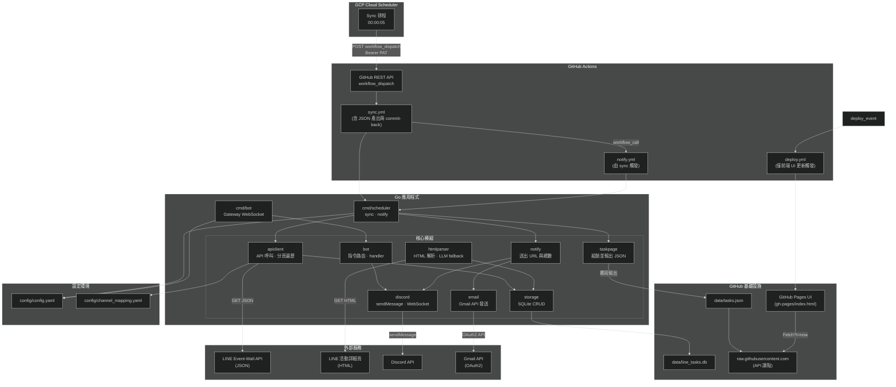
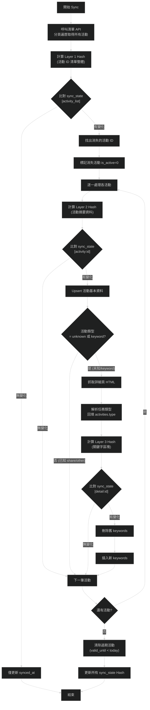
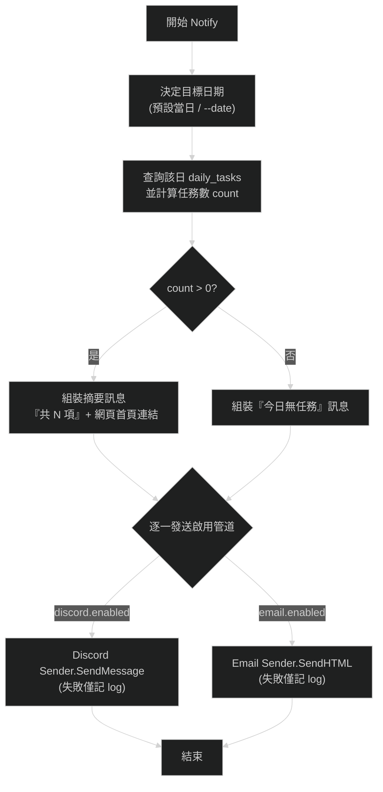
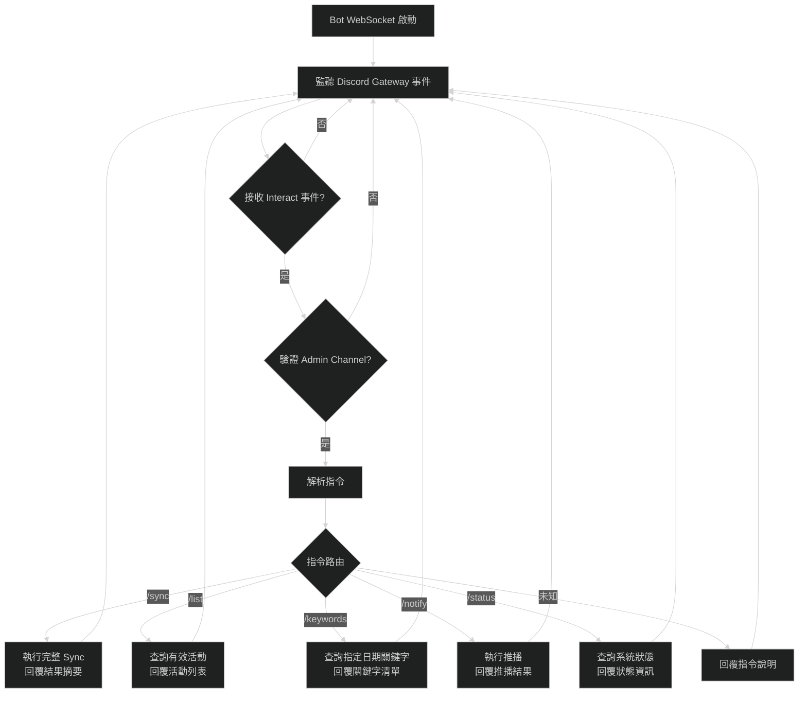
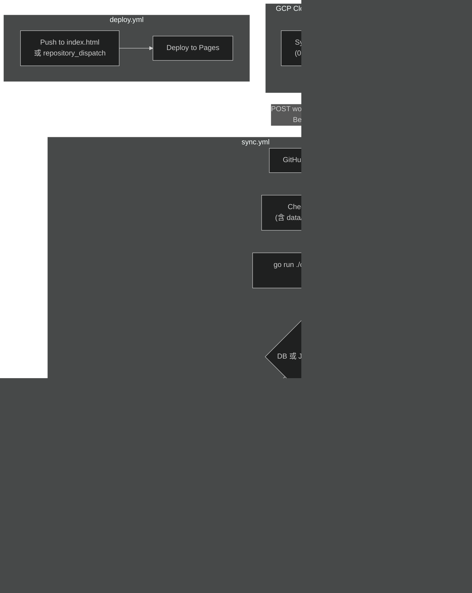
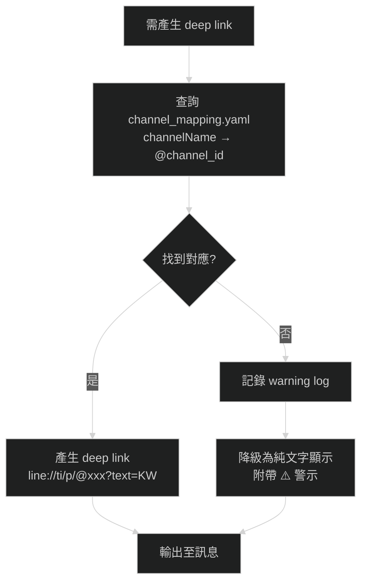

# LINE 活動集點任務爬蟲與推播系統 — 需求規格文件

> **版本**: v1.4
> **最後更新**: 2026-07-03

> **實作狀態（以程式碼為準）**：
> - ✅ **已實作**：`scheduler` CLI（`init` / `sync` / `notify`）、三層 Hash 同步、規則式 HTML 解析（`config/parse_rules.yaml`）、Discord + Email 推播、`tasks.json` 產出與 GitHub Pages 靜態網頁、CI/CD 自動化（`ci.yml` / `sync.yml` / `notify.yml` / `deploy.yml`）。
> - 🚧 **規劃中（尚未實作）**：§5.5 Discord Bot 指令介面（無 `cmd/bot`）、§5.7 AI/LLM fallback。
> - ℹ️ 推播訊息採**精簡摘要**（任務數 + 網頁首頁連結），非全文任務清單（詳見 §5.3）。

---

## 一、專案背景

LINE 平台在台灣定期舉辦各種集點、關鍵字回饋、分享抽獎等行銷活動，使用者需每日手動前往 LINE 活動牆頁面查看當日可參與的活動，並逐一開啟對應官方帳號輸入關鍵字或完成分享任務。此過程繁瑣且容易遺漏。

本專案旨在開發一套自動化爬蟲與推播系統，定期從 LINE 活動牆後端 API 抓取最新活動資訊，解析各活動的任務類型與關鍵字排程，並於每日固定時段透過 **Discord 與 Email** 推播精簡摘要（任務數 + 任務網頁首頁連結）；使用者於網頁上取得可直接點擊的 LINE deep link，一鍵完成任務並追蹤進度。

---

## 二、專案說明

### 核心目標

1. **自動同步活動資料**：定時從 LINE event-wall JSON API 擷取活動清單，並解析活動詳細頁 HTML 取得關鍵字排程。
2. **三層 Hash 差異偵測**：透過分層雜湊比對機制，最小化不必要的重複抓取與解析。
3. **多管道推播通知**：當任務更新時，同時透過 Discord 與 Email 推播「網頁首頁網址」，避免長篇雜亂清單，維持通知乾淨。
4. **Discord Bot 指令介面**：提供互動式查詢與手動觸發功能（指定 Admin 頻道）。
5. **GCP Cloud Scheduler + GitHub Actions 自動化**：由 GCP Cloud Scheduler 定時觸發 Sync，結束後自動部署資料並直接連動 Notify 流程，達成零人工介入。
6. **靜態任務網頁首頁**：產生具有響應式設計的靜態 Web UI，掛載在 GitHub Pages 上讀取 GitHub 第一手 JSON，並於此集中管理與追蹤點擊完成進度。

### 關鍵設計決策

- **JSON API 優先**：活動清單透過 LINE 後端 JSON API 取得（非 HTML 爬取），穩定性高、不需 Headless Browser。
- **HTML 解析僅用於詳細頁**：活動詳細頁的關鍵字排程需透過 HTML 解析取得，此處為 AI fallback 最有價值的應用場景。
- **SQLite 單檔儲存**：純 Go driver（`modernc.org/sqlite`，免 CGO），單一 `.db` 檔案方便 Git 管理。
- **Channel Mapping 配置檔**：因 API 僅回傳 `channelName` 顯示名稱，需透過手動維護的 `channel_mapping.yaml` 對應至 `@channel_id` 以產生 LINE deep link。

---

## 三、技術棧

| 類別            | 技術選型                             | 說明                                         |
| --------------- | ------------------------------------ | -------------------------------------------- |
| 程式語言        | Go (Golang)                          | 遵循 `golang-standards/project-layout` 標準  |
| CLI 框架        | `cobra`                              | 子命令架構（init / sync / notify）           |
| HTTP 客戶端     | `net/http`                           | 呼叫 LINE API 與 Discord API                 |
| HTML 解析       | `goquery` 或等效                     | 解析活動詳細頁 HTML                          |
| 資料庫          | SQLite                               | 使用 `modernc.org/sqlite`（純 Go、免 CGO）   |
| 設定檔          | YAML                                 | `config.yaml` + `channel_mapping.yaml`       |
| 通知推播        | Discord Bot API (`discordgo`)        | `ChannelMessageSend` 傳送更新提醒網址        |
| 通知推播        | Email (Gmail API)                    | 發送更新提醒網址                             |
| 任務網頁前端    | 原生 HTML/JS/CSS                     | 響應式、以 localStorage 紀錄進度             |
| 任務網頁託管    | GitHub Pages                         | 原生靜態網站支援                             |
| 排程自動化      | GCP Cloud Scheduler + GitHub Actions | Cloud Scheduler 定時觸發 `workflow_dispatch` |
| 環境變數 / 日誌 | `godotenv` / `lumberjack`            | `.env` 載入、旋轉式檔案日誌                   |
| Bot 部署（🚧）  | Render free tier / 本機              | WebSocket Gateway 常駐（尚未實作）           |
| AI 強化（🚧）   | OpenAI / Ollama                      | 詳細頁關鍵字抽取的 LLM fallback（尚未實作）  |
| 程式碼品質      | `golangci-lint` / `gofumpt`          | Lint + format 規範                           |

---

## 四、高階架構圖

> 下圖含規劃中元件：`cmd/bot`（`CMD_BOT`）與 `bot` 模組目前**尚未實作**。


```mermaid
%%{init: {'theme':'dark'}}%%
graph TB
    subgraph External["外部服務"]
        LINE_API["LINE Event-Wall API<br/>(JSON)"]
        LINE_PAGE["LINE 活動詳細頁<br/>(HTML)"]
        DISCORD_API["Discord API"]
        GMAIL_API["Gmail API<br/>(OAuth2)"]
    end

    subgraph Scheduler["GCP Cloud Scheduler"]
        CLOUD_SYNC["Sync 排程<br/>00:00:05"]
    end

    subgraph GHA["GitHub Actions"]
        GH_API["GitHub REST API<br/>workflow_dispatch"]
        SYNC_WF["sync.yml<br/>(含 JSON 產出與 commit-back)"]
        NOTIFY_WF["notify.yml<br/>(由 sync 觸發)"]
        DEPLOY_WF["deploy.yml<br/>(僅前端 UI 更新觸發)"]
    end

    subgraph GithubEnv["GitHub 基礎設施"]
        DB["data/line_tasks.db"]
        TASK_JSON["data/tasks.json"]
        PAGE_RAW["raw.githubusercontent.com<br/>(API 讀點)"]
        PAGE_WEB["GitHub Pages UI<br/>(gh-pages/index.html)"]
    end

    subgraph App["Go 應用程式"]
        CMD_SCH["cmd/scheduler<br/>sync · notify"]
        CMD_BOT["cmd/bot<br/>Gateway WebSocket"]

        subgraph Core["核心模組"]
            API_CLIENT["apiclient<br/>API 呼叫 · 分頁遍歷"]
            HTML_PARSER["htmlparser<br/>HTML 解析 · LLM fallback"]
            STORAGE["storage<br/>SQLite CRUD"]
            NOTIFY["notify<br/>送出 URL 與總數"]
            DISCORD["discord<br/>sendMessage · WebSocket"]
            EMAIL["email<br/>Gmail API 發送"]
            BOT["bot<br/>指令路由 · handler"]
            TASKPAGE["taskpage<br/>組裝並輸出 JSON"]
        end
    end

    subgraph Config["設定環境"]
        CONFIG_FILE["config/config.yaml"]
        CHANNEL_MAP["config/channel_mapping.yaml"]
    end

    CLOUD_SYNC -->|"POST workflow_dispatch<br/>Bearer PAT"| GH_API
    GH_API --> SYNC_WF
    SYNC_WF -->|"workflow_call"| NOTIFY_WF
    SYNC_WF --> CMD_SCH
    NOTIFY_WF --> CMD_SCH
    deploy_event --> DEPLOY_WF
    DEPLOY_WF --> PAGE_WEB

    CMD_SCH --> API_CLIENT
    CMD_SCH --> TASKPAGE
    CMD_SCH --> NOTIFY
    CMD_BOT --> BOT
    BOT --> DISCORD
    TASKPAGE -->|"覆寫輸出"| TASK_JSON
    TASK_JSON --> PAGE_RAW
    PAGE_WEB -->|"Fetch?t=now"| PAGE_RAW

    API_CLIENT -->|"GET JSON"| LINE_API
    HTML_PARSER -->|"GET HTML"| LINE_PAGE
    API_CLIENT --> STORAGE
    HTML_PARSER --> STORAGE
    NOTIFY --> DISCORD
    NOTIFY --> EMAIL
    DISCORD -->|"sendMessage"| DISCORD_API
    EMAIL -->|"OAuth2 API"| GMAIL_API
    STORAGE --> DB
    CMD_SCH --> CONFIG_FILE
    CMD_BOT --> CONFIG_FILE
    API_CLIENT --> CHANNEL_MAP
```

---

## 五、主要功能模組

### 5.1 活動同步模組（Sync）— `apiclient` + `storage`

**功能說明**：
定期從 LINE event-wall API 擷取活動清單，透過三層 Hash 差異偵測機制判斷資料是否變更，僅對有異動的部分進行更新，最小化 API 請求次數與資料庫寫入。

> **注意**：JSON API 回傳的活動清單**不含**任務類型（`type`）與關鍵字。新活動首次寫入時，`type` 設為 `unknown`，需透過 §5.2 詳細頁解析模組抓取 HTML 後回填。

**輸入**：
| 項目                   | 來源          | 說明                                                         |
| ---------------------- | ------------- | ------------------------------------------------------------ |
| API 端點               | 固定值        | `https://ec-bot-web.line-apps.com/event-wall/home?region=tw` |
| HTTP Headers           | `config.yaml` | 必須帶入 `origin`、`referer`、`user-agent`                   |
| `pageToken`            | API 回應      | 分頁游標，第一頁不帶此參數                                   |
| `channel_mapping.yaml` | 設定檔        | `channelName` → `@channel_id` 對應表                         |

**輸出**：
| 項目     | 儲存位置        | 說明                              |
| -------- | --------------- | --------------------------------- |
| 活動記錄 | `activities` 表 | 含 ID、標題、類型、頻道、有效期等 |
| 同步狀態 | `sync_state` 表 | 各層 Hash 值與同步時間戳          |
| 日誌     | stdout          | 同步結果摘要（新增/更新/無變化）  |

**分頁邏輯**：
1. 第一次請求不帶 `pageToken`，取得前 10 筆活動。
2. 回應中包含 `pageToken`，帶入下一次請求以取得後續 10 筆。
3. 當回應的 `pageToken` 為 `null` 時，表示已取完所有活動。

**請求 Header 規格**：
```
origin: https://event.line.me
referer: https://event.line.me/bulletin/tw
user-agent: Mozilla/5.0 (Windows NT 10.0; Win64; x64) AppleWebKit/537.36 ...
```

---

### 5.2 詳細頁解析模組（Parse）— `htmlparser`

**功能說明**：
針對 `type` 為 `unknown`（新活動）或 `keyword`（已知關鍵字活動）的活動，抓取其活動詳細頁 HTML，解析任務類型與逐日關鍵字排程。此頁面結構不固定，為 AI fallback 最有價值的應用場景。

- **`unknown` 類型**：新活動首次進入系統，必須抓取詳細頁以判定任務類型，解析後回填 `activities.type`。
- **`keyword` 類型**：已知為關鍵字活動，定期抓取詳細頁以檢查關鍵字排程是否異動（Layer 3 Hash 比對）。
- **其他已確認類型**：已確認為非關鍵字活動，跳過詳細頁抓取。

**任務類型（依 `config/parse_rules.yaml` 規則判定，可擴充）**：
`keyword`、`share`、`shop-collect`、`poll`、`task`、`lucky-draw`、`app-checkin`、`passport`、`other`、`unknown`。
規則以 `text_patterns` 與 / 或 `url_pattern` 比對，並用 `has_daily_tasks`、`has_keyword`、`url_only`、`use_click_url` 等旗標控制抽取行為。新增類型只需編輯 YAML，無需改碼。

**輸入**：
| 項目       | 來源            | 說明           |
| ---------- | --------------- | -------------- |
| `page_url` | `activities` 表 | 活動詳細頁 URL |

**輸出**：
| 項目         | 儲存位置          | 說明                                      |
| ------------ | ----------------- | ----------------------------------------- |
| 任務類型     | `activities.type` | 依 `parse_rules.yaml` 判定（見上方類型清單） |
| 關鍵字排程   | `daily_tasks` 表  | 每日對應的關鍵字 / 連結列表               |
| Layer 3 Hash | `sync_state` 表   | 關鍵字區塊內容雜湊值                      |

---

### 5.3 推播通知模組（Notify）— `notify` + `discord` + `email`

**功能說明**：
在 Sync 流程完成後發動，統計當日的任務更新數量，並組裝一句包含「GitHub Pages 首頁 URL」的通知訊息，透過 **Discord Bot API** 與 **Email（Gmail API）** 雙管道同時簡短推播。不再派發繁雜的全文任務連結清單。每個管道各自擁有 `enabled` 開關，可獨立啟用或停用。

**輸入**：
| 項目         | 來源          | 說明                                             |
| ------------ | ------------- | ------------------------------------------------ |
| 目標日期     | 系統時間 / `--date` | 預設執行當日（Asia/Taipei）                 |
| 任務數       | SQLite        | `daily_tasks` 依 `use_date` 查詢後計數           |
| 網頁首頁 URL | `config.yaml` | `taskpage.github_pages_url`                       |
| Discord 設定 | `config.yaml` | `enabled`、Bot Token、Notify Channel ID          |
| Email 設定   | `config.yaml` | `enabled`、credentials_path、token_path、寄件者、收件人 |

**輸出**：
| 項目         | 目標              | 說明                                       |
| ------------ | ----------------- | ------------------------------------------ |
| Discord 訊息 | Notify Channel ID | 精簡摘要（Markdown，含網頁首頁連結）       |
| Email        | 設定的收件人清單  | 精簡摘要（HTML，含網頁首頁連結）           |

> **實作說明**：目標日期預設為**執行當日**（Asia/Taipei，非隔日），可用 `--date YYYY-MM-DD` 指定。Discord 與 Email 兩管道各有 `enabled` 開關（預設 Discord `false`、Email `true`），皆停用時直接跳過；單一管道發送失敗只記錄 log，不中斷另一管道。

**訊息格式規格（實際）**：

有任務時：
```
📅 07/03 LINE 任務清單已更新
共有 5 項任務等待完成！

👉 [點我前往任務首頁](https://dccoding1118.github.io/more-line-points/)
```

無任務時：
```
📅 07/03 LINE 任務清單
今日沒有需要執行的任務！
```
（Email 主旨統一為 `📅 07/03 LINE 任務清單`，內文為對應 HTML。）

**deep link 格式**：deep link 不再放進推播訊息，而是由 `taskpage` 模組產出至 `tasks.json`，由前端網頁點擊使用：
- 有 `channel_id` 對應時：`https://line.me/R/oaMessage/@{channel_id}/?{keyword}`
- 無 `channel_id` 對應時：降級為純文字顯示關鍵字，並附帶 ⚠️ 警示

---

### 5.4 儲存管理模組（Storage）— `storage`

**功能說明**：
封裝所有 SQLite 資料庫操作，包含 Activity / Keyword / SyncState 的 CRUD、Hash 管理、過期資料清除等。

**輸入**：
| 項目     | 來源          | 說明                         |
| -------- | ------------- | ---------------------------- |
| DB 路徑  | `config.yaml` | 預設 `data/line_tasks.db`    |
| 資料異動 | 各模組呼叫    | Upsert / Delete / Query 操作 |

**輸出**：
| 項目         | 說明                                |
| ------------ | ----------------------------------- |
| 資料查詢結果 | Activity / Keyword / SyncState 結構 |
| 過期清除結果 | 清除 `valid_until < today` 的記錄   |

---

### 5.5 Bot 指令介面模組 — `bot` + `discord`　🚧 規劃中（尚未實作）

> 目前 repo 尚無 `cmd/bot` 與 `internal/bot`；`internal/discord` 僅實作推播用的 `Sender`。以下為規劃規格。

**功能說明**：
透過 Discord WebSocket Gateway 模式接收使用者指令，提供即時查詢與手動操作觸發功能。
為確保安全，指令接收僅限於配置的 `Admin Channel ID` 內生效。

**輸入**：使用者透過 Discord Admin Channel 發送的指令訊息。

**輸出**：Bot 回覆的格式化訊息。

**指令清單**：

| 指令               | 功能                   | 回應內容                            |
| ------------------ | ---------------------- | ----------------------------------- |
| `/sync`            | 手動觸發完整 Sync      | 同步結果摘要（新增/更新/無變化）    |
| `/list`            | 列出所有有效活動       | 活動清單（類型、頻道、有效期）      |
| `/keywords {mmdd}` | 查詢指定日期關鍵字清單 | 關鍵字列表（省略日期則為明日）      |
| `/notify`          | 手動觸發推播           | 重新發送當日網頁 URL 通知           |
| `/status`          | 系統狀態查詢           | 上次 Sync 時間、Hash 狀態、活動筆數 |

**部署方案**：Bot WebSocket Gateway 常駐於 Render free tier 或本機背景執行。

---

### 5.6 GitHub Actions 自動化模組

**功能說明**：
透過 **GCP Cloud Scheduler** 定時呼叫 GitHub REST API 觸發 Sync Workflow，自動執行 Sync 流程產出 DB 與 JSON 檔案。完成後若資料有變更，自動 commit-back 至 repo，並利用 GitHub Actions `workflow_call` 的機制同步發起 Notify 流程傳送通知。此外新增 Deploy Workflow 處裡 GitHub Pages 的前端部署更新。

#### 排程觸發機制

所有排程由 **GCP Cloud Scheduler** 統一管理，透過 GitHub REST API 觸發對應 Workflow 的 `workflow_dispatch` 事件，以 **Fine-grained PAT** 認證。

| Cloud Scheduler 排程 (TWN) | 觸發 Workflow | 用途                   |
| -------------------------- | ------------- | ---------------------- |
| 00:00:05                   | `sync.yml`    | 每日活動同步與網頁發佈 |

#### `sync.yml`
| 觸發方式            | 說明                                    |
| ------------------- | --------------------------------------- |
| `workflow_dispatch` | GCP Cloud Scheduler 外部觸發 / 手動觸發 |

**流程**：checkout → `go run ./cmd/scheduler sync` → `taskpage` 導出 `tasks.json` → commit & push → 若有資料變更，呼叫 `notify.yml`

#### `notify.yml`
| 觸發方式            | 說明                         |
| ------------------- | ---------------------------- |
| `workflow_dispatch` | 手動觸發                     |
| `workflow_call`     | 被 `sync.yml` 成功後自動呼叫 |

**流程**：checkout → `go run ./cmd/scheduler notify`

#### `deploy.yml`
| 觸發方式 | 說明                                    |
| -------- | --------------------------------------- |
| `push`   | 當 `gh-pages/index.html` 異動時自動觸發 |

**流程**：checkout → 封裝 `gh-pages` → 部署至 GitHub Pages

**GitHub Secrets 需求**：
- `DISCORD_BOT_TOKEN`：Discord Bot/App Token
- `DISCORD_GUILD_ID`：Discord 伺服器 ID
- `DISCORD_NOTIFY_CHANNEL_ID`：推送每日任務清單的 Channel ID
- `DISCORD_ADMIN_CHANNEL_ID`：接收管理/維運 slash 指令的 Channel ID
- `GMAIL_CREDENTIALS_JSON`：Gmail API `credentials.json` 的**完整內容**
- `GMAIL_TOKEN_JSON`：Gmail API `token.json` 的**完整內容**

**GitHub Variables 需求**（Actions → Variables）：
- `EMAIL_SENDER`：寄件者信箱
- `EMAIL_RECIPIENTS`：收件人清單（逗號分隔）

> `notify.yml` 於執行期把上述 Secrets/Variables 寫入 `.env`，並將 `GMAIL_CREDENTIALS_JSON` / `GMAIL_TOKEN_JSON` 還原成 `credentials.json` / `token.json`（`GMAIL_CREDENTIAL_PATH` / `GMAIL_TOKEN_PATH` 為指向這兩個檔案的環境變數）。

---

### 5.7 AI 強化模組（選配）— `htmlparser` 擴充　🚧 規劃中（尚未實作）

> 目前 `htmlparser` 僅有規則式解析（`config/parse_rules.yaml`），尚未接入任何 LLM。以下為規劃規格。

**功能說明**：
為 `htmlparser` 加入 LLM fallback 機制，當規則式解析信心不足時，將頁面關鍵段落送入 LLM 進行關鍵字抽取。

**輸入**：
| 項目      | 來源       | 說明                       |
| --------- | ---------- | -------------------------- |
| HTML 片段 | 活動詳細頁 | 關鍵字區塊原始 HTML        |
| LLM API   | 設定檔     | OpenAI / Ollama 端點與金鑰 |

**輸出**：
| 項目            | 說明                           |
| --------------- | ------------------------------ |
| 關鍵字排程 JSON | `{date: keyword[]}` 結構       |
| 信心評分        | 高信心直接使用，低信心觸發 LLM |
| 異常標記        | 推播訊息附帶 ⚠️ 警示            |

**AI 必要性評估**：

| 場景                            | 必要性     | 說明                                      |
| ------------------------------- | ---------- | ----------------------------------------- |
| 清單 API JSON 解析              | **不需要** | JSON 結構固定                             |
| 關鍵字頁面解析                  | **低**     | 詳細頁有固定 pattern                      |
| 關鍵字異常偵測                  | **中**     | 格式不符預期時先用 regex 驗證，失敗再 LLM |
| 詳細頁 HTML 關鍵字抽取 fallback | **中高**   | 頁面結構不規律時，LLM 最具價值            |

---

## 六、運作流程

### 6.1 完整 Sync 流程


```mermaid
%%{init: {'theme':'dark'}}%%
flowchart TD
    START["開始 Sync"] --> FETCH_LIST["呼叫清單 API<br/>分頁遍歷取得所有活動"]
    FETCH_LIST --> CALC_L1["計算 Layer 1 Hash<br/>(活動 ID 清單整體)"]
    CALC_L1 --> CMP_L1{"比對 sync_state<br/>[activity_list]"}

    CMP_L1 -->|"無變化"| UPDATE_TS["僅更新 synced_at"] --> DONE["結束"]
    CMP_L1 -->|"有變化"| FIND_GONE["找出消失的活動 ID"]
    FIND_GONE --> MARK_INACTIVE["標記消失活動 is_active=0"]
    MARK_INACTIVE --> LOOP_ACT["逐一處理各活動"]

    LOOP_ACT --> CALC_L2["計算 Layer 2 Hash<br/>(活動摘要資料)"]
    CALC_L2 --> CMP_L2{"比對 sync_state<br/>[activity:id]"}

    CMP_L2 -->|"無變化"| NEXT_ACT["下一筆活動"]
    CMP_L2 -->|"有變化"| UPSERT["Upsert 活動基本資料"]
    UPSERT --> CHK_TYPE{"活動類型<br/>= unknown 或 keyword?"}

    CHK_TYPE -->|"否 (已知 share/other)"| NEXT_ACT
    CHK_TYPE -->|"是 (未知/keyword)"| FETCH_DETAIL["抓取詳細頁 HTML"]
    FETCH_DETAIL --> PARSE_TYPE["解析任務類型<br/>回填 activities.type"]
    PARSE_TYPE --> CALC_L3["計算 Layer 3 Hash<br/>(關鍵字區塊)"]
    CALC_L3 --> CMP_L3{"比對 sync_state<br/>[detail:id]"}

    CMP_L3 -->|"無變化"| NEXT_ACT
    CMP_L3 -->|"有變化"| DEL_OLD["刪除舊 keywords"]
    DEL_OLD --> INS_NEW["插入新 keywords"]
    INS_NEW --> NEXT_ACT

    NEXT_ACT --> HAS_MORE{"還有活動?"}
    HAS_MORE -->|"是"| LOOP_ACT
    HAS_MORE -->|"否"| CLEAN["清除過期活動<br/>(valid_until < today)"]
    CLEAN --> UPD_HASH["更新所有 sync_state Hash"]
    UPD_HASH --> DONE
```

### 6.2 推播通知流程


```mermaid
%%{init: {'theme':'dark'}}%%
flowchart TD
    START["開始 Notify"] --> CALC_DATE["決定目標日期<br/>(預設當日 / --date)"]
    CALC_DATE --> QUERY["查詢該日 daily_tasks<br/>並計算任務數 count"]
    QUERY --> CHK_COUNT{"count > 0?"}
    CHK_COUNT -->|"是"| MSG_HAS["組裝摘要訊息<br/>『共 N 項』+ 網頁首頁連結"]
    CHK_COUNT -->|"否"| MSG_NONE["組裝『今日無任務』訊息"]

    MSG_HAS --> DISPATCH{"逐一發送啟用管道"}
    MSG_NONE --> DISPATCH
    DISPATCH -->|"discord.enabled"| SEND_DC["Discord Sender.SendMessage<br/>(失敗僅記 log)"]
    DISPATCH -->|"email.enabled"| SEND_EM["Email Sender.SendHTML<br/>(失敗僅記 log)"]
    SEND_DC --> DONE["結束"]
    SEND_EM --> DONE
```

### 6.3 Bot 指令處理流程


```mermaid
%%{init: {'theme':'dark'}}%%
flowchart TD
    START["Bot WebSocket 啟動"] --> POLL["監聽 Discord Gateway 事件"]
    POLL --> NEW_MSG{"接收 Interact 事件?"}
    NEW_MSG -->|"否"| POLL
    NEW_MSG -->|"是"| CHK_CHAN{"驗證 Admin Channel?"}
    CHK_CHAN -->|"否"| POLL
    CHK_CHAN -->|"是"| PARSE["解析指令"]
    PARSE --> ROUTE{"指令路由"}

    ROUTE -->|"/sync"| DO_SYNC["執行完整 Sync<br/>回覆結果摘要"]
    ROUTE -->|"/list"| DO_LIST["查詢有效活動<br/>回覆活動列表"]
    ROUTE -->|"/keywords"| DO_KW["查詢指定日期關鍵字<br/>回覆關鍵字清單"]
    ROUTE -->|"/notify"| DO_NOTIFY["執行推播<br/>回覆推播結果"]
    ROUTE -->|"/status"| DO_STATUS["查詢系統狀態<br/>回覆狀態資訊"]
    ROUTE -->|"未知"| DO_UNKNOWN["回覆指令說明"]

    DO_SYNC --> POLL
    DO_LIST --> POLL
    DO_KW --> POLL
    DO_NOTIFY --> POLL
    DO_STATUS --> POLL
    DO_UNKNOWN --> POLL
```

### 6.4 GitHub Actions 自動化流程


```mermaid
%%{init: {'theme':'dark'}}%%
flowchart TD
    subgraph scheduler["GCP Cloud Scheduler"]
        CS_SYNC["Sync 排程<br/>(00:00:05)"]
    end

    CS_SYNC -->|"POST workflow_dispatch<br/>Bearer PAT"| GH_API_S["GitHub REST API"]

    subgraph sync_flow["sync.yml"]
        GH_API_S --> S2["Checkout repo<br/>(含 data/line_tasks.db)"]
        S2 --> S3["go run ./cmd/scheduler sync"]
        S3 --> S4{"DB 或 JSON 有變更?"}
        S4 -->|"有"| S5["git commit & push<br/>data & gh-pages"]
        S4 -->|"無"| S6["結束"]
        S5 -->|"workflow_call"| notify_flow
        S5 --> S6
    end

    subgraph notify_flow["notify.yml"]
        N3["go run ./cmd/scheduler notify"]
        N3 --> N4["Discord/Email 發佈任務首頁網址"]
    end

    subgraph deploy_flow["deploy.yml"]
        D1["Push to index.html<br/>或 repository_dispatch"] --> D2["Deploy to Pages"]
    end
```

### 6.5 Channel Mapping 降級流程


```mermaid
%%{init: {'theme':'dark'}}%%
flowchart TD
    START["需產生 deep link"] --> LOOKUP["查詢 channel_mapping.yaml<br/>channelName → @channel_id"]
    LOOKUP --> FOUND{"找到對應?"}
    FOUND -->|"是"| LINK["產生 deep link<br/>line://ti/p/@xxx?text=KW"]
    FOUND -->|"否"| WARN["記錄 warning log"]
    WARN --> DEGRADE["降級為純文字顯示<br/>附帶 ⚠️ 警示"]
    LINK --> OUTPUT["輸出至訊息"]
    DEGRADE --> OUTPUT
```

---

## 七、資料庫 Schema

### `activities` 表

> 由 `internal/storage/schema.go` 建立，啟用 `PRAGMA journal_mode=WAL`、`foreign_keys=ON`、`busy_timeout=5000`。

```sql
CREATE TABLE IF NOT EXISTS activities (
  id            TEXT PRIMARY KEY,           -- 來自 API 的活動唯一 ID
  title         TEXT NOT NULL,
  channel_name  TEXT NOT NULL,              -- 頻道顯示名稱（來自 API）
  channel_id    TEXT,                       -- LINE 帳號 ID（來自 channel_mapping，可為空）
  type          TEXT NOT NULL DEFAULT 'unknown', -- 見 §5.2 類型清單
  page_url      TEXT NOT NULL,
  action_url    TEXT,                       -- 直接點擊型任務的目標連結（如抽獎、簽到）
  valid_from    DATETIME,
  valid_until   DATETIME,
  is_active     INTEGER NOT NULL DEFAULT 1, -- 0 = 已從清單消失
  created_at    DATETIME NOT NULL DEFAULT CURRENT_TIMESTAMP,
  updated_at    DATETIME NOT NULL DEFAULT CURRENT_TIMESTAMP
);
-- Hash 統一儲存於 sync_state 表（key: "activity:{id}" / "detail:{id}"），
-- 不在 activities 表中冗餘存放。
```

### `daily_tasks` 表

```sql
CREATE TABLE IF NOT EXISTS daily_tasks (
  id            INTEGER PRIMARY KEY AUTOINCREMENT,
  activity_id   TEXT NOT NULL REFERENCES activities(id) ON DELETE CASCADE,
  use_date      DATE NOT NULL,              -- 使用日期
  keyword       TEXT,                       -- keyword 型任務的關鍵字（可為空）
  url           TEXT,                       -- oaMessage deep link 或店家連結
  note          TEXT
);
```

### `sync_state` 表

```sql
CREATE TABLE sync_state (
  key           TEXT PRIMARY KEY,           -- 索引鍵
  hash          TEXT NOT NULL,              -- 雜湊值
  synced_at     DATETIME NOT NULL           -- 同步時間
);
-- key 範例：
--   "activity_list"      → Layer 1（活動 ID 清單整體 Hash）
--   "activity:{id}"      → Layer 2（各活動摘要 Hash）
--   "detail:{id}"        → Layer 3（詳細頁關鍵字區塊 Hash）
```

---

## 八、目錄結構

```
.
├── cmd/
│   └── scheduler/          # CLI 進入點（init / sync / notify）
│       ├── main.go         # .env 載入、日誌旋轉、Asia/Taipei 時區、signal handling
│       └── cli/            # Cobra 子命令
│           ├── root.go     # root command 定義
│           ├── init.go     # init 子命令
│           ├── sync.go     # sync 子命令
│           └── notify.go   # notify 子命令
│   # └── bot/              # 🚧 Discord Bot WebSocket Gateway 進入點（尚未實作）
├── internal/
│   ├── apiclient/          # LINE event-wall API 呼叫與分頁遍歷
│   ├── htmlparser/         # 活動詳細頁 HTML 解析 + oaMessage link 解碼
│   ├── syncer/             # Sync 編排 + 三層 Hash 差異偵測
│   ├── storage/            # SQLite CRUD、schema、Hash 管理、過期清除
│   ├── config/             # 設定載入（Config / ChannelMapping / ParseRules）
│   ├── notify/             # 推播訊息組裝（多管道調度）
│   ├── discord/            # Discord API 封裝（Sender）
│   ├── email/              # Email Gmail API 封裝（OAuth2）
│   ├── taskpage/           # tasks.json 組裝與靜態網頁支援
│   └── model/              # 共用資料結構定義
│   # └── bot/              # 🚧 Bot 指令路由與 handler（尚未實作）
├── config/
│   ├── config.yaml         # 應用程式設定（DB、API、通知、parser 等）
│   ├── channel_mapping.yaml # channelName → @channel_id 對應表
│   └── parse_rules.yaml    # HTML 任務類型判定規則 + 日期 pattern
├── data/
│   ├── line_tasks.db       # SQLite 資料庫（納入 Git 版控）
│   └── tasks.json          # 自動同步產生之給前端存取的每日任務（納入 Git 版控）
├── gh-pages/
│   └── index.html          # GitHub Pages 任務網頁殼（fetch data/tasks.json）
├── .github/
│   ├── actions/setup-go/   # Composite Action：安裝 Go + module cache
│   └── workflows/
│       ├── ci.yml          # Lint / Test / Build
│       ├── sync.yml        # Sync（workflow_dispatch）
│       ├── notify.yml      # Notify（workflow_call / workflow_dispatch）
│       └── deploy.yml      # GitHub Pages Deploy
├── tests/                  # integration/（txtar）、helpers/、fixture/
├── docs/                   # requirements / design / guides / test / changes
├── .mise.toml              # 工具鏈與任務
└── go.mod
```

---

## 九、設定檔格式

### `config.yaml`

> 值支援 `${ENV_VAR}` 展開（`os.ExpandEnv`，**不支援** `:-default` 語法）；`.env` 由 `godotenv` 自動載入。

```yaml
database:
  path: "data/line_tasks.db"

channel_mapping:
  path: "config/channel_mapping.yaml"

taskpage:
  output_path: "data/tasks.json"
  github_pages_url: "https://dccoding1118.github.io/more-line-points/"

api:
  base_url: "https://ec-bot-web.line-apps.com/event-wall/home"
  region: "tw"
  headers:
    origin: "https://event.line.me"
    referer: "https://event.line.me/bulletin/tw"
    user-agent: "Mozilla/5.0 (Windows NT 10.0; Win64; x64) AppleWebKit/537.36 ..."

parser:
  rules_path: config/parse_rules.yaml

discord:
  enabled: false                      # 預設關閉
  bot_token: "${DISCORD_BOT_TOKEN}"
  guild_id: "${DISCORD_GUILD_ID}"
  notify_channel_id: "${DISCORD_NOTIFY_CHANNEL_ID}"
  admin_channel_id: "${DISCORD_ADMIN_CHANNEL_ID}"
  api_endpoint: ""                    # 留空使用 Discord 官方 API

email:
  enabled: true
  credentials_path: "${GMAIL_CREDENTIAL_PATH}"
  token_path: "${GMAIL_TOKEN_PATH}"
  sender: "${EMAIL_SENDER}"
  recipients_env: "${EMAIL_RECIPIENTS}" # 逗號分隔字串，非空時覆寫 recipients
  recipients: []
```

必填欄位於載入時驗證：`database.path`、`taskpage.output_path`、`taskpage.github_pages_url`、`api.base_url`、`api.region`、`api.headers.*`、`parser.rules_path`。

### `channel_mapping.yaml`

```yaml
# channelName（來自 API）→ LINE channel_id（@xxx）
mappings:
  "LINE 購物": "@lineshopping_tw"
  "LINE Pay": "@linepay"
  "LINE TODAY": "@linetoday"
  # ...（其餘頻道見實際檔案）

# 遇到未對應的 channelName 時的行為
on_missing: warn   # warn | skip | error
```

### `parse_rules.yaml`

定義詳細頁 HTML 的任務類型判定規則與日期抽取 pattern。每條規則以 `text_patterns`
與 / 或 `url_pattern` 比對，旗標 `has_daily_tasks` / `has_keyword` / `url_only` /
`use_click_url` 控制抽取行為。新增類型只需編輯此檔。

```yaml
rules:
  - type: keyword
    text_patterns: ["輸入關鍵字", "指定關鍵字", "完整關鍵字"]
    url_pattern: "line.me/R/oaMessage/"
    has_daily_tasks: true
    has_keyword: true
  - type: share
    text_patterns: ["分享連結"]
    url_pattern: "event.line.me/s/"
  # ... passport / shop-collect / lucky-draw / app-checkin / poll

date_patterns:
  - '(\d{1,2})[月/](\d{1,2})[日]?'   # 3月1日、3/1
  - '^(\d{2})(\d{2})'                # 0301（關鍵字開頭 MMDD）
```

---

## 十、非功能性需求

### 10.1 可靠性

- **三層 Hash 差異偵測**：避免重複處理，減少不必要的 API 呼叫和 DB 寫入。
- **冪等性**：同一份資料重複 Sync 不產生副作用，多次執行結果一致。
- **錯誤容忍**：單一活動解析失敗不影響整體 Sync 流程，記錄錯誤日誌後繼續處理下一筆。

### 10.2 效能

- **分頁遍歷效率**：API 分頁以 10 筆為單位，預期活動總數在百筆以內，全量遍歷應在數秒內完成。
- **差異化更新**：透過 Hash 層級比對，僅對有變更的活動進行資料庫寫入與詳細頁抓取。
- **HTTP 請求禮貌性**：對 LINE API 的請求間隔適當控制，避免觸發速率限制。

### 10.3 可維護性

- **模組化架構**：各模組職責單一，可獨立測試與替換。
- **Table-Driven Tests**：所有單元測試採用 Go 標準 Table-Driven 模式。
- **Interface 隔離**：外部依賴（HTTP 客戶端、DB）透過 Interface 注入，方便 Mock 測試。
- **代碼品質**：通過 `golangci-lint` 檢查（含 `staticcheck`、`gosec`、`govet`）。

### 10.4 可觀測性

- **結構化日誌**：每次 Sync / Notify 輸出明確的操作摘要（新增/更新/無變化/錯誤）。
- **狀態查詢**：透過 `/status` Bot 指令查看上次同步時間、各層 Hash 狀態與活動筆數。

### 10.5 安全性

- **敏感資訊管理**：Discord Bot Token 等私密資訊透過 GitHub Secrets 或環境變數注入，不硬編碼於配置檔。
- **管理權限**：Bot 互動限定在 `DISCORD_ADMIN_CHANNEL_ID` 指明的頻道內，避免未授權操作。
- **Email 認證**：使用 Gmail API 進行 OAuth2 認證（**Production Mode**，refresh token 不受 7 天過期限制），捨棄舊有的 SMTP App Password 降低被攔截的風險，且要求從 `.gitignore` 排除 `credentials.json` 與 `token.json`。
- **外部排程認證**：GCP Cloud Scheduler 作為 Sync 與 Notify 的唯一排程觸發源，使用 GitHub **Fine-grained PAT**（僅授予 `Actions: Read and write`、限定單一 repo、90 天過期定期輪替），最小化憑證洩漏風險。
- **API 偽裝**：HTTP 請求帶入瀏覽器 User-Agent 與正確 origin/referer，避免被封鎖。

### 10.6 可部署性

- **純 Go 編譯**：使用 `modernc.org/sqlite` 免 CGO，支援跨平台編譯。
- **GitHub Actions 自動化**：由 GCP Cloud Scheduler 統一排程觸發 `workflow_dispatch` 驅動 `sync.yml`，結束後以 `workflow_call` 發動 `notify.yml` 推送通知，同時 GitHub Pages 讀取 repo JSON 極速生效，全自動且解耦。
- **Bot 部署靈活性**：支援 Render free tier 雲端常駐或本機背景執行。

### 10.7 可擴充性

- **AI 強化（選配）**：htmlparser 預留 LLM fallback 擴充點，不影響核心流程。
- **Channel Mapping 動態擴展**：新增頻道僅需編輯 YAML 配置檔，無需修改代碼。
- **on_missing 策略可配置**：未對應 channelName 時的處理行為（warn / skip / error）可透過設定調整。

---

## 十一、開發階段規劃

> 採用洋蔥式開發策略：每個 Patch 結束都有**可執行、可驗證的成品**。由內而外，核心先行。

| Patch | 名稱                  | 目標                                           | 驗證標準                                                 |
| ----- | --------------------- | ---------------------------------------------- | -------------------------------------------------------- |
| 0     | 專案骨架與基礎設施    | `go run .` 能跑、config 可讀、DB 可開          | `data/line_tasks.db` 存在，schema 正確，log 顯示啟動成功 |
| 1     | 清單 Sync (L1+L2)     | 從 API 抓活動清單並寫入 DB                     | `activities` 表有資料；二次執行顯示「無變化，跳過」      |
| 2     | 詳細頁解析 (L3)       | 解析 HTML 取得任務類型與關鍵字                 | `activities.type` 正確分類，`daily_tasks` 表有逐日資料   |
| 3     | 推播通知              | 發送任務狀態與網頁 URL 到 Discord + Email      | Discord 與 Email 收到格式正確訊息，網址可連結            |
| 4     | GitHub Actions 自動化 | Sync 與 Notify 全自動                          | Actions 執行成功，DB 提交出現，完成後連動觸發通知流程    |
| 4.5   | GitHub Pages 網頁     | 建立任務端靜態網頁管理與 `tasks.json` 產出機制 | Github Pages 版面可檢視 JSON 與更新 LocalStorage         |
| 5     | Bot 指令介面          | Discord 訊息觸發操作                           | `/status` 回應正確狀態資訊                               |
| 6     | AI 強化（選配）       | LLM fallback 提升容錯率                        | 模擬規則解析失敗，LLM 正確補齊關鍵字                     |
